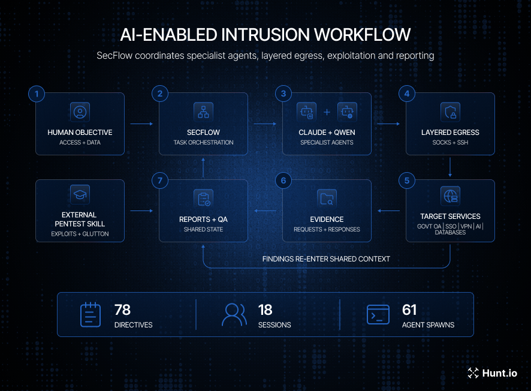
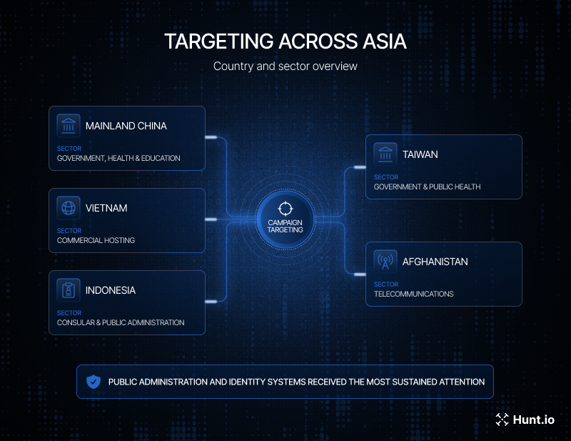

# Chinese Hackers Use AI Agents in Multi-Country Cyber Campaign

**AI-Enabled Threat Activity**{.cve-chip} **Cyber Espionage**{.cve-chip} **SecFlow**{.cve-chip} **GLUTTON Webshell**{.cve-chip} **Credential Theft**{.cve-chip} **Data Exfiltration**{.cve-chip}

## Overview

Hunt.io documented a Chinese-speaking threat actor using an AI-agent orchestration framework called SecFlow to automate and coordinate cyber-espionage operations. The framework reportedly used commercial AI models as specialized workers for reconnaissance, exploitation, data collection, and reporting.

The campaign combined AI-assisted tasking with conventional intrusion tradecraft, including exposed attack infrastructure, webshell deployment, credential access, and staged data theft from targeted organizations.

## Technical Specifications

| **Attribute** | **Details** |
|---|---|
| **Primary Framework** | SecFlow AI-agent orchestration platform |
| **Model Profiles Observed** | Claude, Qwen, and DeepSeek profiles with switching support |
| **Routing Infrastructure** | Private proxy infrastructure associated with niestools.com |
| **Exposed Components** | AI orchestration host, Java/CAS exploitation tooling, fake MySQL deserialization service, Shellshock and credential-testing infrastructure, payload repository |
| **Custom Malware/Tooling** | GLUTTON webshell framework |
| **Stealth Technique** | Steganographic payload concealment in PNG files with in-memory decode/execute flow |
| **Post-Exploitation Actions** | Command execution, ASPX webshell deployment, LSASS and SAM/SYSTEM hive collection, credential extraction, privileged account creation, file exfiltration |
| **Known Confirmed Data Loss** | 822 OA user account records; 949 attachments (~1.28 GB), including sensitive health-related information |
| **Secondary Exposure** | AI education platform with 23 agent configurations, 14 API-secret fields, and 104 chatbot conversations |

## Affected Products

- Internet-facing Office Automation (OA) platforms
- Java/CAS-based web applications and related middleware
- Apache, Grafana, and other publicly exposed enterprise services with unpatched weaknesses
- Windows servers hosting vulnerable web applications
- AI-agent backends and management interfaces with weak access controls

## Attack Scenario

1. Operators perform reconnaissance and scanning against internet-facing applications across multiple targets.
2. The threat actor tests credentials and probes vulnerable services, including Java/CAS-related paths and auxiliary infrastructure.
3. Once access is established, attackers obtain Windows command execution and deploy ASPX webshells.
4. Attackers collect credential material from LSASS memory and SAM/SYSTEM registry hives.
5. A privileged account is created for persistent access and post-compromise control.
6. Files are staged and exfiltrated from compromised environments.
7. In parallel, fake MySQL deserialization services are used to target vulnerable Java applications.
8. GLUTTON tooling may embed payloads in PNG files and execute decoded code in memory to reduce static detection.

## Impact Assessment

=== "Integrity"

    - Unauthorized command execution and webshell persistence on compromised systems
    - Privileged account creation enables continued attacker control
    - System configuration and trust boundaries may be altered during post-exploitation

=== "Confidentiality"

    - Confirmed theft of account records and attachment data, including sensitive health information
    - Credential material extraction increases risk of lateral movement and follow-on compromise
    - Exposure of AI-agent secrets and chatbot conversations increases privacy and security risk

=== "Availability"

    - Operational disruption may occur during containment, credential resets, and forensic response
    - Compromised enterprise services may require temporary isolation or rebuilds
    - Broad campaign activity increases cumulative risk across multiple organizations

## Mitigation Strategies

### Immediate Actions

- Secure internet-facing applications and Office Automation systems.
- Patch vulnerable Java/CAS, Apache, Grafana, and other exposed software.
- Isolate suspected hosts and preserve forensic evidence before cleanup.
- Revoke compromised sessions and rotate exposed credentials, tokens, and API secrets.

### Short-term Measures

- Monitor for webshell activity and unusual command execution patterns.
- Protect and monitor access to LSASS memory and SAM/SYSTEM registry hives.
- Enforce MFA and least-privilege controls for administrative and remote access paths.
- Require strong authentication on AI-agent platforms and management backends.

### Monitoring & Detection

- Detect suspicious proxy-mediated and automated AI-agent activity.
- Inspect uploaded image files for hidden payload indicators and anomalous server-side decoding behavior.
- Correlate reconnaissance, credential testing, exploitation, and exfiltration as a single kill chain.
- Hunt for unauthorized privileged-account creation and anomalous outbound transfer activity.

### Long-term Solutions

- Build behavioral detections for end-to-end attack-chain activity rather than model-name indicators only.
- Establish hardening baselines for AI orchestration infrastructure and secret-management workflows.
- Conduct recurring adversary emulation for webshell, credential-theft, and data-exfiltration scenarios.
- Implement continuous external exposure management for internet-facing assets.

## Resources and References

!!! info "Public Reporting"
    - [Chinese Hackers Use AI Agents in Multi-Country Cyber Campaign | Security Affairs](https://securityaffairs.com/198417/ai/chinese-hackers-use-ai-agents-in-multi-country-cyber-campaign.html)

---

*Last Updated: September 6, 2026*
