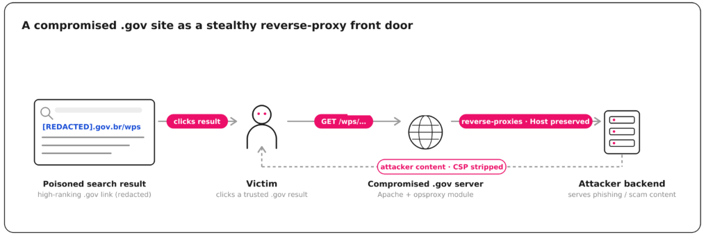

# Brazilian Government Traffic Hijacking Campaign

**Traffic Hijacking**{.cve-chip} **Malicious Apache Modules**{.cve-chip} **SEO Poisoning**{.cve-chip} **Government Domains**{.cve-chip} **Gambling Goblin**{.cve-chip}

## Overview

A Chinese-speaking cybercrime group tracked as **Gambling Goblin** reportedly compromised web servers belonging primarily to Brazilian government and educational institutions. The attackers deployed malicious Apache modules to intercept visitor traffic and redirect selected requests to attacker-controlled pages promoting online gambling and sports betting.

Reporting indicates the campaign has been active since mid-2025 and leverages trusted victim domains to increase credibility, search visibility, and user click-through.

## Technical Details

### Core Intrusion Behavior

- Attackers installed custom Apache modules, including one identified as `opsproxy.c` in public research.
- The module reportedly hooks Apache request processing during the name-translation phase.
- Requests matching selected URL prefixes, including `/wps`, `/bmw`, and `/card`, were intercepted.
- Matching requests were reverse-proxied to attacker-controlled upstream infrastructure.
- Malicious response handling reportedly stripped security headers while preserving the legitimate victim-domain appearance.

### Associated Tooling

Research also referenced additional attacker tooling used across the campaign, including:

- DownPro
- AlphaAgent
- oRAT
- 3snake-based credential stealer
- SSH brute-forcer
- Plugin-driven reconnaissance tooling

### Campaign Characteristics

- Initial access vector has not been publicly confirmed.
- High-reputation domains were allegedly abused for large-scale SEO manipulation and traffic laundering.
- Content flow included phishing-style pages imitating trusted brands such as Google Play, Microsoft Store, and Amazon before pushing betting-related content.

## Technical Specifications

| **Attribute** | **Details** |
|---|---|
| **Threat Cluster** | Gambling Goblin (reported Chinese-speaking cybercrime group) |
| **Primary Victim Profile** | Brazilian government and educational web infrastructure |
| **Malicious Mechanism** | Custom Apache module traffic interception and reverse proxying |
| **Module Example** | `opsproxy.c` (as identified in published research) |
| **Trigger Paths (Reported)** | `/wps`, `/bmw`, `/card` |
| **Primary Objective** | Traffic hijacking, SEO abuse, gambling/betting redirection |
| **Secondary Risk** | Credential theft and phishing via trusted-domain impersonation |
| **Activity Window (Reported)** | Active since mid-2025 |

## Affected Products

- Apache web servers where attackers gained write/execution capability for module deployment.
- Public-facing websites under government and education domains in the observed campaign.
- Downstream users visiting compromised legitimate websites.

## Attack Scenario

1. Attackers gain access to a target web server (initial access path not publicly confirmed).
2. Malicious Apache modules and support tooling are deployed.
3. Apache processes incoming traffic under normal domain branding.
4. Requests matching selected URL patterns are intercepted.
5. Malicious module reverse-proxies traffic to attacker infrastructure.
6. Visitors receive attacker-controlled phishing or betting content while still seeing trusted victim domains.
7. Compromised domains are leveraged for SEO manipulation and broader campaign reach.

## Impact Assessment

=== "Institutional and User Impact"

    - Government and educational website trust can be degraded by malicious content delivery
    - Visitors may be exposed to phishing, fraud, and credential-harvesting flows
    - Domain reputation, citizen trust, and service integrity may be significantly affected

=== "Search and Ecosystem Impact"

    - High-authority domains can be abused for search-ranking manipulation
    - Redirect infrastructure can scale campaign reach beyond initially compromised pages

=== "Potential Escalation Risk"

    - Existing traffic-hijack infrastructure could be adapted for malware delivery
    - Credential-theft and social-engineering components may support follow-on compromise activity

## Mitigation Strategies

### Validate Apache Integrity

- Audit loaded Apache modules and investigate unknown or unsigned modules.
- Monitor module directories and Apache configuration files for unauthorized changes.
- Implement file-integrity monitoring on web roots, config paths, and module binaries.

### Monitor Proxy Abuse and Response Tampering

- Investigate unexpected outbound connections and reverse-proxy behavior from web servers.
- Inspect HTTP responses for unauthorized content injection or stripped security headers.
- Alert on unusual path-based routing behavior matching suspicious prefixes.

### Reduce Initial Access and Persistence Risk

- Patch Apache, operating systems, and hosted web applications promptly.
- Enforce strong SSH authentication and disable password-based SSH access where feasible.
- Rotate administrative credentials after suspected compromise.

### Full Incident Response

- Investigate for unauthorized processes, persistence, backdoors, and reconnaissance tooling.
- Perform full incident-response scoping instead of only removing a malicious module.
- Preserve forensic artifacts and logs before cleanup to support attribution and eradication.

## Resources and References

!!! info "Public Reporting"
    - [Malicious Apache Modules Hijack Brazilian Government Site Traffic to Push Betting Pages](https://thehackernews.com/2026/09/malicious-apache-modules-hijack.html)
    - [Gaming the system: how a Chinese-speaking actor turned Brazilian government sites into an SEO weapon](https://research.checkpoint.com/2026/gaming-the-system-how-a-chinese-speaking-actor-turned-brazilian-government-sites-into-an-seo-weapon/)

---

*Last Updated: September 08, 2026*