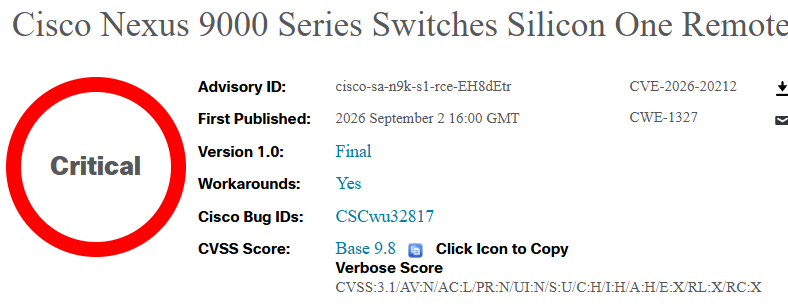

# CVE-2026-20212 - Cisco Nexus 9000 Series Switches Silicon One Remote Code Execution Vulnerability

**Critical RCE**{.cve-chip} **Cisco Nexus 9000**{.cve-chip} **Silicon One**{.cve-chip} **Unauthenticated Attack**{.cve-chip} **Root Privileges**{.cve-chip} **NX-OS**{.cve-chip}

## Overview

Cisco addressed a critical vulnerability in the Silicon One integration of certain Cisco Nexus 9000 Series switches. A remote, unauthenticated attacker could potentially exploit the issue to execute arbitrary code with root privileges on an affected device.

Cisco also noted that exploitation attempts may crash the S1HAL process, which can trigger device reload behavior and service instability.

## Technical Specifications

| **Attribute** | **Details** |
|---|---|
| **CVE** | CVE-2026-20212 |
| **CWE** | CWE-1327 |
| **Affected Platform** | Certain Cisco Nexus 9000 Series switches with Silicon One ASIC |
| **Attack Prerequisite** | Network reachability to affected switch |
| **Exposed Network Paths** | TCP ports 43210 and 43211 reachable through default Layer 3 (L3) VRF |
| **Vulnerability Condition** | Specially crafted input may be interpreted/executed as code |
| **Potential Privilege Level** | Root-level code execution |
| **Secondary Effect** | S1HAL process crash and possible device reload |
| **Authentication Requirement** | None (remote unauthenticated path) |

## Affected Products

- Cisco Nexus 9000 Series switches containing Silicon One ASIC
- Deployments exposing reachable paths to TCP 43210/43211 in the default L3 VRF
- Data-center and enterprise switching environments running vulnerable Cisco NX-OS releases
- Networks without restrictive control-plane and infrastructure ACL protections

## Attack Scenario

1. An attacker gains network connectivity to a vulnerable Cisco Nexus 9000 switch.
2. The attacker reaches TCP port 43210 or 43211 through the default L3 VRF path.
3. Specially crafted input is sent to the vulnerable service path.
4. The Silicon One integration processes the malicious input.
5. The attacker may achieve arbitrary code execution with root privileges.
6. Alternatively, exploitation may crash S1HAL and trigger a switch reload, impacting availability.

## Impact Assessment

=== "Integrity"

    - Root-level execution could allow full unauthorized modification of switch behavior
    - Attackers may alter configuration, monitoring controls, or forwarding logic
    - Compromise of control-plane trust may enable broader network manipulation

=== "Confidentiality"

    - Device compromise may expose sensitive network topology and configuration data
    - Attackers could access operational telemetry and potentially intercept or reroute traffic paths
    - Further pivot risk increases in tightly integrated data-center environments

=== "Availability"

    - Exploitation may crash S1HAL and force device reload behavior
    - Service degradation or outage may occur on critical switching infrastructure
    - Network-wide operational impact is possible in high-dependency environments

## Mitigation Strategies

### Immediate Actions

- Upgrade to a fixed Cisco NX-OS software release.
- Use Cisco Software Checker to identify vulnerable and fixed versions.
- Apply infrastructure ACLs (iACLs) to reduce reachable attack surface.

### Short-term Measures

- Where operationally appropriate, explicitly block TCP traffic destined to locally configured IPs on ports 43210 and 43211.
- Restrict management and control-plane adjacency to trusted networks only.
- Validate exposure paths across data-center and interconnect segments.

### Monitoring & Detection

- Monitor for unusual traffic targeting ports 43210 and 43211.
- Alert on unexpected S1HAL instability, crashes, or reload events.
- Correlate anomalous control-plane activity with suspicious network probing patterns.

### Long-term Solutions

- Maintain rapid patch governance for critical network-infrastructure advisories.
- Implement periodic exposure assessment for switch control-plane interfaces.
- Enforce least-privilege network segmentation around management infrastructure.
- Include switch firmware vulnerability validation in continuous security baselines.

## Resources and References

!!! info "Public Reporting and Vendor Advisory"
    - [Cisco Fixed Critical RCE in Nexus 9000 Series Switches | Security Affairs](https://securityaffairs.com/198366/security/cisco-fixed-critical-rce-in-nexus-9000-series-switches.html)
    - [Cisco Nexus 9000 Series Switches Silicon One Remote Code Execution Vulnerability | Cisco](https://www.cisco.com/c/en/us/support/docs/csa/cisco-sa-n9k-s1-rce-EH8dEtr.html)

---

*Last Updated: September 6, 2026*
