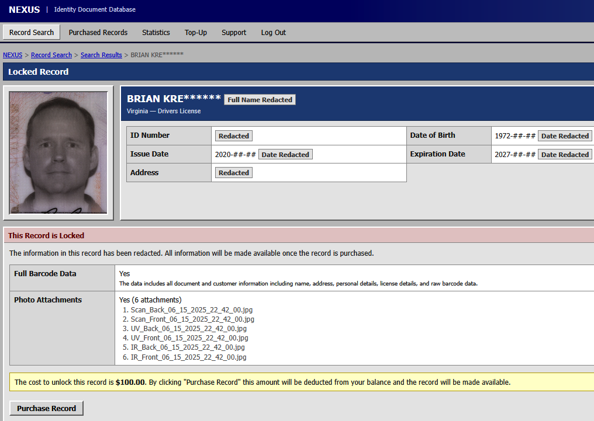

# Dark Web Service Nexus Sells 153M+ Driver's Licenses

**Dark Web Marketplace**{.cve-chip} **Identity Data Exposure**{.cve-chip} **Driver License Records**{.cve-chip} **Potential PII Breach**{.cve-chip} **Fraud Risk**{.cve-chip} **Investigation Ongoing**{.cve-chip}

## Overview

A dark-web service called Nexus advertised searchable access to digital scans of identity documents allegedly belonging to more than 170 million people in North America. Nexus claimed to hold over 153 million driver's licenses, more than 10 million ID cards, over 3 million travel documents or international IDs, and approximately 579,000 medical cards.

These values are marketplace claims and do not yet represent a verified count of unique victims. Public reporting indicates an active investigation into the data source and scope.

## Technical Specifications

| **Attribute** | **Details** |
|---|---|
| **Service Name** | Nexus (dark-web identity-data marketplace) |
| **Claimed Dataset Scale** | 170M+ records (claimed), including 153M+ driver's licenses |
| **Other Claimed Records** | 10M+ ID cards, 3M+ travel/international IDs, ~579K medical cards |
| **Data Types Reported** | Front/back ID scans, IR/UV image variants, timestamps, associated metadata |
| **Suspected Source** | Possible link to identity-verification workflows; source not conclusively confirmed |
| **Investigative Correlation** | Timestamps reportedly mapped to real-world ID verification events |
| **Potential Vendor Link in Reporting** | Evidence reportedly pointed toward IDScan.net; attribution not finalized |
| **Verification Status** | Marketplace claims pending independent victim-level validation |

## Affected Products

- Identity-verification and document-scanning platforms
- KYC onboarding systems using government-issued ID capture
- Customer verification portals retaining ID image archives
- Organizations storing ID scans with long retention windows
- Individuals whose driver's license or identity card images may be in exposed datasets

## Attack Scenario

1. An attacker gains unauthorized access to identity-verification infrastructure or associated storage.
2. Government-issued ID scans and metadata are collected and exfiltrated.
3. Records are transferred periodically or continuously into attacker-controlled repositories.
4. Data is normalized, indexed, and integrated into the Nexus search-and-sale platform.
5. Criminal buyers query and purchase records for fraud, impersonation, and account-abuse operations.
6. Operators may advertise ongoing updates, but an active ongoing breach has not been officially confirmed.

## Impact Assessment

=== "Integrity"

    - Trust in identity-verification pipelines is degraded when source custody is uncertain
    - Compromised verification records can enable manipulation of downstream onboarding checks
    - Long-lived identity attributes increase persistent fraud risk over time

=== "Confidentiality"

    - Potential exposure of highly sensitive identity images and associated personal metadata
    - Elevated risk of identity theft, impersonation, account takeover attempts, and synthetic identity fraud
    - Possible exposure of sensitive government-related identity records may increase broader security concerns

=== "Availability"

    - Primary impact is confidentiality and fraud risk rather than direct service outage
    - Operational overhead increases for investigations, customer notification, and fraud response
    - Defensive monitoring and remediation efforts can consume significant compliance resources

## Mitigation Strategies

### Immediate Actions

- Minimize retention of ID images and related metadata to legal and operational necessity.
- Encrypt sensitive identity data at rest and in transit with strict key-management controls.
- Enforce MFA and strong access controls for administrative, API, and service accounts.
- Begin incident-response investigation and preserve audit logs for forensic analysis.

### Short-term Measures

- Monitor for abnormal bulk access or export behavior across identity-data stores.
- Implement data-loss prevention and exfiltration monitoring on sensitive repositories.
- Segregate identity-document storage from general application infrastructure.
- Rotate credentials, API keys, and secrets potentially exposed through linked systems.

### Monitoring & Detection

- Alert on unusual query volume, image retrieval spikes, and high-entropy outbound transfers.
- Track unauthorized access attempts to document archives, object storage, and backup systems.
- Correlate verification-event logs with suspicious timestamp-aligned access patterns.
- Expand fraud monitoring for new-account abuse, impersonation patterns, and KYC anomalies.

### Long-term Solutions

- Establish strong retention and deletion policies for identity images and verification artifacts.
- Conduct periodic third-party security assessments of identity-verification providers.
- Implement privacy-by-design controls for document handling and minimal-data workflows.
- Provide affected individuals with guidance on credit monitoring and identity-protection actions when exposure is confirmed.

## Resources and References

!!! info "Public Reporting"
    - [Dark Web Service Nexus Sells 153M+ Driver's Licenses | Security Affairs](https://securityaffairs.com/198388/security/dark-web-service-nexus-sells-153m-drivers-licenses.html)
    - [FBI probes report of data breach exposing millions of drivers' licenses in US, Canada | Reuters](https://www.reuters.com/world/us/fbi-says-it-is-investigating-report-that-millions-us-drivers-licenses-exposed-2026-09-02/)
    - [FBI Probes Service Selling 153M+ Drivers Licenses | Krebs on Security](https://krebsonsecurity.com/2026/09/fbi-probes-service-selling-153m-drivers-licenses/)
    - [153 Million Driver License Images Offered on Dark Web | SecurityWeek](https://www.securityweek.com/153-million-driver-license-images-offered-on-dark-web/)

---

*Last Updated: September 6, 2026*
