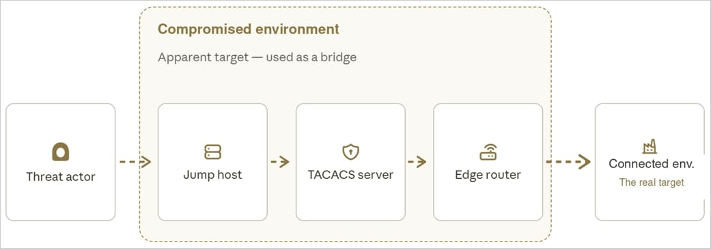
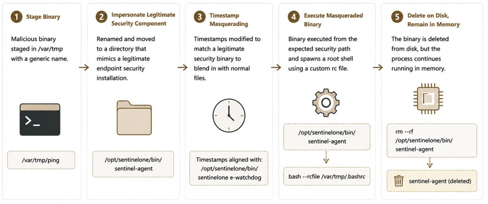

# Fire Ant - China-linked Cyber Espionage Campaign Targeting Trusted Infrastructure

**Cyber Espionage**{.cve-chip} **Trusted Infrastructure**{.cve-chip} **Cisco IOS XR**{.cve-chip} **TACACS Credential Theft**{.cve-chip} **Linux Backdoors**{.cve-chip} **Covert Tunneling**{.cve-chip}

## Overview

Fire Ant expanded beyond earlier virtualization-focused operations to compromise trusted infrastructure components, including Cisco IOS XR routers, TACACS authentication servers, and Linux management hosts. The campaign leveraged these systems for intelligence collection, credential theft, activity concealment, and exploration of access paths to higher-value connected environments, described as targeting the target behind the target.

The operation demonstrates a strategic shift toward infiltrating core administrative and network-trust layers rather than only endpoint or application surfaces.

## Technical Specifications

| **Attribute** | **Details** |
|---|---|
| **Campaign Name** | Fire Ant |
| **Primary Target Class** | Trusted infrastructure (routers, authentication servers, management hosts) |
| **Network Infrastructure Impact** | Cisco IOS XR routers observed with unexplained active GRE tunnel lacking matching config/commit history |
| **Credential Access Focus** | TACACS credential interception and collection activity |
| **Log and Evidence Evasion** | Selective syslog suppression, manipulation of Linux login records, removal of sudo-related evidence |
| **Persistence Methods** | Persistent Linux backdoors and malware disguised as legitimate services or security tools |
| **Covert Communication** | Hidden tunnels and packet-activated backdoors without standard listening ports |
| **Operational Objective** | Surveillance, credential theft, stealth persistence, and pivoting to higher-value networks |

## Affected Products

- Cisco IOS XR routers in trusted network paths
- TACACS authentication servers and related credential workflows
- Linux management and jump hosts used for infrastructure administration
- Security monitoring environments relying solely on host-local logs
- Connected high-value enterprise and critical-infrastructure-adjacent networks

## Attack Scenario

1. Attackers compromise a trusted infrastructure component (router, TACACS server, or Linux management host).
2. Persistence is established via backdoors and disguised service-level malware.
3. Covert communication channels are created, including hidden GRE tunneling and packet-triggered activation techniques.
4. Defensive visibility is degraded through selective log suppression and manipulation of authentication/login artifacts.
5. Authentication traffic and administrative credentials are intercepted and harvested.
6. Compromised infrastructure nodes are used as stealth pivot points for reconnaissance and deeper access.
7. Operators scan and explore connected high-value environments, including critical infrastructure-linked networks.

## Impact Assessment

=== "Integrity"

    - Trust anchors such as routers and authentication servers can be manipulated by adversaries
    - Forensic integrity is weakened by log tampering and evidence suppression
    - Administrative control planes may be altered to support persistent stealth access

=== "Confidentiality"

    - TACACS and infrastructure credentials may be exposed and reused for broader compromise
    - Network telemetry and internal traffic can be surveilled from compromised transit systems
    - Sensitive operational data in connected high-value environments faces elevated collection risk

=== "Availability"

    - Immediate disruption is not the primary objective, but availability risk rises with deep infrastructure compromise
    - Stealth persistence in routing and authentication layers can enable later operational impact
    - Incident response and trust restoration can require high-effort service and access revalidation

## Mitigation Strategies

### Immediate Actions

- Treat routers, authentication servers, and jump hosts as high-value assets with enhanced protection.
- Investigate unexplained tunnels, operational-state anomalies, and undocumented router behaviors.
- Export logs to independently managed, centralized, and immutable logging infrastructure.
- Isolate and triage suspected compromised infrastructure nodes before broad remediation.

### Short-term Measures

- Cross-validate infrastructure logs against network telemetry, memory artifacts, and identity records.
- Monitor TACACS flows and authentication behavior for unusual access and credential-use patterns.
- Hunt for persistence artifacts, disguised services, and packet-triggered backdoor indicators.
- Strengthen segmentation and privilege boundaries between management networks and production assets.

### Monitoring & Detection

- Alert on selective syslog suppression patterns, log gaps, and suspicious log-source divergence.
- Detect unusual outbound tunnels, GRE anomalies, and stealthy beacon traffic from infrastructure hosts.
- Monitor Linux authentication artifacts for tampering and unexpected sudo/log-cleaning behaviors.
- Apply available IOCs and detection rules from trusted reporting, then tune for environment context.

### Long-term Solutions

- Implement defense-in-depth for trusted infrastructure with independent telemetry and integrity controls.
- Perform periodic memory, firmware, and configuration integrity assessments for critical network devices.
- Establish continuous threat hunting focused on infrastructure-layer abuse and credential interception.
- Conduct red-team scenarios that emulate target-behind-the-target pivot tactics.

## Resources and References

!!! info "Public Reporting"
    - [China-linked Fire Ant Hides Inside Trusted Infrastructure | Security Affairs](https://securityaffairs.com/198183/apt/china-linked-fire-ant-hides-inside-trusted-infrastructure.html)
    - [Fire Ant Evolves: From Hypervisors to Trusted Infrastructure | Sygnia](https://www.sygnia.co/blog/fire-ant-evolves-from-hypervisors-to-trusted-infrastructure/)
    - [Chinese Fire Ant hackers turn Cisco routers into spying platforms | BleepingComputer](https://www.bleepingcomputer.com/news/security/chinese-fire-ant-hackers-turn-cisco-routers-into-spying-platforms/)

---

*Last Updated: September 6, 2026*
