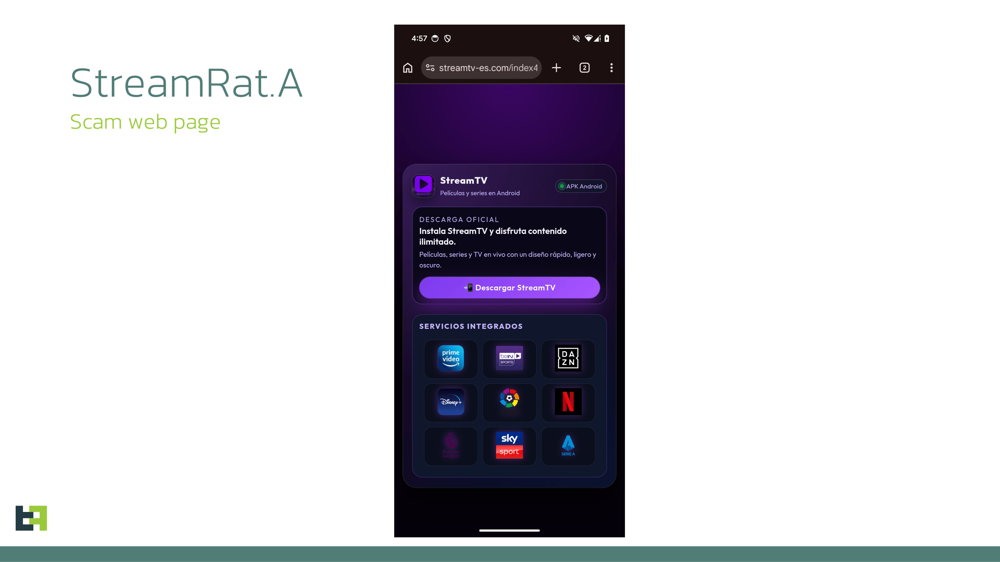
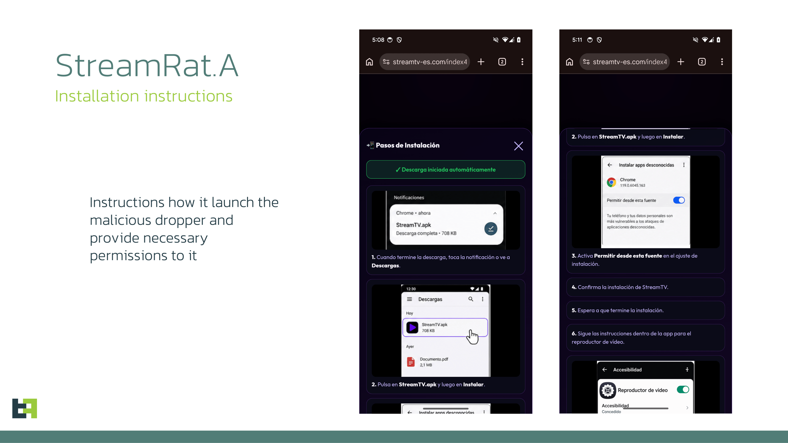

# Meta Ads Push StreamRat Android Trojan That Can Gain Near-Complete Device Control

**Android Trojan**{.cve-chip} **Malvertising**{.cve-chip} **StreamRat**{.cve-chip} **Accessibility Abuse**{.cve-chip} **Remote Device Control**{.cve-chip}

## Overview

StreamRat is a sophisticated Android banking trojan distributed via malicious advertisements promoting a fake TV-streaming service. Victims are redirected to a malicious website and tricked into sideloading an APK.

After high-risk permissions are granted, especially Accessibility Services, attackers can gain broad remote control capabilities including activity monitoring, keystroke capture, credential theft, overlay abuse, and unauthorized on-device actions.

## Technical Details

The campaign follows a multi-stage infection chain using a phishing website, an Android dropper, and the final StreamRat payload.

### Infection Chain Behavior

- Malicious ads direct targets to an attacker-controlled website.
- The website fingerprints visitors and prioritizes Android devices for APK delivery.
- Victims download an initial dropper package, commonly referenced as app.apk in reporting.
- The dropper may request default launcher privileges and installation from unknown sources.
- The dropper may create a deliberately non-functional VPN profile to disrupt other app connectivity.
- The final StreamRat payload is downloaded and installed.
- Victims are prompted to grant Accessibility permissions, enabling deep interaction control.

### StreamRat Capabilities

- Accessibility-service abuse for broad UI interaction and interaction automation.
- WebSocket-based C2 communications.
- Foreground app monitoring and installed-app enumeration.
- Keystroke capture and credential theft support.
- Overlay attacks that imitate legitimate apps or system prompts.
- Remote interaction features and screen-capture capability.

## Technical Specifications

| **Attribute** | **Details** |
|---|---|
| **Malware Family** | StreamRat (Android banking trojan) |
| **Initial Access Vector** | Malicious social-media ads leading to phishing/sideload flow |
| **Primary Target Platform** | Android devices |
| **Infection Stages** | Malicious site -> dropper APK -> StreamRat payload |
| **Privilege Mechanisms** | Accessibility abuse, launcher privileges, unknown-sources install path |
| **C2 Method** | WebSocket-based communications |
| **Post-Install Functions** | App monitoring, keylogging behavior, overlay abuse, screen capture, remote control |
| **Deception Theme** | Fake TV-streaming app promotion |

## Affected Products

- Android devices where users install malicious APKs from untrusted sources.
- Environments where users grant Accessibility permissions to untrusted apps.
- Accounts and services accessed from compromised mobile endpoints, especially finance-related apps.

## Attack Scenario

1. Victim encounters a malicious streaming-themed advertisement on Meta platforms.
2. Ad click redirects to a phishing-style website.
3. The website detects Android and delivers a malicious APK flow.
4. Victim installs a dropper app outside trusted app stores.
5. Dropper requests risky permissions and may configure a non-functional VPN profile.
6. StreamRat payload is downloaded and installed.
7. Victim grants Accessibility permission.
8. Malware establishes C2 communications over WebSocket.
9. Attacker conducts monitoring, credential theft, overlays, screen capture, and remote control actions.

## Impact Assessment

=== "Potential Financial and Account Risk"

    - Theft of banking credentials and session-linked information
    - Account takeover and unauthorized transactions
    - Financial fraud via attacker-driven device interactions

=== "Device and Data Exposure"

    - Keystroke and screen monitoring
    - Theft of sensitive personal or enterprise information accessed on device
    - Unauthorized actions executed in victim context

=== "Social-Engineering Amplification"

    - Overlay prompts can impersonate trusted apps or system updates
    - Victims may disclose credentials or approve malicious actions unknowingly

## Mitigation Strategies

### Reduce Sideloading Risk

- Install apps only from trusted sources such as official app stores.
- Avoid APKs delivered through social-media ads or unknown websites.

### Restrict High-Risk Permissions

- Do not grant Accessibility Services to untrusted applications.
- Audit existing Accessibility-enabled apps and remove suspicious entries.

### Strengthen Mobile Security Controls

- Keep Google Play Protect enabled.
- Investigate unknown or suspicious VPN profiles/configurations on devices.
- Use mobile threat defense tooling to detect malicious APK behavior and suspicious C2 traffic.

### Detection and Response

- Block validated malicious indicators in monitoring and enforcement systems.
- Hunt for signs of overlay abuse, unauthorized Accessibility activation, and unexpected remote-interaction behavior.

## Resources and References

!!! info "Public Reporting"
    - [Meta Ads Push StreamRat Android Trojan That Can Gain Near-Complete Device Control](https://thehackernews.com/2026/09/meta-ads-push-streamrat-android-trojan.html)
    - [Uncovering StreamRat: From Meta Ads to Full Device Takeover](https://www.threatfabric.com/blogs/from-meta-ads-to-full-device-takeover-uncovering-streamrat)

---

*Last Updated: September 08, 2026*