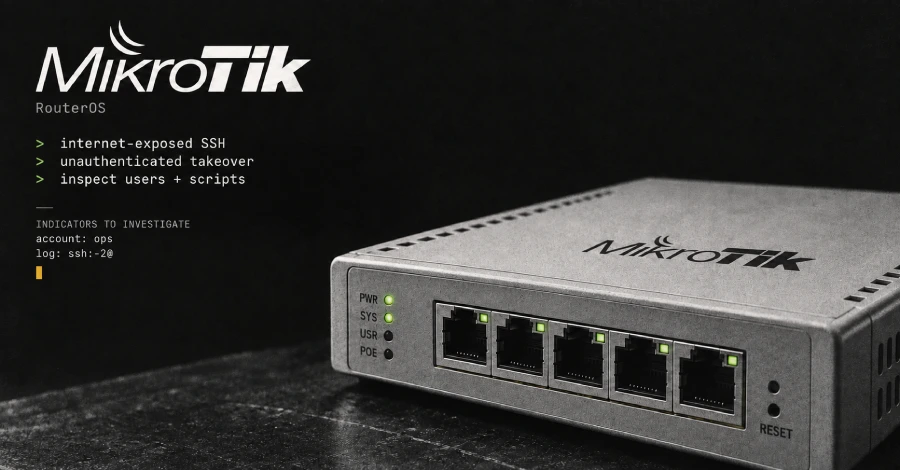

# MikroTrick: Actively Exploited MikroTik RouterOS SSH Attack Chain

**Active Exploitation**{.cve-chip} **MikroTik RouterOS**{.cve-chip} **SSH Exposure**{.cve-chip} **CVE-2026-67276**{.cve-chip} **CVE-2026-86060**{.cve-chip}

## Overview

CERT Polska warned that attackers are actively exploiting a two-vulnerability chain, dubbed **MikroTrick**, against internet-exposed MikroTik RouterOS devices with SSH enabled. The chain can allow an unauthenticated attacker to progress to full administrative control of vulnerable routers.

Public reporting indicates successful exploitation observed since at least September 2, 2026. MikroTik began releasing fixes on September 3, 2026, and defenders are advised to patch immediately, reduce external exposure, and perform compromise assessments.

## Technical Details

### Vulnerabilities in the Chain

- **CVE-2026-67276**: SSH authentication bypass vulnerability (CVSS 9.2).
- **CVE-2026-86060**: SSH-session privilege escalation vulnerability.

### Affected Scope

- MikroTik RouterOS devices on vulnerable releases with SSH exposed to untrusted internet networks.

### Observed Exploitation

- CERT Polska reported successful attacks and observed creation of a highly privileged account named `ops`.
- Activity was observed dating to at least September 2, 2026.
- RouterOS history can show suspicious events, including failed login attempts with username `-2`, which should be treated as abnormal and investigated.
- Any `ssh:-2@<IP>` history event associated with configuration changes should be treated as likely compromise unless tied to authorized testing.

### Reported Infrastructure and IOC Context

- Reporting references source infrastructure including `82.192.72[.]4` and `103.102.31[.]18`.
- Public summaries indicate campaign-linked hosting of a MIPS BusyBox binary and related files/scripts.
- File names and hashes are reported in source coverage but are time-sensitive and should be validated directly from current threat-intelligence and primary advisories before enforcement.

### Zero-Day Status Assessment

- Security Affairs (citing Costin Raiu) reported exploitation may have started before public fix announcements, suggesting possible zero-day activity.
- The Hacker News notes available dates do not conclusively prove patch availability timing before first attacks.
- Best current classification: **possible zero-day exploitation**, not conclusively verified from public data.

### Default Firewall Context

- MikroTik default firewall policy is reported to block public access to management ports when unchanged.
- Risk remains high where SSH was intentionally exposed or default firewall policy was modified.

## Technical Specifications

| **Attribute** | **Details** |
|---|---|
| **Campaign Name** | MikroTrick |
| **Vendor/Product** | MikroTik RouterOS |
| **Primary Entry CVE** | CVE-2026-67276 (SSH auth bypass, CVSS 9.2) |
| **Privilege Escalation CVE** | CVE-2026-86060 |
| **Exposure Prerequisite** | SSH reachable from untrusted internet networks |
| **Observed Suspicious Account** | `ops` (reported) |
| **Suspicious Username Pattern** | `-2` in failed login/log history (reported indicator) |
| **Observed Activity Window** | Since at least 2026-09-02 |
| **Fix Availability (Reported)** | Fixes began releasing on 2026-09-03 |
| **Zero-Day Classification** | Possible, not conclusively verified publicly |

## Affected Products

- MikroTik RouterOS devices on vulnerable releases with internet-exposed SSH services.
- Environments where edge/router administration is reachable from untrusted networks.

## Attack Scenario

1. Attacker discovers an internet-exposed MikroTik RouterOS SSH service.
2. Attacker abuses **CVE-2026-67276** to bypass SSH authentication conditions.
3. Attacker chains **CVE-2026-86060** to escalate privileges within the SSH session.
4. Full administrative control is obtained on the router.
5. Attacker establishes persistence by creating privileged users (for example `ops`) and/or adding unauthorized SSH keys.
6. Router settings may be altered to support follow-on activity (services, firewall rules, scripts, scheduler entries, proxies, tunnels, packet capture).

## Impact Assessment

=== "Confirmed Impact"

    - Active exploitation was confirmed by CERT Polska reporting
    - Attack chain can lead to full administrative control of affected routers
    - Suspicious privileged account creation (`ops`) has been observed in reported cases

=== "Potential Impact"

    - Traffic interception, DNS or routing manipulation, proxy/tunnel abuse, and credential capture
    - Internal reconnaissance and lateral movement via compromised edge infrastructure
    - Not all potential actions are publicly confirmed in every observed incident

=== "Sector Relevance"

    - RouterOS platforms are used across enterprise, ISP, SMB, industrial, education, and government-connected environments
    - Compromised edge routers can affect both IT operations and trust boundaries for remote administration

=== "Used in Egypt"

    - MikroTik equipment is used in Egypt across ISP, enterprise, SMB, and institutional deployments
    - No public source in this incident confirms a specific Egyptian victim
    - Egyptian organizations with exposed RouterOS management services should treat this as urgent

### Criticality

- **Critical** due to active exploitation and the ability to obtain full administrative control of exposed edge routers.

## Mitigation Strategies

### Patch RouterOS Immediately

- Upgrade affected RouterOS devices to the appropriate fixed release recommended by MikroTik.
- Verify installed version after update using official RouterOS update mechanisms.

### Remove Public SSH Exposure

- Disable SSH if not operationally required.
- If required, restrict SSH to trusted administrator IP ranges, management VLANs, VPN-only access, or hardened jump hosts.
- CERT Polska also advised temporary restriction of exposed SSH, WWW/WWW-SSL, and bandwidth-test services until patching is complete.

### Check Device State and Configuration

- Inspect RouterOS flagged/health state after update.
- Review users, SSH keys, scripts, scheduler entries, services, firewall rules, proxies, tunnels, and packet-sniffer settings for unauthorized changes.
- Absence of a `-2` log artifact alone does not prove safety because logs may have rolled over or been cleared.

### Hunt for Compromise Indicators

- Search logs/history for `-2` login anomalies, unexpected privileged account creation (including `ops`), and suspicious configuration changes.
- Investigate communications with `82.192.72[.]4` and `103.102.31[.]18` after validating current intelligence.

### Recover Securely if Compromise Is Suspected

- Isolate affected routers and preserve logs/config exports before reset.
- Rebuild from factory defaults and trusted verified configuration baselines.
- Avoid blindly restoring full backups from potentially compromised devices.
- Rotate RouterOS passwords, SSH keys, VPN secrets, Wi-Fi credentials, API credentials, and related secrets.

### Avoid Risky Interim Behavior

- Until patched, avoid risky management behavior noted by CERT Polska (including use of sensitive outbound TLS/initiation paths and RouterOS built-in SSH client workflows on unpatched devices).
- Treat interim controls only as temporary risk reduction, not a substitute for patching.

## Resources and References

!!! info "Public Reporting"
    - [The Hacker News: Attackers Hijack MikroTik Routers Through Internet-Exposed SSH](https://thehackernews.com/2026/09/attackers-hijack-mikrotik-routers.html)
    - [Security Affairs: Your MikroTik Router May Already Be Compromised: Look for SSH User "-2"](https://securityaffairs.com/198538/security/your-mikrotik-router-may-already-be-compromised-look-for-ssh-user-2.html)

---

*Last Updated: September 07, 2026*