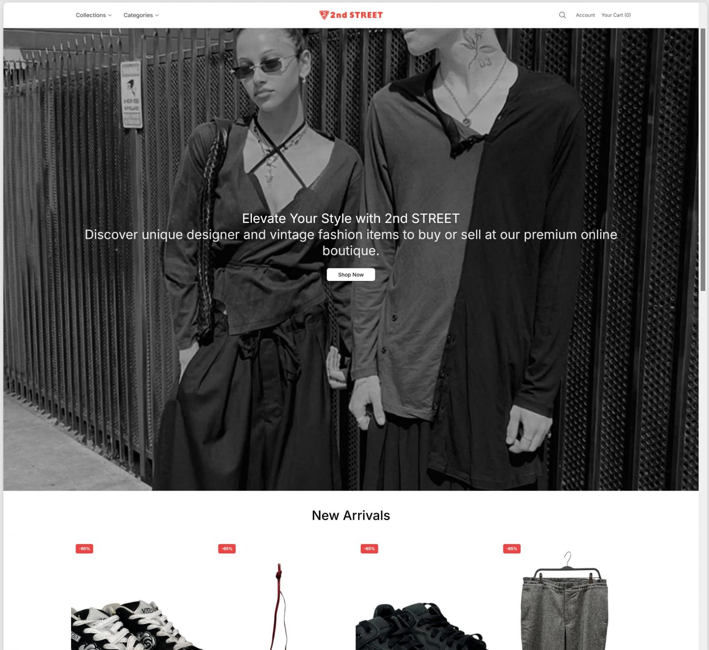

# DoppelCart - Large-Scale Fake Online Shop Fraud Network

**E-Commerce Fraud**{.cve-chip} **Fake Shops**{.cve-chip} **Card Theft**{.cve-chip} **Phishing Checkout**{.cve-chip} **Domain Churn**{.cve-chip}

## Overview

DoppelCart is a large-scale cybercrime operation involving approximately 119,000 fraudulent online shopping websites. The sites impersonate legitimate brands and retailers by cloning product pages, visual design, and pricing to appear trustworthy.

Victims are enticed to complete purchases on fake stores where payment-card and personal information can be harvested at checkout. The operation's large domain pool enables rapid replacement of blocked or taken-down sites.

## Technical Details

### Infrastructure Scale

- Researchers reported roughly 119,000 fraudulent domains.
- Most domains were reportedly registered under the `.shop` TLD.
- Infrastructure scale suggests extensive automation for registration, deployment, and replacement.

### Fraud Delivery Model

- Cloned e-commerce content mimics trusted retailer layouts and catalogs.
- Fake checkout workflows request full payment and personal details.
- Captured data can include card number, expiration, CVV/CVC, billing details, and contact information.

### Operational Characteristics

- High-volume domain churn supports resilience against takedowns.
- Campaign likely relies on repeatable templates for content replication and hosting orchestration.
- Search and ad placement exposure can direct victims toward attacker-controlled storefronts.

## Technical Specifications

| **Attribute** | **Details** |
|---|---|
| **Campaign Name** | DoppelCart |
| **Estimated Scale** | ~119,000 fake shop domains |
| **Dominant TLD (Reported)** | `.shop` |
| **Primary Objective** | Payment-card and personal-data theft via fraudulent checkout |
| **Deception Method** | Cloned product pages, copied branding, counterfeit storefront design |
| **Persistence Pattern** | Rapid domain replacement after block/takedown |
| **Operational Model** | Automated domain registration, site deployment, and content replication |

## Affected Products

- Consumers searching for products, discounts, and online retailers.
- Legitimate brands impersonated by fake shops.
- Payment ecosystems (banks/processors) exposed to fraud and chargebacks.

## Attack Scenario

1. Victim searches for a product or aggressive discount online.
2. Search results, ads, or links route victim to a DoppelCart-controlled fake shop.
3. Site imitates a legitimate retailer with cloned branding and products.
4. Victim proceeds to checkout and enters payment/personal details.
5. Submitted information is transmitted to attacker-controlled infrastructure.
6. Victim may receive no item, counterfeit goods, or failed order fulfillment.
7. Stolen card/personal data is later abused directly or sold.

## Impact Assessment

=== "Consumer Impact"

    - Payment-card theft and fraudulent transactions
    - Financial losses from fake purchases
    - Identity-exposure risks from personal-data collection

=== "Business and Brand Impact"

    - Brand impersonation and reputational damage
    - Customer distrust and support burden
    - Potential legal/compliance pressures around scam misuse of trademarks

=== "Financial Ecosystem Impact"

    - Increased chargebacks and fraud-investigation costs
    - Expanded card-abuse monitoring overhead for banks and processors

## Mitigation Strategies

### Consumer Protections

- Verify domain names before purchase and prefer trusted bookmarks/official retailer links.
- Avoid unrealistic discounts and urgency-driven offers.
- Do not submit payment-card data to unfamiliar shops.
- Enable transaction alerts and monitor banking/card activity.
- Use virtual/limited-use cards where available.

### Brand and Organization Defenses

- Continuously monitor for fraudulent domains impersonating brand assets.
- Correlate suspicious domains via DNS, certificates, hosting, and web fingerprints.
- Accelerate takedown/reporting workflows for counterfeit storefronts.
- Track fraudulent checkout patterns and shared infrastructure indicators.
- Share actionable indicators with financial institutions and threat-intelligence partners.
- Educate customers on fake-store detection and ad-driven fraud risks.

## Resources and References

!!! info "Public Reporting"
    - [DoppelCart: 119,000 Domains in What May Be the Largest Documented Fake-Shop Network](https://nebty-id.com/en/doppelcart-fake-shop-network/)
    - [More than 100,000 fake stores are out to steal your card details](https://www.malwarebytes.com/blog/scams/2026/09/more-than-100000-fake-stores-are-out-to-steal-your-card-details)
    - [FRITZ! and Dreame: 119,000 fake shops take your card at checkout](https://www.notebookcheck.net/FRITZ-and-Dreame-119-000-fake-shops-take-your-card-at-checkout.1398244.0.html)
    - [DoppelCart fraud network uses 119,000 fake shops to steal credit cards](https://www.bleepingcomputer.com/news/security/doppelcart-fraud-network-uses-119-000-fake-shops-to-steal-credit-cards/)

---

*Last Updated: September 14, 2026*