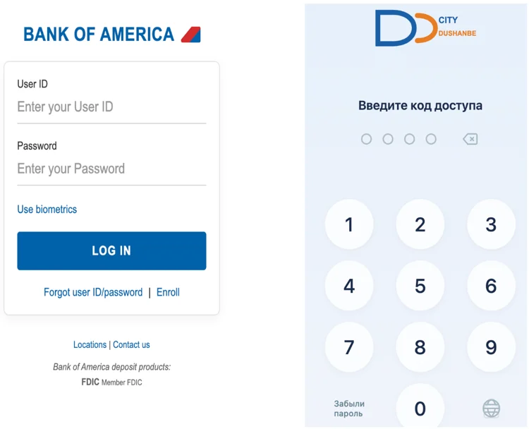

# RatHat Android Trojan

**RatHat**{.cve-chip} **Android Trojan**{.cve-chip} **Accessibility Abuse**{.cve-chip} **ADB Self-Pairing**{.cve-chip} **AI-Assisted UI Automation**{.cve-chip}

## Overview

RatHat is a newly identified Android Trojan that combines Accessibility Service abuse, Android Wireless Debugging/ADB self-pairing, native shell-level components, reverse tunneling, credential theft, and generative-AI-assisted UI automation.

Infection commonly starts through smishing, malicious ads, deceptive sites, or third-party APK repositories. Victims are socially engineered to sideload a malicious APK and grant Accessibility permissions. RatHat then automates settings navigation, enables Developer Options and Wireless Debugging, retrieves the six-digit ADB pairing code, and pairs to the device's own ADB service.

This behavior allows the malware to move beyond normal Android app sandbox constraints and establish shell-level execution capability.

## Technical Details

### Core Components

- Malicious Android app/dropper to obtain Accessibility access and control device UI.
- Go-based `liblocal-service.so` agent to execute commands through acquired shell access and support persistence/system manipulation.
- `libmedia_codec.so` (FRP component) to establish reverse tunneling to attacker infrastructure and expose remote access into the ADB environment.

### Primary Behaviors

- Accessibility abuse for UI reading, synthetic taps, information extraction, and app-interaction automation.
- Raw input monitoring that captures touch coordinates and correlates them to keypad/pattern layouts for PIN/pattern reconstruction.
- Credential theft through overlay-style imitation of targeted finance/payment interfaces.
- SMS and notification interception that can expose OTP/MFA codes.
- Screen monitoring/capture for broader victim-activity visibility.

### AI-Assisted Automation

- RatHat serializes the Accessibility tree into XML.
- UI data is sent to a generative-AI assistant.
- AI guidance can identify screen elements, return likely coordinates, and suggest action/navigation steps (including scrolling).

### Anti-Analysis Features

Researchers observed:

- APK/container manipulation.
- Extremely large Android manifest design.
- DEX bytecode poisoning and encrypted strings.
- Runtime checks for debugging, Frida, Xposed, root, and emulator conditions.

## Technical Specifications

| **Attribute** | **Details** |
|---|---|
| **Malware Name** | RatHat |
| **Platform** | Android |
| **Initial Delivery** | Smishing, malvertising, deceptive websites, third-party APK sources |
| **Privilege Expansion Path** | Accessibility abuse -> enable Wireless Debugging -> ADB self-pairing -> shell-level access |
| **Remote Access Method** | Reverse tunnel via native FRP-related component |
| **Credential/Data Targets** | Banking/payment credentials, OTP/MFA codes, unlock secrets, UI/session data |
| **Notable Innovation** | Generative-AI-assisted UI decision support |

## Affected Products

- Android devices where users can install apps from untrusted sources.
- Devices where Accessibility abuse and Wireless Debugging enablement are not monitored.
- Personal and enterprise-managed devices used for financial, payment, or corporate authentication workflows.

## Attack Scenario

1. Victim receives or encounters malicious APK delivery (phishing, smishing, malvertising, or fake app source).
2. Victim installs malware and grants Accessibility permissions.
3. RatHat uses Accessibility to enable Developer Options and Wireless Debugging.
4. Malware retrieves ADB pairing code and self-pairs with local ADB service.
5. Native components activate shell operations, reverse tunnel access, and persistence.
6. Malware captures credentials, OTPs, PINs/patterns, and screen/UI context.
7. AI-assisted logic helps automate complex UI navigation for account-abuse workflows.
8. Stolen data is used for account takeover and broader fraud/abuse operations.

## Impact Assessment

=== "Potential Consequences"

    - Theft of banking/payment usernames, passwords, PINs, and authentication codes
    - OTP/MFA interception via SMS/notification access
    - Theft of device unlock credentials and behavioral UI data
    - Persistent remote shell-level access through reverse tunneling

=== "Enterprise and Identity Risk"

    - Increased exposure of corporate accounts when infected devices are used for work authentication
    - Elevated risk of account takeover across banking, payment, messaging, and enterprise services

=== "Criticality"

    - **High** due to multi-stage privilege expansion, stealth/persistence mechanisms, and AI-assisted automation that can improve attacker reliability

## Mitigation Strategies

### User-Focused Controls

1. Avoid APK installation from unsolicited SMS, ads, or unofficial websites.
2. Do not grant Accessibility Service permissions to apps without legitimate accessibility need.
3. Keep Developer Options and Wireless Debugging disabled unless explicitly required.
4. Keep Android OS and mobile security controls fully updated.
5. Monitor for unfamiliar apps and unexpected Accessibility-enabled services.
6. Prefer phishing-resistant MFA methods where possible instead of SMS OTP.

### Incident Response Guidance

- If RatHat infection is suspected, do not rely solely on uninstalling the visible APK.
- Reported behavior indicates components may persist outside normal app lifecycle.
- Based on vendor findings, a factory reset may be required for full remediation.

### Enterprise Mobile Hardening

- Enforce managed-device policy controls for unknown-source installs and developer-feature access.
- Alert on Wireless Debugging enablement and unusual Accessibility-service activity.
- Use mobile threat defense/EDR telemetry to detect UI automation abuse and reverse-tunnel behavior.

## Resources and References

!!! info "Public Reporting"
    - [RatHat Turns Android Accessibility Into an Attack Weapon - Security Affairs](https://securityaffairs.com/199317/malware/rathat-turns-android-accessibility-into-an-attack-weapon.html)
    - [New RatHat Android malware uses AI to automate device control](https://www.bleepingcomputer.com/news/security/new-rathat-android-malware-uses-ai-to-automate-device-control/)
    - [New Android malware uses AI to steal bank logins and PINs | Malwarebytes](https://www.malwarebytes.com/blog/news/2026/09/new-android-malware-uses-ai-to-steal-bank-logins-and-pins)
    - [RatHat: AI-Powered Mobile Threat is Here for Your Credentials & Bank Accounts](https://zimperium.com/blog/rathat-ai-powered-mobile-threat-is-here-for-your-credentials-bank-accounts)

---

*Last Updated: September 21, 2026*
