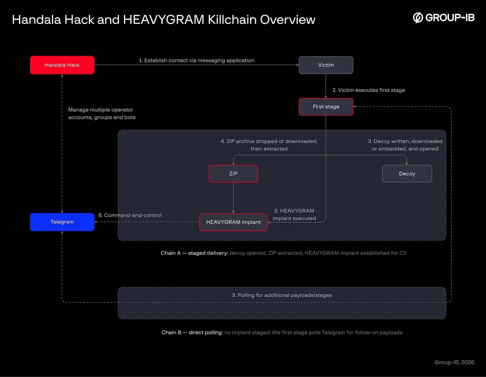
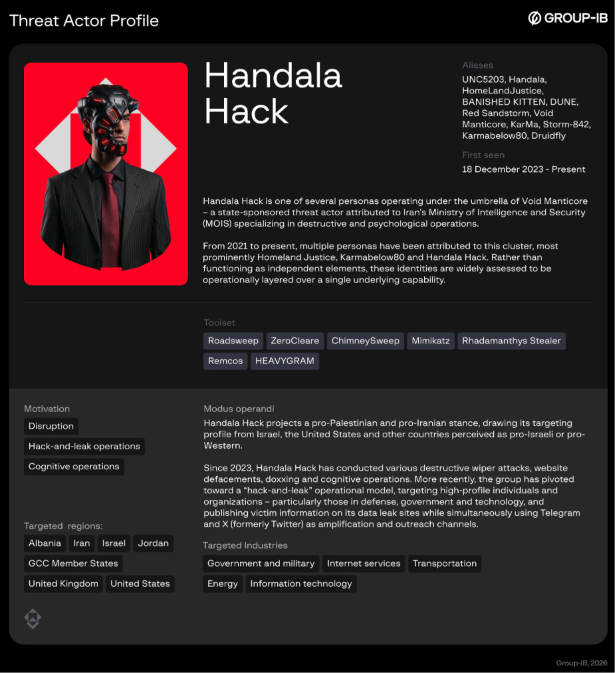
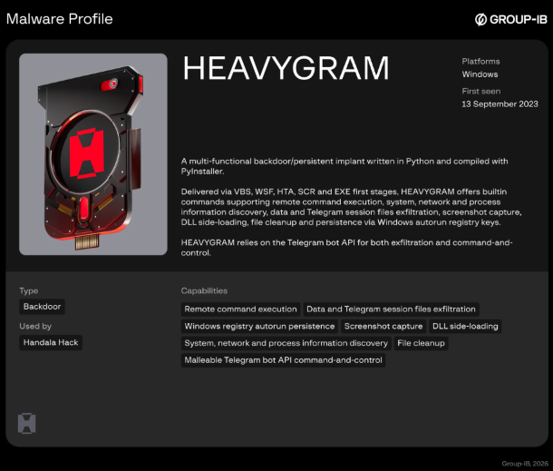

# HEAVYGRAM: A Telegram-based Surveillance Backdoor Linked to Handala Hack

**HEAVYGRAM**{.cve-chip} **Handala Hack**{.cve-chip} **Telegram C2**{.cve-chip} **Windows Backdoor**{.cve-chip} **Surveillance Malware**{.cve-chip}

## Overview

HEAVYGRAM is a Windows-focused surveillance backdoor linked to Iran-associated Handala Hack activity. Public reporting states the malware uses Telegram bot infrastructure for command-and-control and exfiltration while supporting persistent remote access and broad victim monitoring.

Group-IB attributes HEAVYGRAM to Handala Hack with moderate confidence. Reported functionality includes command execution, sensitive-data collection, screenshot capture, messaging-data access, and persistence via Registry Run keys.

## Technical Details

### Platform and Operational Profile

- Primary target platform: Windows.
- C2 and exfiltration channel: Telegram bot infrastructure.
- Persistence mechanism: Windows Registry Run keys.

### Reported Capabilities

- Remote command execution.
- System, process, and network discovery.
- Screenshot capture and screen surveillance.
- Microphone-access capability.
- Collection of email and Telegram/WhatsApp-related data.
- File upload/download and follow-on payload execution.
- DLL side-loading and deletion of selected data.
- Potential abuse of Microsoft Defender exclusions for defense evasion.

### Evasion and Persistence Notes

- Run-key persistence enables execution at logon.
- Defender-exclusion abuse can reduce detection effectiveness when available.
- Telegram-based C2 can blend with commonly allowed communications.

## Technical Specifications

| **Attribute** | **Details** |
|---|---|
| **Malware Family/Name** | HEAVYGRAM |
| **Attributed Actor (Public Reporting)** | Handala Hack (moderate confidence attribution by Group-IB) |
| **Primary Platform** | Windows |
| **C2 Channel** | Telegram bots |
| **Persistence Method** | Registry Run keys |
| **Collection Scope** | Credentials/sensitive data, screenshots, messaging/email data, potential audio capture |
| **Post-Compromise Actions** | Command execution, file transfer, payload staging, data deletion |

## Affected Products

- Windows endpoints used by targeted individuals/organizations.
- Accounts and datasets accessible through compromised endpoints, including messaging and email artifacts.
- Environments where Telegram traffic is broadly permitted without deep inspection.

## Attack Scenario

1. Threat actor performs reconnaissance and engages victims through Telegram, WhatsApp, or other social channels.
2. Attacker impersonates trusted contact or technical support role.
3. Victim opens a malicious file disguised as legitimate software or document content.
4. HEAVYGRAM executes silently and establishes persistence via Registry Run keys.
5. Malware connects to Telegram-based C2 infrastructure.
6. Backdoor performs collection/exfiltration and receives remote execution tasks.
7. Stolen information may be used for surveillance, account abuse, coercion, or leak-site publication.

## Impact Assessment

=== "Potential Consequences"

    - Credential and sensitive-data theft
    - Persistent remote surveillance and endpoint control
    - Collection of messaging/email intelligence and behavioral context
    - Possible exposure of victim contacts, geolocation hints, and social graphs

=== "Operational and Personal Risk"

    - Higher danger for journalists, activists, dissidents, and high-risk individuals
    - Publication of victim data on leak platforms can increase harassment and targeting risk

=== "Criticality"

    - **High** due to stealthy persistence, surveillance features, and remote-control capability via mainstream communication channels

## Mitigation Strategies

### User and Operational Hygiene

- Avoid opening unexpected files received through messaging platforms.
- Verify sender identity via separate trusted channels before opening files.
- Download software only from trusted official sources.

### Endpoint Security Controls

- Enable and maintain EDR/antivirus protections.
- Monitor and alert on suspicious Microsoft Defender exclusion changes.
- Hunt for anomalous Registry Run-key entries and unusual startup persistence.
- Apply application and operating-system security updates promptly.

### Network and Detection Measures

- Inspect unusual Telegram/cloud-storage communication patterns from enterprise endpoints.
- Correlate suspicious messaging-traffic events with endpoint process/file activity.
- Investigate potential compromise quickly and contain affected hosts.

### Post-Compromise Response

- Reimage or thoroughly remediate confirmed compromised systems.
- Rotate credentials, session tokens, and authentication material exposed on infected endpoints.
- Review impacted accounts for unauthorized access and persistence artifacts.

## Resources and References

!!! info "Public Reporting"
    - [Iran-Linked Handala Hack Tied to HEAVYGRAM Telegram Backdoor That Can Steal Passwords](https://thehackernews.com/2026/09/iran-linked-handala-hack-tied-to.html)
    - [Iranian cyber targeting of dissidents, activists and journalists | National Cyber Security Centre](https://www.ncsc.gov.uk/news/iranian-cyber-targeting-of-dissidents-activists-and-journalists)
    - [UK, US and Netherlands issue advisory on Iran-linked spyware | Reuters](https://www.reuters.com/world/uk-us-netherlands-issue-advisory-iran-spyware-2026-09-15/)
    - [HEAVYGRAM: A Telegram-based Surveillance Backdoor Linked to Handala Hack | Group-IB Blog](https://www.group-ib.com/blog/heavygram-handala-hack-telegram-c2/)
    - [Iranian Hackers Use Telegram-Controlled Malware to Spy on Dissidents and Journalists](https://thehackernews.com/2026/09/iranian-hackers-use-telegram-controlled.html)

---

*Last Updated: September 21, 2026*
