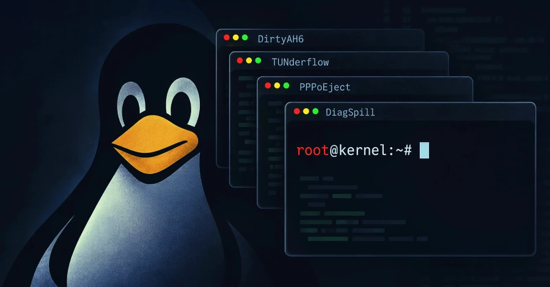

# Four Linux Kernel Local Privilege-Escalation Vulnerabilities

**Linux Kernel**{.cve-chip} **Local Privilege Escalation**{.cve-chip} **DirtyAH6**{.cve-chip} **TUNderflow**{.cve-chip} **PPPoEject**{.cve-chip} **DiagSpill**{.cve-chip}

## Overview

A security researcher publicly released working exploit code for four Linux kernel vulnerabilities in networking-related components. Successful exploitation can allow an attacker with local access to escalate privileges and execute code at root level.

The vulnerabilities are **DirtyAH6**, **TUNderflow**, **PPPoEject**, and **DiagSpill**. Three typically require unprivileged user namespaces or suitable network capabilities, while DiagSpill can be reachable without those prerequisites when SCTP and `sctp_diag` are enabled. Public reporting states the underlying bugs existed for approximately 10 to 21 years.

## Technical Details

### CVE-2026-80844 - DirtyAH6

- Component: IPv6 IPsec Authentication Header handling.
- Weakness: insufficient validation of routing-header `segments_left`.
- Result: out-of-bounds memory write.

### CVE-2026-81000 - TUNderflow

- Component: TUN/TAP virtual networking path.
- Weakness: incorrect receive-headroom handling.
- Result: size-calculation wrap leading to out-of-bounds write.

### CVE-2026-68121 - PPPoEject

- Component: PPPoE handling logic.
- Weakness: use-after-free involving stale network-buffer pointer after device operation changes the underlying buffer.
- Result: memory corruption and potential code execution in kernel context.

### CVE-2026-74469 - DiagSpill

- Component: SCTP diagnostic handling.
- Weakness: 16-bit transport counter wrap at 65,536.
- Result: undersized allocation followed by approximately 8 MiB out-of-bounds write.

### Privilege and Reachability Notes

- DirtyAH6, TUNderflow, and PPPoEject generally rely on unprivileged user/network namespaces or appropriate capabilities.
- DiagSpill may be reachable without user namespaces or special privileges when SCTP and `sctp_diag` are available.

## Technical Specifications

| **Attribute** | **Details** |
|---|---|
| **Primary Issue Type** | Linux kernel local privilege escalation via memory corruption |
| **Vulnerabilities** | CVE-2026-80844, CVE-2026-81000, CVE-2026-68121, CVE-2026-74469 |
| **Subsystems** | IPv6/IPsec AH, TUN/TAP, PPPoE, SCTP diagnostics |
| **Likely Outcome** | Root-level code execution from low-privileged context |
| **Remote Risk** | Primarily local; limited crash-oriented remote scenarios under specific conditions |
| **Research Context** | Public exploit code released |

## Affected Products

- Linux systems running vulnerable kernels in affected version lines.
- Multi-user Linux environments with local shell/process exposure.
- Container and shared-host environments where local privilege boundaries are security-critical.
- Systems with enabled AH6/IPsec AH, TUN/TAP, PPPoE, SCTP, or `sctp_diag` functionality.

## Attack Scenario

1. Attacker achieves initial low-privileged access (for example via compromised application account or shell).
2. Attacker reaches vulnerable kernel networking functionality.
3. Attacker triggers one of the memory-corruption paths.
4. Kernel memory corruption is leveraged for code execution.
5. Attacker escalates to root and fully compromises the host.

The vulnerabilities are primarily local in nature. DirtyAH6 and DiagSpill have limited remote crash possibilities in specific configurations, but public reporting did not establish a practical general-purpose remote root path.

## Impact Assessment

=== "Potential Consequences"

    - Local privilege escalation to root
    - Full host compromise
    - Access to protected files, secrets, and credentials
    - Security-control bypass and persistence installation

=== "Infrastructure Risk"

    - Elevated risk in shared, multi-user, and infrastructure-hosted Linux systems
    - Potential container-to-host compromise under suitable conditions

=== "Criticality"

    - **High** due to public exploit availability and direct root-escalation potential from low-privileged footholds

## Mitigation Strategies

### Patch to Fixed Kernel Releases

Update to distribution-provided kernels that include the fixes. Public reporting identifies these first upstream stable versions containing all four fixes:

- 5.10.270
- 5.15.221
- 6.1.188
- 6.6.157
- 6.12.109
- 6.18.50
- 7.2.4

Always confirm distribution advisories, because vendors may backport fixes without matching upstream version numbers.

### Reduce Attack Surface if Patching Is Delayed

- Disable unprivileged user namespaces where feasible.
- This can reduce common attack paths for DirtyAH6, TUNderflow, and PPPoEject.
- This does **not** mitigate DiagSpill exposure when SCTP and `sctp_diag` remain available.

### Disable Unused Kernel Features

Where operationally possible, disable unnecessary components such as:

- AH6/IPsec AH
- TUN/TAP
- PPPoE
- SCTP
- `sctp_diag`

### Hardening and Detection

- Restrict local interactive access and tightly control low-privileged account execution paths.
- Monitor for suspicious namespace activity and unexpected network-stack manipulation attempts.
- Prioritize rapid remediation on internet-facing or multi-tenant Linux infrastructure.

## Resources and References

!!! info "Public Reporting"
    - [Public Exploits Released for Four Linux Kernel Flaws That Enable Local Root](https://thehackernews.com/2026/09/public-exploits-released-for-four-linux.html)
    - [oss-security - A quartet of Linux local root vulns: DirtyAH6, PPPoEject, TUNderflow, and DiagSpill](https://www.openwall.com/lists/oss-security/2026/09/18/3)

---

*Last Updated: September 21, 2026*
