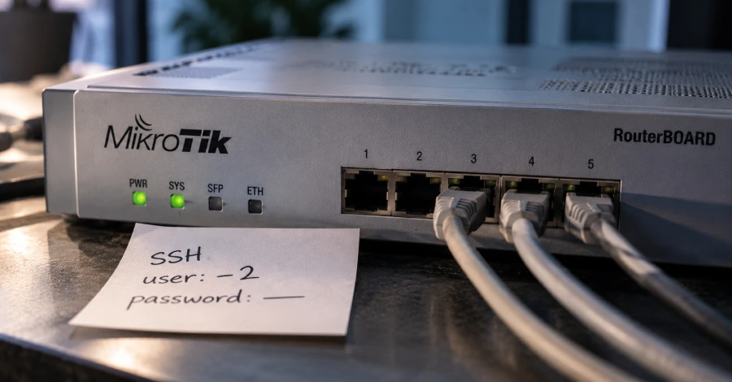
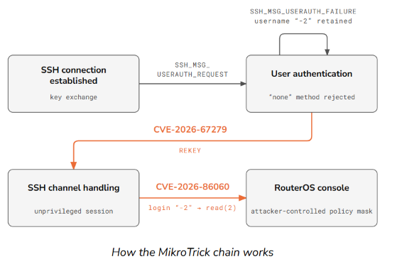

# MikroTrick - MikroTik RouterOS SSH Exploitation Chain

**MikroTik RouterOS**{.cve-chip} **MikroTrick**{.cve-chip} **CVE-2026-67276**{.cve-chip} **CVE-2026-86060**{.cve-chip} **SSH Administrative Takeover**{.cve-chip}

## Overview

Attackers are exploiting a vulnerability chain known as **MikroTrick** that targets MikroTik RouterOS. Public reporting indicates the chain can let attackers with network reachability to a router's SSH service obtain full administrative access without a valid password or SSH private key.

The chain combines authentication-bypass behavior with privilege/session manipulation, enabling direct compromise of exposed network-edge infrastructure.

## Technical Details

### Core Vulnerabilities

- **CVE-2026-67276**: SSH RSA public-key authentication bypass in RouterOS.
- **CVE-2026-86060**: SSH session privilege-manipulation / argument-injection weakness.
- **CVE-2026-67277**: additional issue disclosed by CERT Polska affecting the bandwidth-test service.

### Exploitation Characteristics

- Primary exposure condition: router SSH reachable from untrusted networks, including the internet.
- Authentication bypass can remove need for valid SSH password/key material.
- Crafted session/username manipulation can elevate privileges to administrative context.

## Technical Specifications

| **Attribute** | **Details** |
|---|---|
| **Chain Name** | MikroTrick |
| **Primary Targets** | MikroTik RouterOS devices |
| **Core CVEs** | CVE-2026-67276, CVE-2026-86060, CVE-2026-67277 |
| **Primary Entry Path** | Internet/LAN-reachable SSH management service |
| **Security Outcome** | Full RouterOS administrative session takeover |
| **Follow-On Risk** | Persistence, traffic manipulation, tunneling/proxying, lateral movement |

## Affected Products

- MikroTik RouterOS systems that remain on vulnerable releases.
- Routers exposing SSH management services to untrusted networks.
- Environments relying on router trust boundaries for segmentation and transit security.

## Attack Scenario

1. Attacker identifies a MikroTik router with publicly reachable SSH.
2. RouterOS SSH authentication weakness is exploited.
3. Crafted SSH username/session context is used to manipulate privileges.
4. Administrative RouterOS session is obtained.
5. Router configuration is modified for persistence, traffic control, tunneling/proxying, or further network access.

## Impact Assessment

=== "Primary Impact"

    - Full administrative compromise of affected routers
    - Unauthorized account creation and privilege persistence
    - Firewall, NAT, and routing-policy tampering

=== "Network Impact"

    - Traffic interception, redirection, or degradation
    - Establishment of tunnels/proxies for hidden command-and-control or pivoting
    - Use of compromised routers as footholds into connected internal environments

=== "Criticality"

    - **Critical** for internet-exposed vulnerable devices due to unauthenticated administrative takeover potential

## Mitigation Strategies

### Patch Immediately

Upgrade to fixed RouterOS releases:

- 7.24.2+
- 7.23.4+
- 6.49.21+
- 7.25 beta 3+

### Restrict Management Exposure

- Restrict SSH to trusted management networks only.
- Avoid direct exposure of management interfaces to the public internet.
- Use allowlisting, VPN/jump-host administration, and least-privilege management paths.

### Post-Patch Validation

- Review router logs/configuration for unknown users, scripts, schedulers, proxies, tunnels, and unexpected policy changes.
- Audit startup/persistence mechanisms and management accounts.

### Incident Response if Compromise Is Suspected

- Preserve evidence before broad cleanup actions.
- Isolate affected router(s) from critical network paths.
- Factory-reset and rebuild from trusted baseline configurations.
- Rotate passwords, SSH keys, and related secrets tied to affected infrastructure.

## Resources and References

!!! info "Public Reporting"
    - [MikroTrick Chain Let Attackers Take Over MikroTik Routers Without a Password or SSH Key](https://thehackernews.com/2026/09/mikrotrick-chain-let-attackers-take.html)
    - [MikroTik SSH Rekeying and Username Flaws Chain Into Unauthenticated RouterOS Admin Access](https://cyberpress.org/mikrotik-flaws-enable-admin-access/)
    - [MikroTrick: technical analysis, disclosure process, and the use of LLM agents | CERT Polska](https://cert.pl/en/posts/2026/09/mikrotrick-technical-analysis/)

---

*Last Updated: September 24, 2026*
