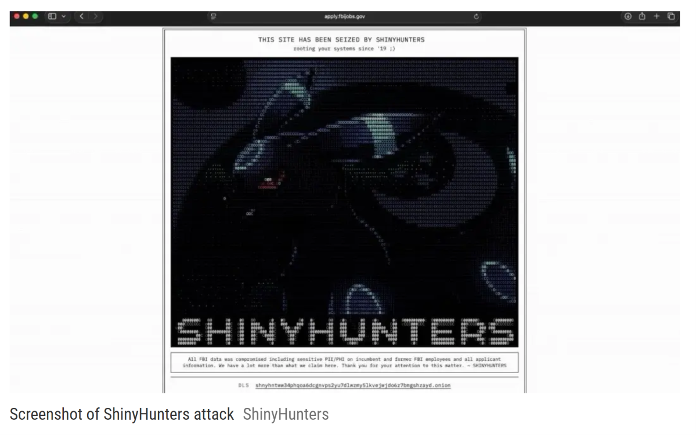

# ShinyHunters - FBIJobs.gov Data Breach

**ShinyHunters**{.cve-chip} **FBIJobs.gov**{.cve-chip} **PeopleSoft Zero-Day Claim**{.cve-chip} **Applicant Data Exposure**{.cve-chip} **Federal Recruitment Portal**{.cve-chip}

## Overview

ShinyHunters claimed it compromised the FBIJobs.gov recruitment portal and accessed sensitive information related to current/former FBI personnel and job applicants. The FBI confirmed it is investigating unauthorized activity affecting FBIJobs.gov, but has not publicly confirmed the full extent of the alleged compromise.

Public reporting states the threat actor shared a sample of roughly 5,000 records, with some reported as corresponding to real FBI/DOJ personnel. Claims about total access scope and internal system compromise remain only partially verified in public sources.

## Technical Details

### Alleged Initial Exploit Path

- ShinyHunters claimed exploitation of a previously unknown Oracle PeopleSoft vulnerability.
- The group described the issue as pre-authentication remote code execution (RCE).
- Public technical validation details remain limited at time of reporting.

### Claimed Attacker Actions

- Compromise of FBIJobs.gov environment.
- Website defacement of the recruitment portal.
- Lateral movement attempts/alleged access into additional infrastructure.
- Access to employee and applicant-related information.
- Claimed exfiltration volume of approximately 2-3 TB.

### Additional Unverified Claims

- Claimed access to HR, MedLink, and Criminal Justice Information Services-related systems.
- These specific broader access claims are unconfirmed publicly.

## Technical Specifications

| **Attribute** | **Details** |
|---|---|
| **Threat Actor (Claimed)** | ShinyHunters |
| **Primary Affected Portal** | FBIJobs.gov |
| **Alleged Initial Vector** | Previously unknown Oracle PeopleSoft vulnerability (pre-auth RCE claimed) |
| **Publicly Confirmed by FBI** | Investigation of unauthorized activity affecting FBIJobs.gov |
| **Sample Data Claim** | ~5,000 records reportedly shared by actor |
| **Claimed Exfiltration** | ~2-3 TB (actor claim, unverified) |

## Affected Products

- FBIJobs.gov recruitment portal and associated application environment.
- Potentially linked personnel/applicant data stores tied to recruitment workflows.
- Any connected systems are only partially confirmed in public reporting.

## Attack Scenario

1. Attacker identifies a reportedly vulnerable PeopleSoft-based recruitment service.
2. Alleged zero-day exploit is used to obtain pre-auth remote code execution.
3. Adversary gains control of exposed web/application environment.
4. FBIJobs.gov is defaced and service availability is impacted.
5. Attacker attempts/allegedly performs lateral movement toward additional infrastructure.
6. Personnel/applicant datasets are searched and allegedly exfiltrated.
7. Stolen data is leveraged for pressure, influence, or follow-on targeting.

## Impact Assessment

=== "Confirmed and Reported Impact"

    - FBIJobs.gov was taken offline or placed into maintenance state
    - FBI publicly confirmed investigation of unauthorized activity on FBIJobs.gov

=== "Alleged Data Exposure"

    - Names, addresses, phone numbers, dates of birth, SSNs, emergency-contact and family details
    - Employment/assignment details and applicant information
    - Some reporting indicates sample records included assignment-related context for certain personnel

=== "Potential Risk"

    - Targeted phishing and social engineering
    - Identity theft and account-abuse operations
    - Harassment or threats toward personnel and families
    - Follow-on cyber operations using exposed personnel metadata

=== "Criticality"

    - **High** due to potential sensitivity of affected personnel data and possible national-security implications, while full breach scope remains under investigation

## Mitigation Strategies

### Incident Validation and Containment

- Determine whether compromise originated from FBI enterprise assets or third-party provider paths.
- Isolate affected FBIJobs.gov infrastructure and related services.
- Preserve forensic evidence, including full application/server and security logs.

### Technical Remediation

- Validate and patch alleged PeopleSoft vulnerability once technically confirmed.
- Review credentials, service accounts, and privileged access linked to affected environments.
- Hunt for lateral-movement traces and persistence mechanisms.
- Review AWS GovCloud activity/data-access telemetry where applicable.

### Data Exposure and Workforce Protection

- Determine exact datasets accessed or exfiltrated.
- Notify potentially affected personnel/applicants as required.
- Monitor for phishing, identity theft, and role-targeted campaigns.

### Architectural Hardening

- Enforce strong segmentation between public recruitment infrastructure and sensitive internal systems.
- Reduce trust paths between internet-facing systems and high-value personnel/mission data stores.

## Resources and References

!!! info "Public Reporting"
    - [ShinyHunters Claims FBI Breach, Says It Stole Data on Agents and Job Applicants](https://thehackernews.com/2026/09/shinyhunters-claims-fbi-breach-says-it.html)
    - [FBI investigating alleged ShinyHunters breach of its jobs site | The Record](https://therecord.media/fbi-investigating-alleged-shinyhunters-job-site-breach)
    - [ShinyHunters claims FBI hack: 'This is NOT financially motivated'](https://www.theregister.com/security/2026/09/22/shinyhunters-claims-fbi-hack-this-is-not-financially-motivated/5298385)
    - [FBI investigates hackers' claim to have stolen sensitive employee data, compromised jobs website - ABC News](https://abcnews.com/US/wireStory/fbi-investigates-apparent-breach-jobs-website-hackers-claim-136686678)
    - [ShinyHunters hackers say they breached FBI, stole data on bureau employees | Reuters](https://www.reuters.com/world/shinyhunters-hackers-say-they-breached-federal-bureau-investigation-no-immediate-2026-09-22/)

---

*Last Updated: September 24, 2026*
