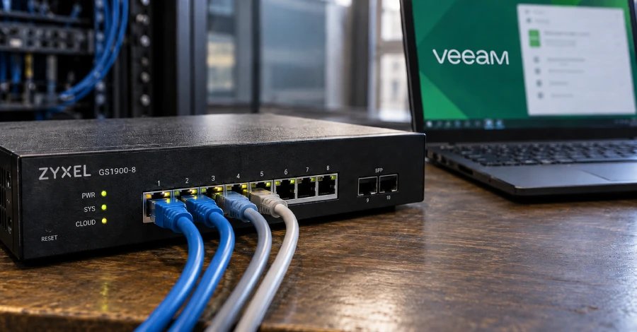
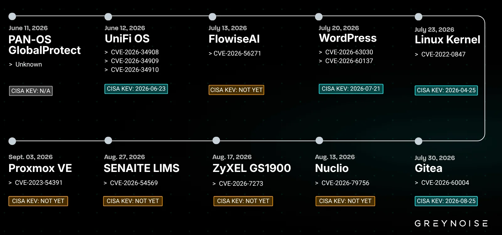

# Zyxel GS1900 CVE-2026-7273 & Veeam Agent for Windows CVE-2026-32996

**Zyxel GS1900**{.cve-chip} **CVE-2026-7273**{.cve-chip} **Veeam Agent for Windows**{.cve-chip} **CVE-2026-32996**{.cve-chip} **Active Exploitation**{.cve-chip}

## Overview

Attackers are actively exploiting two separate vulnerabilities affecting different technologies:

- **CVE-2026-7273**: stack-based buffer overflow in a CGI component of Zyxel GS1900 switches.
- **CVE-2026-32996**: local privilege-escalation flaw in Veeam Agent for Microsoft Windows.

The Zyxel issue can reportedly allow unauthenticated attackers on the LAN to execute operating-system commands via crafted HTTP requests. The Veeam issue can allow a local low-privileged user to escalate to SYSTEM privileges.

## Technical Details

### Zyxel - CVE-2026-7273

- Type: stack-based buffer overflow.
- Affected product line: Zyxel GS1900 series.
- Attack vector: LAN.
- Authentication required: no.
- Exploitation path: crafted HTTP requests to vulnerable CGI component.
- Result: arbitrary OS command execution.
- Affected firmware context: GS1900 firmware 2.90(XXXX.1)C0 and earlier.
- Reported campaign behavior: use of TFTP to fetch custom data-collection scripts.
- Reported collection target set: switch configs, network details, and hashed root credentials.

### Veeam - CVE-2026-32996

- Type: local privilege escalation.
- Severity context: CVSS 7.3.
- Vulnerable component: Veeam Endpoint Backup service.
- Relevant IPC surface: `\\.\pipe\Veeam\VAW\ServiceConnectionPipe`
- Reported flaw pattern: elevated session UID tied to client-controlled value.
- Additional issue: UID appears in log data readable by standard users.
- Abuse path: attacker obtains UID and reuses elevated session context to execute commands as SYSTEM.

## Technical Specifications

| **Attribute** | **Details** |
|---|---|
| **Vulnerability Set** | CVE-2026-7273 (Zyxel), CVE-2026-32996 (Veeam) |
| **Primary Affected Technologies** | Zyxel GS1900 switches; Veeam Agent for Microsoft Windows |
| **Primary Risk Type** | Unauthenticated LAN command execution (Zyxel), local SYSTEM escalation (Veeam) |
| **Attack Prerequisites** | LAN reachability to switch management path; local user access on Windows host |
| **Observed Exploitation Context** | Active exploitation reported publicly |
| **Potential Follow-On** | Reconnaissance, lateral movement, persistence, infrastructure abuse |

## Affected Products

- Zyxel GS1900 switch deployments using vulnerable firmware builds.
- Veeam Agent for Microsoft Windows instances lacking fixed versions.
- Environments where attackers can reach switch management services or gain low-privileged local Windows access.

## Attack Scenario

### Zyxel Path

1. Attacker gains LAN-level reachability to vulnerable GS1900 switch management interface.
2. Crafted HTTP request triggers CVE-2026-7273 overflow condition.
3. Command execution is achieved on the switch OS.
4. Attacker collects config/network data and may stage further network operations.

### Veeam Path

1. Attacker obtains local low-privileged access to a Windows host.
2. Session UID is retrieved from readable logs / related service context.
3. Attacker abuses service interaction through vulnerable named-pipe path.
4. Commands execute with SYSTEM privileges.

## Impact Assessment

=== "Infrastructure Impact"

    - Compromise of vulnerable Zyxel switches
    - Exposure of switch configuration and network metadata
    - Possible disclosure of hashed root credentials

=== "Endpoint/Backup Impact"

    - Privilege escalation from local user to SYSTEM on affected Windows systems
    - Elevated risk for systems with backup software trust and broad administrative reach

=== "Follow-On Risk"

    - Increased reconnaissance, lateral movement, and persistence opportunities
    - Potential use of compromised infrastructure as staging points for broader attacks

=== "Criticality"

    - **High** due to active exploitation, unauthenticated command execution on network gear, and SYSTEM-level escalation on endpoint/backup infrastructure

## Mitigation Strategies

### Zyxel Remediation

- Patch GS1900 switches immediately.
- Upgrade vulnerable GS1900 models to fixed **2.90(XXXX.2)C0** firmware branches.
- Restrict switch management-plane access to trusted management networks only.
- Monitor for anomalous HTTP requests and unexpected TFTP activity.
- Audit switch configuration, credentials, and account state for unauthorized changes.

### Veeam Remediation

- Upgrade Veeam components to fixed versions.
- Public reporting states fixes include **Veeam Agent for Microsoft Windows 13.0.3.1220** and broader remediation in **Veeam Backup & Replication 13.0.2.29**.
- Prioritize patching on shared systems, admin workstations, and servers with local-user exposure.
- Review Veeam/service logs for suspicious access patterns and unexpected SYSTEM-level process creation.

### Incident Response

- Investigate indicators aligned with known exploitation behavior.
- Isolate suspected compromised assets where needed.
- Preserve forensic evidence before aggressive remediation.
- Rotate credentials/secrets tied to impacted systems after containment.

## Resources and References

!!! info "Public Reporting"
    - [Zyxel and Veeam Flaws Under Active Exploitation With Command and SYSTEM Access](https://thehackernews.com/2026/09/zyxel-and-veeam-flaws-under-active.html)
    - [Public PoC Exposes Critical Veeam Agent Privilege Escalation](https://securityaffairs.com/199532/security/public-poc-exposes-critical-veeam-agent-privilege-escalation.html)
    - [Attacker compromised nearly 1000 Zyxel switches since August (CVE-2026-7273) - Help Net Security](https://www.helpnetsecurity.com/2026/09/22/zyxel-switches-cve-2026-7273-vulnerability-exploited/)

---

*Last Updated: September 24, 2026*
