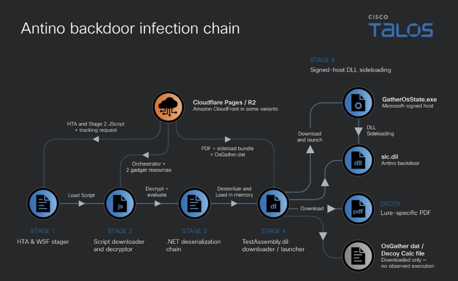

# UAT-11587 - Antino Backdoor Campaign

**UAT-11587**{.cve-chip} **China-nexus**{.cve-chip} **Antino Backdoor**{.cve-chip} **Rust Malware**{.cve-chip} **Government Targeting**{.cve-chip}

## Overview

Cisco Talos identified UAT-11587 and assesses with high confidence that it is China-nexus activity targeting government and policy organizations across Asia.

The campaign uses highly tailored spear-phishing emails and decoy content to deliver Antino, a previously undocumented Rust-compiled Windows backdoor. Talos assesses with moderate confidence that the activity supports intelligence gathering.

## Technical Details

Antino is a Rust-compiled Windows backdoor with capabilities for:

- Host reconnaissance
- Command shell and PowerShell execution
- File upload and download
- In-memory shellcode loading
- Persistence operations

A notable feature is command-and-control behavior using Microsoft Graph with Outlook and OneDrive workflows, leveraging Microsoft 365 objects as dead drops rather than relying only on traditional attacker-hosted C2 infrastructure.

Talos also documented abuse of Cloudflare infrastructure, including cloud-hosted payload staging.

Reported recurring five-stage infection chain:

1. Initial script execution.
2. Encrypted payload retrieval and decryption.
3. In-memory .NET loading.
4. Payload staging.
5. DLL sideloading through a legitimate Microsoft-signed executable.

## Technical Specifications

| **Attribute** | **Details** |
|---|---|
| **Threat Cluster** | UAT-11587 (Talos tracking) |
| **Assessed Nexus** | China-nexus (high-confidence Talos assessment) |
| **Malware Family** | Antino backdoor (Rust-compiled, Windows) |
| **Primary Targets** | Government and policy organizations across Asia |
| **C2 Characteristics** | Microsoft Graph with Outlook and OneDrive dead-drop style operations |
| **Delivery/Execution Chain** | Multi-stage loader with encrypted payloads, in-memory .NET activity, and DLL sideloading |

## Affected Products

- Windows endpoints at targeted organizations.
- Microsoft 365-connected enterprise environments where Outlook/OneDrive and OAuth/application access can be abused post-compromise.
- Email and cloud-content workflows susceptible to spear-phishing and staged payload retrieval.

## Attack Scenario

1. Attacker profiles a government or policy target.
2. A highly customized spear-phishing email is sent, often using political, diplomatic, security, or regional-policy themes.
3. Victim is directed to a decoy attachment or cloud-hosted content.
4. A multi-stage loader retrieves and decrypts additional components.
5. DLL sideloading is used to execute Antino.
6. Antino establishes persistence and communicates through Microsoft 365 using Microsoft Graph, Outlook, and OneDrive.
7. Attacker executes commands, runs PowerShell, collects information, transfers files, and can load additional shellcode.

## Impact Assessment

=== "Primary Impact"

    - Persistent remote access to targeted endpoints
    - Command execution and file-transfer capability supporting long-term intrusion
    - Elevated risk of sensitive information theft from policy, diplomatic, and defense contexts

=== "Scale and Exposure"

    - Talos reporting indicates approximately 350 compromised endpoints across identified activity
    - Centralized use of legitimate cloud services can reduce detection visibility for conventional network-based controls

=== "Strategic Risk"

    - Activity pattern is consistent with intelligence-collection objectives and potential follow-on compromise

## Mitigation Strategies

1. Strengthen targeted-phishing defenses and user awareness for policy-themed lure content.
2. Sandbox suspicious HTML/HTA and document-based content before user interaction.
3. Monitor and alert on suspicious `mshta.exe`, Windows Script Host, PowerShell, and unusual .NET in-memory execution.
4. Detect DLL sideloading patterns involving legitimate signed executables.
5. Monitor abnormal Microsoft Graph, Outlook, and OneDrive activity.
6. Investigate unusual OAuth/application permissions and token usage.
7. Isolate endpoints quickly when Antino indicators are detected.
8. Review and rotate credentials accessible from compromised systems.
9. Use behavior-based EDR detections rather than relying only on IP/domain blocking, since activity can transit legitimate Microsoft 365 infrastructure.

## Resources and References

!!! info "Public Reporting"
    - [China-nexus UAT-11587 targets government and policy organizations across Asia with Antino backdoor](https://blog.talosintelligence.com/china-nexus-uat-11587-targets-government-and-policy-organizations-across-asia-with-antino-backdoor/)
    - [Antino Backdoor Targets Asian Government Organizations](https://blog.netmanageit.com/antino-backdoor-targets-asian-government-organizations/)
    - [China-nexus UAT-11587 targets government and policy organizations across Asia with Antino backdoor - Live Threat Intelligence - Threat Radar | OffSeq.com](https://radar.offseq.com/threat/china-nexus-uat-11587-targets-government-and-policy-organizations-across-asia-with-antino-backdoor-c9030f900b59c0b1)

---

*Last Updated: October 1, 2026*
