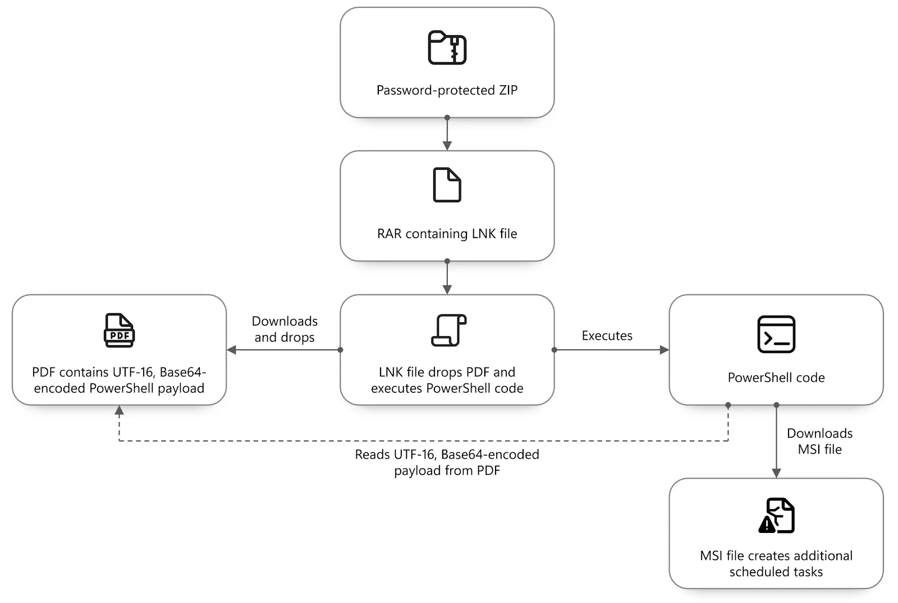

# Star Blizzard - RedFlick / CosmicPulse Campaign

**Star Blizzard**{.cve-chip} **RedFlick**{.cve-chip} **CosmicPulse**{.cve-chip} **Spear-Phishing**{.cve-chip} **State-Linked Activity**{.cve-chip}

## Overview

Russian state-linked threat actor Star Blizzard expanded activity in 2026 from highly targeted spear-phishing into larger-volume campaigns.

Microsoft reported at least 13 large-scale phishing campaigns, with tens to hundreds of emails per campaign, affecting more than 100 organizations primarily in the United States and United Kingdom.

The actor frequently impersonated reputable think tanks and NGOs, often using fake conference or event invitations as initial lures. Organizations associated with Ukraine and international policy were among key targeting themes.

Microsoft also described a technique named RedFlick that uses Windows Scheduled Tasks to facilitate malware deployment and eventually install the CosmicPulse Python-based backdoor.

## Technical Details

Observed infection chain:

1. Initial phishing email, often framed as conference, event, payment, or organizational communication.
2. Victim engagement phase where initial messages may contain no attachment; malicious payload is sent after response.
3. Delivery of password-protected ZIP or RAR archive, with password sometimes provided separately or inside an image.
4. Execution of a malicious LNK disguised as a PDF.
5. LNK-driven download and installation of a remotely hosted MSI package.
6. RedFlick persistence and execution setup via scheduled tasks masquerading as legitimate components.
7. WebDAV usage for remote resource access.
8. Abuse of control.exe to launch retrieval/execution of next-stage components.
9. CosmicPulse deployment by downloader malware previously tracked as NOROBOT/BAITSWITCH.

Observed scheduled-task names include:

- Internet Quality Test Connection
- Network Configuration Manager
- System Health Monitor

Microsoft reporting indicates the first task can transmit host/network name and username to C2 and facilitate remote DLL execution. The second supports WebDAV activity, while the third leverages control.exe for next-stage retrieval and execution.

Researchers also observed use of compromised WordPress and cPanel websites in phishing infrastructure, rather than relying only on attacker-created free email accounts.

## Technical Specifications

| **Attribute** | **Details** |
|---|---|
| **Threat Actor** | Star Blizzard (Russian state-linked, per public reporting) |
| **Primary Technique Shift** | Expansion from narrow spear-phishing to broader phishing campaigns |
| **Malware/Technique Labels** | RedFlick scheduled-task technique; CosmicPulse Python-based backdoor |
| **Initial Delivery** | Socially engineered phishing workflows with delayed payload delivery |
| **Execution Chain Components** | LNK, MSI, scheduled tasks, WebDAV, control.exe abuse, downloader/backdoor deployment |
| **Targeting Focus** | Government, policy, Ukraine-related and international-policy organizations |

## Affected Products

- Windows endpoints targeted through malicious archives, LNK files, and MSI execution.
- Enterprise email and collaboration environments exploited for phishing engagement.
- Organizations with weak controls on scheduled-task abuse, WebDAV activity, and endpoint script execution.

## Attack Scenario

1. Fake conference or event invitation is sent to the target.
2. Victim responds to initial legitimate-looking communication.
3. Follow-up phishing message delivers malicious content.
4. Password-protected archive is provided.
5. Archive contains a malicious LNK disguised as a PDF.
6. LNK executes commands to download a remote MSI installer.
7. RedFlick is installed and creates scheduled tasks for persistence/execution.
8. WebDAV accesses remote attacker resources.
9. control.exe is abused to retrieve or execute next-stage payloads.
10. CosmicPulse downloader/backdoor is deployed and establishes C2.
11. Attackers conduct espionage-focused data collection and follow-on actions.

## Impact Assessment

=== "Primary Impact"

    - Unauthorized access to targeted Windows systems
    - Long-term persistence via scheduled tasks
    - Remote execution capability through multi-stage malware chain

=== "Data and Strategic Risk"

    - Potential exposure of sensitive diplomatic, policy, financial, and government information
    - Increased risk for organizations connected to Ukraine-related policy work
    - Campaign scale growth increases attacker reach and potential victim volume

=== "Scale Context"

    - Public reporting indicates more than 100 affected organizations, while the exact count of fully compromised organizations is not publicly established

## Mitigation Strategies

1. Enable phishing-resistant MFA where possible.
2. Use advanced email security controls and attachment detonation/sandboxing.
3. Block or heavily restrict suspicious attachments and archive-delivered payloads.
4. Monitor for malicious LNK behavior and abnormal shortcut execution chains.
5. Monitor Windows Scheduled Tasks for suspicious creation/modification.
6. Restrict unnecessary outbound SSH and remote administrative channels.
7. Monitor abnormal WebDAV activity from user endpoints.
8. Alert on suspicious control.exe and msiexec.exe execution patterns.
9. Enable robust EDR/endpoint protection with behavioral analytics.
10. Apply attack-surface reduction rules and script-control hardening.
11. Monitor for Star Blizzard indicators of compromise from trusted intelligence feeds.
12. Keep systems and security tooling fully updated.
13. Train users to recognize targeted phishing and event-invitation lures.

## Resources and References

!!! info "Public Reporting"
    - [Russia's Star Blizzard Targets 100+ Organizations With Fake Event Invites to Deliver Backdoor](https://thehackernews.com/2026/09/russias-star-blizzard-targets-100.html)
    - [Star Blizzard refines phishing and malware delivery with the RedFlick technique | Microsoft Security Blog](https://www.microsoft.com/en-us/security/blog/2026/09/29/star-blizzard-refines-phishing-and-malware-delivery-with-the-redflick-technique/)

---

*Last Updated: October 1, 2026*
