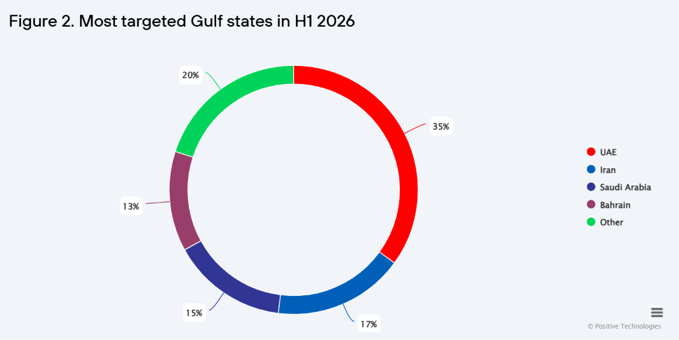
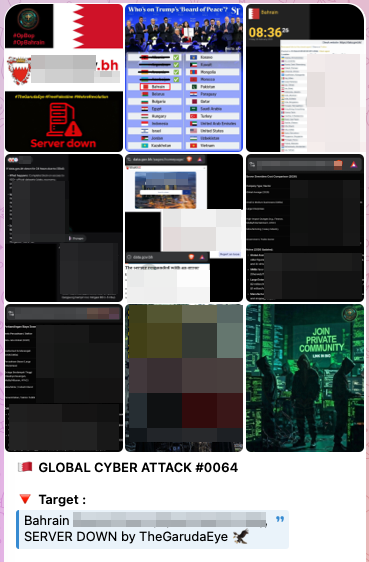
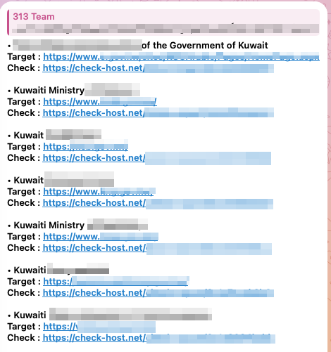
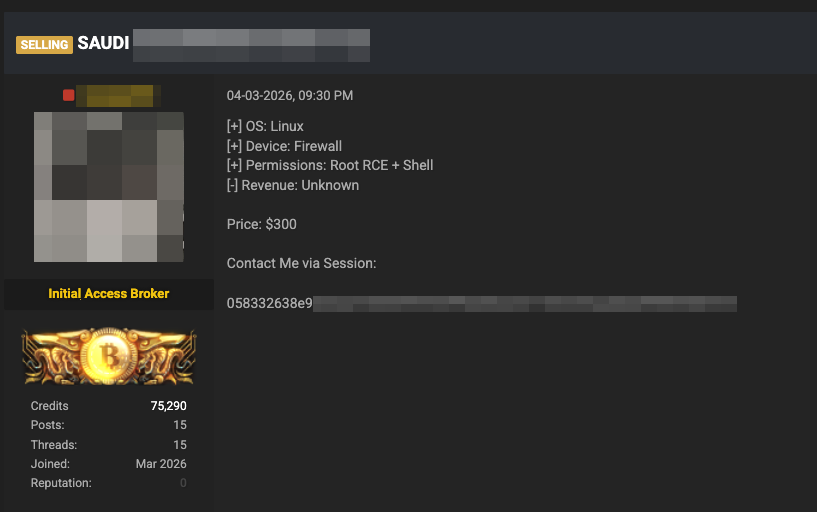
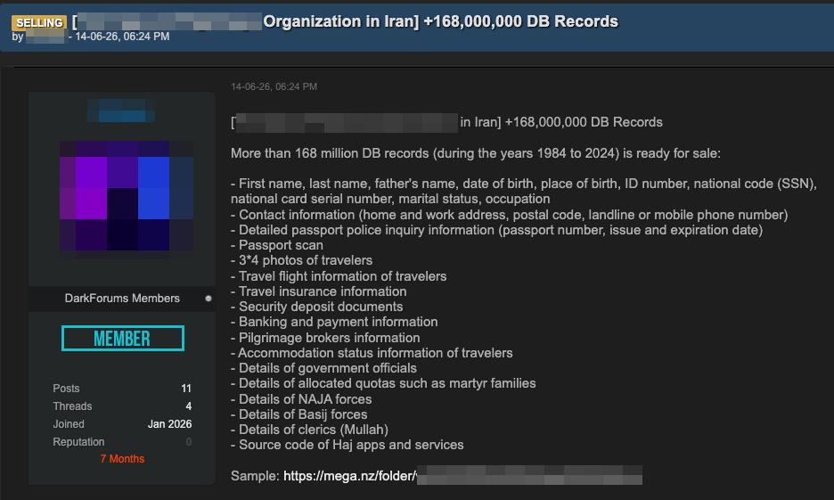

# Increasingly Complex Cyberattacks Targeting UAE and Saudi Arabia

**UAE**{.cve-chip} **Saudi Arabia**{.cve-chip} **Gulf Threat Landscape**{.cve-chip} **RAT Activity**{.cve-chip} **Critical Infrastructure Risk**{.cve-chip}

## Overview

H1 2026 reporting indicates an elevated cyber-threat landscape across Gulf states, with the UAE accounting for 35% and Saudi Arabia for 15% of recorded incidents, representing a combined 50% share.

The observed activity spans financially motivated cybercrime, hacktivist operations, and state-aligned threat behavior, with increasing attack complexity and automation trends noted in regional analysis.

## Technical Details

### Reported Attack Methods

- Vulnerability exploitation: 38%
- Malware deployment: 31%
- Social engineering: 27%

### Primary Target Categories

- Computers, servers, and network devices: 69%
- Web resources: 27%
- Employees: 25%
- IoT devices: 17%

### Malware Composition (Reported)

- RAT families represented 43% of malware attacks.
- Ransomware represented 35%.

## Technical Specifications

| **Attribute** | **Details** |
|---|---|
| **Timeframe** | H1 2026 |
| **Geographic Focus** | UAE and Saudi Arabia (plus wider Gulf context) |
| **Dominant Initial Technique** | Vulnerability exploitation |
| **Top Technical Target Class** | Computers/servers/network devices |
| **Notable Malware Trend** | High RAT prevalence with significant ransomware share |
| **Operational Concern** | Potential pivot toward critical infrastructure/OT environments |

## Affected Products

- Enterprise servers and endpoint fleets.
- Public-facing web platforms and digital services.
- Network/security infrastructure and management devices.
- IoT-connected operational and support assets.
- Personnel accounts and identity/access workflows affected by social-engineering campaigns.

## Attack Scenario

1. Attacker identifies vulnerable internet-facing or legacy assets.
2. Vulnerability exploit or weak-credential abuse provides foothold.
3. Malware payload (RAT/shell/ransomware precursor) is deployed.
4. Persistence and credential collection are established.
5. Lateral movement expands access across IT environment.
6. Adversary reaches higher-value systems, potentially including critical infrastructure or OT/ICS-adjacent environments.
7. Outcomes include data theft, espionage, ransomware impact, or operational disruption.

## Impact Assessment

=== "Regional Impact Indicators"

    - Operational disruption cited in 58% of reported incidents
    - Data breaches cited in 46%
    - Damage to national interests cited in 29%

=== "Sector Targeting"

    - Government organizations represented 27% of attacks
    - Industrial organizations represented 17%

=== "Criticality"

    - **High** due to broad regional concentration, multi-actor threat diversity, and sustained exploitation of both IT and potentially OT-relevant environments

## Mitigation Strategies

### Reduce Exploitable Exposure

- Prioritize patching of internet-facing and critical vulnerabilities.
- Decommission or isolate legacy systems where feasible.
- Minimize exposed attack surface and enforce hardened baseline configurations.

### Strengthen Identity and Access Controls

- Enforce strong authentication and MFA across privileged and remote access paths.
- Reduce standing privilege and apply least-privilege administration.

### Segment and Monitor IT/OT

- Segment IT and OT networks with strict policy controls.
- Monitor OT-relevant traffic patterns and protocol anomalies.
- Limit trust and routing paths between business systems and operational environments.

### Improve Detection and Preparedness

- Secure email and common malware-delivery channels.
- Continuously monitor IoT assets and unmanaged devices.
- Perform recurring security audits, penetration tests, cyber exercises, stress tests, and bug-bounty-informed hardening.

## Resources and References

!!! info "Public Reporting"
    - [UAE, KSA Face Spike in Increasingly Complex Cyberattacks](https://www.darkreading.com/threat-intelligence/uae-saudi-arabia-face-onslaught-of-increasingly-sophisticated-automated-cyberattacks)
    - [Cyberthreats to the Gulf states in H1 2026](https://positechglobal.com/en/research/analytics/cyberthreats-to-the-gulf-states-in-h1-2026/)

---

*Last Updated: September 29, 2026*
