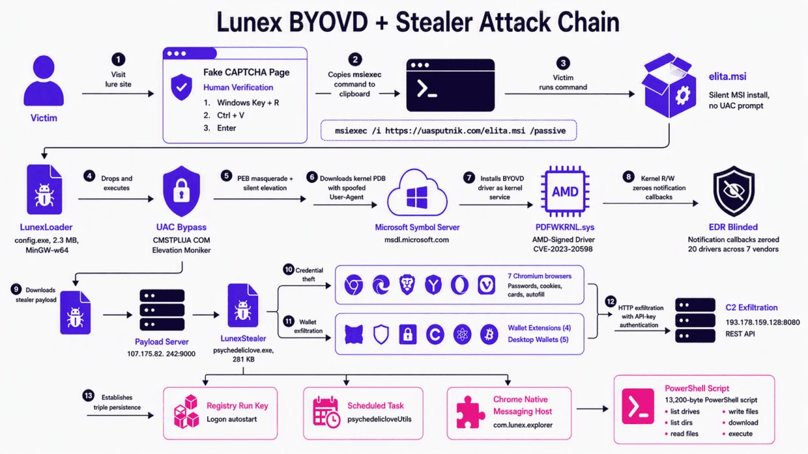

# Lunex Stealer Abuses AMD Driver

**Lunex Stealer**{.cve-chip} **Psychedelic Stealer**{.cve-chip} **BYOVD**{.cve-chip} **CVE-2023-20598**{.cve-chip} **ClickFix Social Engineering**{.cve-chip}

## Overview

Lunex is a malware-as-a-service (MaaS) platform associated with Psychedelic Stealer campaigns. Distribution is reported through compromised websites using fake Cloudflare/CAPTCHA verification pages and ClickFix-style social engineering.

The attack chain leverages a vulnerable AMD Radeon driver to interfere with endpoint security monitoring before deploying final information-stealing payloads.

## Technical Details

### Reported Infection Chain

- Fake CAPTCHA/verification page.
- Malicious MSI delivery.
- `LunexLoader` execution.
- UAC bypass via `CMSTPLUA` COM object.
- BYOVD path using `PDFWKRNL.sys` associated with **CVE-2023-20598**.
- Security-monitoring interference.
- Final Psychedelic/Lunex stealer deployment.

### Theft and Persistence Behaviors

- Credential theft from seven Chromium-based browsers.
- Theft of cryptocurrency-wallet data.
- Session-cookie and browser-data exfiltration.
- Malicious Chrome extension installation.
- PowerShell-based Native Messaging Host deployment.

### Defensive-Evasion Context

- Reported BYOVD stage weakens security visibility before payload actions.
- Native Messaging Host persistence can survive stealer removal, browser restarts, and system reboots.

## Technical Specifications

| **Attribute** | **Details** |
|---|---|
| **Malware Family/Platform** | Lunex MaaS / Psychedelic Stealer |
| **Primary Delivery Style** | Fake CAPTCHA + ClickFix social engineering |
| **Loader Stage** | Malicious MSI -> LunexLoader |
| **Privilege Path** | UAC bypass using CMSTPLUA COM object |
| **Kernel/Evasion Stage** | BYOVD using `PDFWKRNL.sys` (CVE-2023-20598 context) |
| **Primary Data Targets** | Browser credentials, cookies, wallet data, session artifacts |

## Affected Products

- Windows endpoints susceptible to social-engineering execution flows.
- Environments with vulnerable AMD Radeon driver versions present.
- Chromium-based browser users and systems storing high-value session/credential artifacts.

## Attack Scenario

1. Victim visits a compromised legitimate website.
2. Fake Cloudflare/CAPTCHA verification prompt is displayed.
3. ClickFix flow convinces victim to execute malicious command/installer.
4. MSI stage deploys and runs LunexLoader.
5. Loader performs UAC bypass.
6. Vulnerable AMD driver is loaded through BYOVD.
7. Security monitoring visibility is weakened.
8. Lunex/Psychedelic Stealer extracts browser credentials, cookies, and crypto-wallet data.
9. Persistence and remote filesystem capabilities are established.

## Impact Assessment

=== "Primary Impact"

    - Credential and session-cookie theft
    - Cryptocurrency-wallet data theft
    - Browser compromise and account-takeover risk

=== "Endpoint Security Impact"

    - Reduced EDR/security monitoring visibility
    - File read/write/download/execute abuse potential
    - Persistent browser-linked footholds via malicious extensions/Native Messaging Host

=== "Criticality"

    - **High** due to combined social engineering, UAC bypass, BYOVD evasion, and high-value credential/session theft outcomes

## Mitigation Strategies

### Patch and Driver Control

- Update AMD Radeon software and remove vulnerable driver versions.
- Enforce strict driver-loading and application-control policies.
- Monitor for unexpected `PDFWKRNL.sys` loading events.

### Detection and Response Hardening

- Detect ClickFix patterns, suspicious MSI execution, and anomalous PowerShell usage.
- Monitor UAC-bypass behaviors involving `CMSTPLUA`.
- Hunt for malicious Chrome extensions and unauthorized Native Messaging Host registration.
- Inspect and block suspicious browser-configuration changes.

### User and Incident Response Guidance

- Do not execute commands provided by CAPTCHA/verification pages.
- If compromise is suspected, isolate affected endpoints immediately.
- From a clean system, reset credentials and revoke active sessions/tokens.

## Resources and References

!!! info "Public Reporting"
    - [Lunex Stealer Abuses AMD Driver to Disable Security Monitoring and Steal Browser Credentials](https://thehackernews.com/2026/09/lunex-stealer-abuses-amd-driver-to.html)
    - [Lunex stealer abuses AMD driver to disable security monitoring and steal browser credentials | LavX News](https://news.lavx.hu/article/lunex-stealer-abuses-amd-driver-to-disable-security-monitoring-and-steal-browser-credentials)

---

*Last Updated: September 29, 2026*
