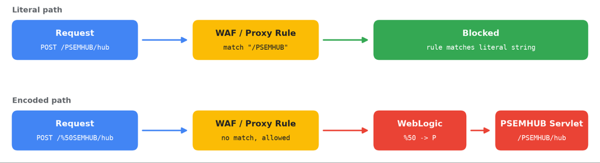

# ShinyHunters / UNC6240 - Oracle PeopleSoft WAF Bypass Campaign

**ShinyHunters**{.cve-chip} **UNC6240**{.cve-chip} **Oracle PeopleSoft**{.cve-chip} **CVE-2026-35273**{.cve-chip} **WAF Bypass**{.cve-chip}

## Overview

ShinyHunters resumed large-scale exploitation of Oracle PeopleSoft **CVE-2026-35273** after many organizations attempted mitigation through WAF blocking rules rather than patching vulnerable systems.

Attackers modified requests by URL-encoding part of the vulnerable `PSEMHUB` path, allowing some WAF implementations to miss malicious traffic while backend systems decoded and routed requests to the vulnerable component. Public reporting indicates web shells were deployed on dozens of systems globally.

## Technical Details

### Vulnerable Component

- Product area: Oracle PeopleSoft PeopleTools Environment Management Hub (PSEMHUB/EMHub).
- Exploitability: remote, unauthenticated.
- Primary risk: remote code execution.

### WAF-Bypass Mechanism

- Original target path: `/PSEMHUB/`
- Bypass variant: `/%50SEMHUB/` (`%50` URL-decodes to `P`).
- Some defensive controls reportedly inspected literal URL strings before normalization/decoding.
- Backend decoding then restored the effective path to `PSEMHUB`, enabling exploit traffic to reach target servlet logic.

### Post-Exploitation Behavior

- Java deserialization abuse used for command execution.
- JSP web shells reported, including `x.jsp` and `u.jsp`.
- Follow-on access/tunneling and potential data theft opportunities observed in campaign reporting.

## Technical Specifications

| **Attribute** | **Details** |
|---|---|
| **Campaign Actor Labeling** | ShinyHunters / UNC6240 (public reporting context) |
| **Primary CVE** | CVE-2026-35273 |
| **Exposed Surface** | PeopleTools Environment Management Hub (PSEMHUB) |
| **Attack Type** | Unauthenticated RCE via deserialization path |
| **Evasion Technique** | URL-encoding WAF bypass (`/%50SEMHUB/`) |
| **Persistence Indicator** | JSP web-shell deployment on compromised servers |

## Affected Products

- Oracle PeopleSoft deployments exposing vulnerable PeopleTools EMHub/PSEMHUB functionality.
- WebLogic-backed PeopleSoft environments where patching was delayed and WAF-only mitigations were applied.

## Attack Scenario

1. Attacker identifies internet-exposed or otherwise reachable unpatched PeopleSoft target.
2. Malicious POST requests are sent to PSEMHUB servlet paths.
3. Encoded path variant (`/%50SEMHUB/`) bypasses literal WAF rules in some environments.
4. Java deserialization exploitation yields remote code execution.
5. JSP web shells are deployed for persistence/command execution.
6. Adversary establishes additional access paths, potentially tunnels traffic, and may exfiltrate data.
7. Compromised PeopleSoft infrastructure is reused for follow-on activity.

## Impact Assessment

=== "Primary Impact"

    - Full server compromise potential via unauthenticated RCE
    - Persistent web-shell footholds on enterprise systems
    - Credential theft and lateral movement opportunities

=== "Data and Business Impact"

    - Potential exposure of HR, payroll, student, and other highly sensitive enterprise data in PeopleSoft ecosystems
    - Risk of significant downstream operational and compliance impact from long-lived compromise

=== "Criticality"

    - **Critical** due to active exploitation, bypass of weak compensating controls, and widespread enterprise data sensitivity in PeopleSoft environments

## Mitigation Strategies

### Patch and Exposure Control

1. Apply Oracle patch for CVE-2026-35273 immediately.
2. Do not rely solely on WAF URL-blocking rules.
3. Disable EMHub where feasible, or remove PSEMHUB application in applicable single-server deployments.

### Detection and Threat Hunting

4. Review WebLogic logs for `/PSEMHUB/` and encoded variants such as `/%50SEMHUB/`.
5. Inspect `PSEMHUB.war` for unauthorized JSP artifacts.
6. Validate all WebLogic nodes, including load-balanced nodes, for consistent compromise checks.

### Post-Compromise Hardening

7. Rotate credentials accessible to PeopleSoft service accounts.
8. Monitor outbound connections from PeopleSoft servers and investigate suspicious remote-management tooling.
9. Hunt for persistence, tunneling utilities, and unexpected administrative agents.

## Resources and References

!!! info "Public Reporting"
    - [ShinyHunters uses WAF bypass trick in Oracle PeopleSoft attacks](https://www.bleepingcomputer.com/news/security/shinyhunters-uses-waf-bypass-trick-in-oracle-peoplesoft-attacks/)
    - [ShinyHunters Renewed Mass Exploitation Campaign Targeting Oracle PeopleSoft | Google Cloud Blog](https://cloud.google.com/blog/topics/threat-intelligence/shinyhunters-renewed-mass-exploitation-campaign-targeting-oracle-peoplesoft)
    - [Oracle Security Alert Advisory - CVE-2026-35273](https://www.oracle.com/security-alerts/alert-cve-2026-35273.html)

---

*Last Updated: September 29, 2026*
