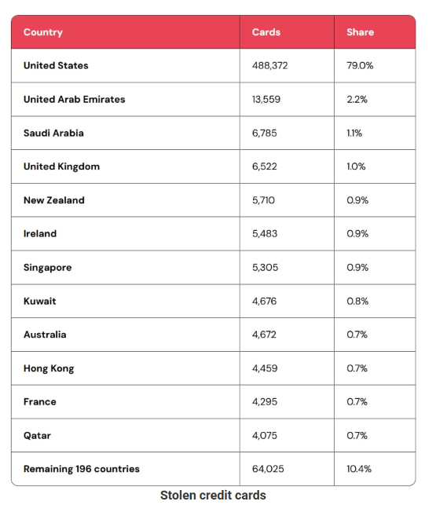
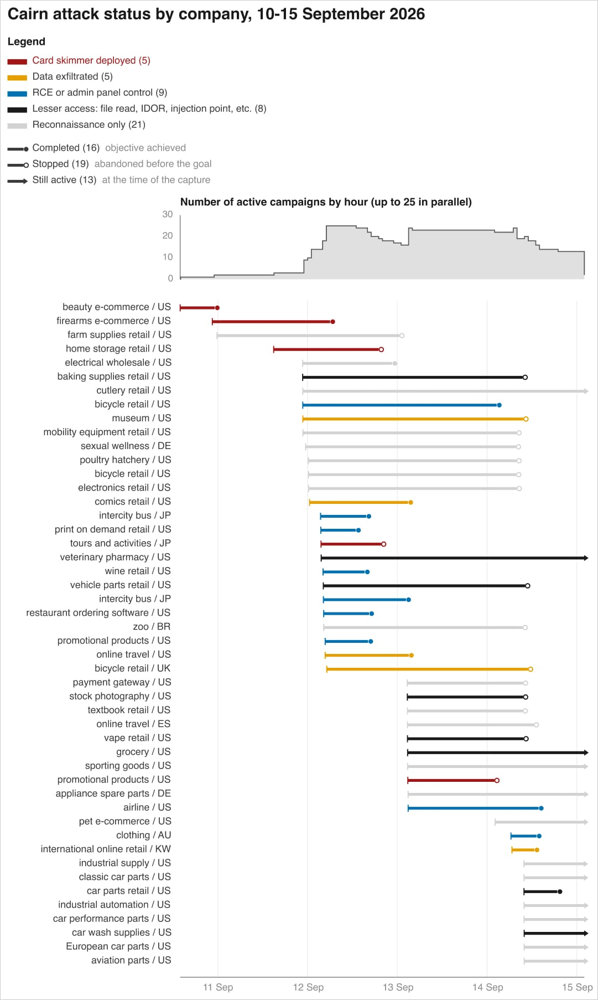

# AI-Agent E-Commerce Skimming Campaign

**AI-Agent Campaign**{.cve-chip} **E-Commerce Skimming**{.cve-chip} **Magecart-style Injection**{.cve-chip} **Credential Theft**{.cve-chip} **600K+ Cards**{.cve-chip}

## Overview

A financially motivated threat actor reportedly used multiple open-source AI-agent frameworks to automate reconnaissance, exploitation, credential theft, lateral movement, and payment-card skimmer deployment against online retailers.

Public reporting indicates more than 600,000 payment-card records were stolen, while skimming code was deployed across 100+ websites.

## Technical Details

Three AI-agent tools were reportedly used:

- Strix for automated reconnaissance and vulnerability scanning.
- Cairn for exploitation and post-compromise activity.
- Hermes for orchestration and campaign management.

Reported techniques included:

- SQL injection
- MFA bypass
- Web-shell deployment
- Privilege escalation
- Credential theft
- Database extraction
- CDN/object-storage manipulation
- Kubernetes configuration changes
- Malicious JavaScript injection into checkout flows

Cron jobs were reportedly used to restore skimmers after removal, increasing persistence and recovery speed.

## Technical Specifications

| **Attribute** | **Details** |
|---|---|
| **Threat Type** | Financially motivated, automation-heavy intrusion and skimming campaign |
| **Automation Stack** | Strix (recon/scanning), Cairn (exploitation/post-compromise), Hermes (orchestration) |
| **Initial Access Techniques** | Web-application exploitation, including SQL injection |
| **Post-Compromise Activity** | Credential theft, privilege escalation, lateral movement, data extraction |
| **Skimming Method** | Magecart-style JavaScript injection in checkout infrastructure |
| **Persistence Method** | Cron-based restoration of removed skimming code |

## Affected Products

- Internet-facing e-commerce web applications and associated checkout systems.
- Retail cloud/application stacks with weak secret management or over-privileged service accounts.
- Environments where CDN/object storage and Kubernetes controls were insufficiently monitored or protected.

## Attack Scenario

1. AI agents identify internet-facing targets.
2. Automated vulnerability scanning is conducted.
3. Web-application weaknesses are exploited.
4. Administrative access and/or web shells are established.
5. Credentials are stolen and databases/cloud secrets are accessed.
6. Payment-card information is extracted.
7. Magecart-style JavaScript skimmers are injected into checkout infrastructure.
8. Persistence is maintained and card-data collection continues.

## Impact Assessment

=== "Primary Impact"

    - More than 600,000 payment-card records reportedly stolen
    - 100+ websites infected with skimming code
    - Sustained exposure to payment fraud and account abuse

=== "Operational Risk"

    - Automated offensive workflows increased campaign scale and speed
    - In at least one reported case, autonomous cleanup activity deleted database tables
    - Demonstrates potential for unintended destructive effects from autonomous agent operations

=== "Criticality"

    - **High to Critical** due to broad customer impact, payment-data exposure, and persistent skimmer reinfection behavior

## Mitigation Strategies

1. Patch internet-facing web applications and eliminate SQL injection vulnerabilities.
2. Enforce strong MFA and monitor MFA-bypass attempts.
3. Apply least privilege to application, database, cloud, and CI/CD accounts.
4. Protect cloud secrets and rotate exposed credentials.
5. Monitor checkout JavaScript and third-party scripts for unauthorized changes.
6. Implement Content Security Policy (CSP) and Subresource Integrity (SRI) where appropriate.
7. Monitor CDN, object-storage, Kubernetes, and deployment-configuration changes.
8. Detect unexpected web shells, cron jobs, and unauthorized administrative accounts.
9. Use database activity monitoring and alert on large payment-data queries or exports.

## Resources and References

!!! info "Public Reporting"
    - [Malicious AI agents steal 600K credit cards, infect 100+ sites with skimmers](https://www.bleepingcomputer.com/news/security/malicious-ai-agents-steal-600k-credit-cards-infect-100-plus-sites-with-skimmers/)

---

*Last Updated: September 29, 2026*
