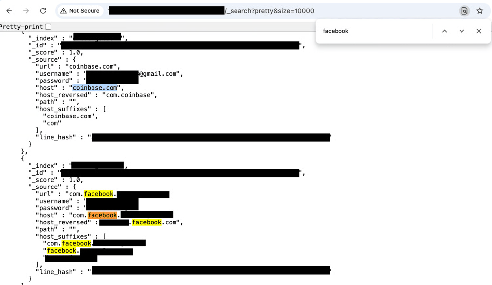

# 48 Million Gmail Usernames And Passwords Leaked Online

**Data Breach**{.cve-chip} **Credential Exposure**{.cve-chip} **Infostealer Campaign**{.cve-chip}

## Overview
A massive dataset containing 149,404,754 unique usernames and passwords was discovered completely unprotected on a cloud server, accessible without any authentication or encryption. 

The leaked credentials include an estimated 48 million Gmail accounts plus millions more from platforms including Facebook, Instagram, Netflix, TikTok, and other major services. 

The dataset appears to be the aggregated result of infostealer malware campaigns (keylogging and password-stealing software deployed on infected devices) that collected and exfiltrated credentials over an extended period. 

The repository lacked any access controls, encryption, or ownership identifiers, remaining publicly accessible to anyone with the direct link.

## Technical Specifications

| **Attribute** | **Details** |
|---------------|-------------|
| **Breach Type** | Credential Leak / Exposed Database |
| **Total Records** | 149,404,754 unique credentials |
| **Gmail Accounts** | ~48 million |
| **Affected Platforms** | Gmail, Facebook, Instagram, Netflix, TikTok, and others |
| **Data Format** | Raw credential records (email/username + password + login links) |
| **Hosting** | Unprotected cloud server |
| **Access Controls** | None (publicly accessible) |
| **Encryption** | No encryption applied |
| **Source** | Suspected infostealer malware aggregation |
| **Discovery Method** | Publicly accessible link |

## Affected Products
- Gmail (Google) - 48 million credentials
- Facebook
- Instagram
- Netflix
- TikTok
- Multiple other consumer and enterprise services
- Any platform credentials included in the dataset

## Attack Scenario
1. Infostealer malware (keyloggers, form-grabbers, clipboard monitors) infects victim devices through phishing, drive-by downloads, or software vulnerabilities
2. Malware captures login credentials as users enter them during authentication to various platforms and services
3. Stolen credentials are automatically exfiltrated to attacker-controlled servers and aggregated into a centralized database over months or years
4. The large credential repository is stored on a cloud server with default or misconfigured security settings, leaving it completely unprotected without password protection or encryption
5. The publicly accessible link to the database becomes available online, allowing threat actors, security researchers, or any internet user to browse, download, and weaponize the 149+ million exposed credentials

## Impact Assessment

=== "Integrity"
    * Unauthorized account modifications and configuration changes
    * Malicious email forwarding rules and account recovery settings altered
    * Credential and recovery email address changes by attackers
    * Device and application settings manipulation on compromised accounts
    * Creation of backup authentication methods controlled by threat actors

=== "Confidentiality"
    * Direct account takeover via leaked credentials for Gmail and other services
    * Exposure of personal communications, contacts, and files in cloud storage
    * Access to linked financial accounts (PayPal, banking, cryptocurrency)
    * Compromise of secondary authentication methods and backup codes
    * Identity theft using exposed personal information across linked accounts
    * Access to sensitive documents and private data stored in compromised services

=== "Availability"
    * Account lockouts due to unauthorized password changes
    * Loss of access to cloud services and stored data
    * Service disruption through attackers modifying account settings
    * Potential deletion or encryption of user data by threat actors
    * Reputational and operational impact from widespread credential misuse

## Mitigation Strategies

### Immediate Actions
- Change passwords for all affected accounts, particularly those in the exposed dataset
- Enable two-factor authentication (2FA) / multi-factor authentication (MFA) on all critical accounts
- Check email forwarding rules and connected devices for unauthorized access
- Review account activity logs for suspicious login patterns and locations
- Monitor linked accounts and financial platforms for unauthorized transactions
- Run comprehensive malware scans on all devices to remove infostealer malware

### Short-term Measures
- Implement password manager to generate and store unique passwords per service
- Update recovery email addresses and phone numbers to verified accounts only
- Review OAuth/third-party application permissions and revoke unauthorized access
- Use passkeys/WebAuthn as replacement for password-based authentication where available
- Enable security alerts and notifications for account activity
- Block known malicious IP addresses at network and device level

### Monitoring & Detection
- Monitor for credential stuffing attacks targeting exposed account credentials
- Track for unusual login locations, times, and devices accessing accounts
- Monitor for phishing emails targeting leaked credential holders
- Alert on password reset requests and new device authentication
- Monitor financial accounts for unauthorized transactions
- Track darknet and threat intelligence feeds for credential trading and usage
- Implement SIEM monitoring for failed and successful authentication attempts

### Long-term Solutions
- Organization-wide mandatory multi-factor authentication (MFA) and passkey deployment
- Deploy security awareness training focused on phishing, malware, and credential hygiene
- Implement endpoint detection and response (EDR) for infostealer malware prevention
- Use DNS filtering and web filtering to block malware distribution sites
- Establish credential exposure monitoring service to detect future breaches
- Enforce strong password policies and periodic credential rotation
- Implement zero-trust architecture limiting lateral movement after credential compromise
- Deploy behavioral analytics to detect compromised credential usage patterns

## Resources and References

!!! info "Official Documentation"
    - [48 Million Gmail Usernames And Passwords Leaked Online Again](https://www.forbes.com/sites/daveywinder/2026/01/25/48-million-gmail-usernames-and-passwords-leaked-online/?streamIndex=0)
    - [149M Instagram, TikTok passwords leaked as database sits open for weeks — Cybernews](https://cybernews.com/security/credential-leak-facebook-instagram-passwords-exposed/)
    - [Millions of Gmail accounts at risk after massive password leak, expert warns](https://www.thenews.com.pk/latest/1389651-millions-of-gmail-accounts-at-risk-after-massive-password-leak-expert-warns)
    - [149 million passwords for Gmail, Facebook, Instagram and other popular services exposed online — Tom's Guide](https://www.tomsguide.com/computing/online-security/149-million-passwords-for-gmail-facebook-instagram-and-other-popular-services-exposed-online-how-to-stay-safe-after-this-major-leak)
    - [149 million passwords exposed online — Euro Weekly News](https://euroweeklynews.com/2026/01/25/massive-data-leak-leaves-149-million-accounts-exposed-with-no-warning/)
    - [Login credentials of 149 million accounts including Gmail, Facebook, Netflix leaked — The Tribune](https://www.tribuneindia.com/news/science-technology/login-credentials-of-149-million-accounts-including-gmail-facebook-netflix-leaked-report/)
