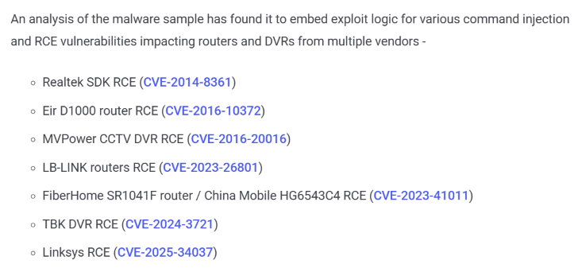

# Realtek Jungle SDK Exploitation - Cling IoT Botnet

**Realtek Jungle SDK**{.cve-chip} **CVE-2021-35394**{.cve-chip} **Cling Botnet**{.cve-chip} **IoT Exploitation**{.cve-chip} **STUN-based C2**{.cve-chip}

## Overview

Threat actors are actively exploiting CVE-2021-35394 in the Realtek Jungle SDK to compromise internet-exposed IoT devices.

A subset of observed activity deploys the Cling botnet, which establishes persistence, propagates to additional vulnerable devices, and communicates with operators using a STUN-based command-and-control mechanism.

By leveraging STUN-like traffic, malicious C2 activity can blend with legitimate NAT-traversal communications and complicate conventional detection.

## Technical Details

CVE-2021-35394 is an unauthenticated remote code execution vulnerability affecting the Realtek Jungle SDK diagnostic component commonly compiled as UDPServer.

Observed exploitation characteristics:

- Exploit traffic uses specially crafted UDP packets beginning with `orf;`.
- Attackers execute shell commands remotely.
- BusyBox `wget` is used to download and execute Cling payloads.

Cling includes exploit logic for multiple additional router/DVR vulnerabilities, including:

- CVE-2014-8361
- CVE-2016-10372
- CVE-2016-20016
- CVE-2023-26801
- CVE-2023-41011
- CVE-2024-3721
- CVE-2025-34037

Persistence and tampering behavior includes:

- `/root/.cling`
- `/usr/local/bin/.cling`
- `/etc/inittab`
- `/etc/init.d/rcS`
- `/etc/rc.d/rc.boot`

Cling can also replace legitimate `wget` with a malicious version so that later `wget` execution retriggers malware behavior.

C2 behavior:

- Bot contacts a hard-coded list of approximately 13 STUN servers roughly every 5 seconds.
- Malware records externally mapped NAT ports and sends custom registration data.
- Operator command data is encoded in the STUN transaction ID field.

## Technical Specifications

| **Attribute** | **Details** |
|---|---|
| **Primary CVE** | CVE-2021-35394 |
| **Affected Component** | Realtek Jungle SDK diagnostic service (UDPServer) |
| **Exploit Trigger Pattern** | Crafted UDP packets prefixed with `orf;` |
| **Payload Family** | Cling IoT botnet malware |
| **Persistence Methods** | Hidden files plus init-script/inittab modification and tool replacement |
| **C2 Profile** | STUN-like beaconing and command transport via transaction-ID encoding |

## Affected Products

- Internet-exposed IoT devices that embed vulnerable Realtek Jungle SDK implementations.
- Router, DVR, and embedded edge devices with reachable vulnerable UDP diagnostic services.
- Environments where unsupported or end-of-life embedded devices remain in production.

## Attack Scenario

1. Attacker scans the internet for vulnerable Realtek-based devices.
2. Attacker exploits CVE-2021-35394 over exposed UDP services.
3. Remote shell commands are executed.
4. BusyBox `wget` downloads Cling malware.
5. Cling runs and establishes persistence on the device.
6. Compromised host contacts STUN infrastructure.
7. Bot registers NAT-mapped ports and state information.
8. Operator commands are delivered through STUN-like traffic patterns.
9. Cling scans for additional vulnerable routers and DVRs.
10. Newly compromised nodes can be used for DDoS, proxying, and TCP tunneling operations.

## Impact Assessment

=== "Primary Impact"

    - Unauthorized remote control of vulnerable IoT devices
    - Persistent compromise across reboots
    - Expansion into large-scale IoT botnet infrastructure

=== "Operational and Network Impact"

    - Worm-like propagation to additional vulnerable endpoints
    - Potential DDoS abuse, proxy service abuse, and covert tunneling activity
    - Possible use of compromised edge devices as footholds for follow-on intrusion

=== "Detection Challenge"

    - STUN-based C2 can resemble legitimate NAT-traversal traffic and reduce visibility in traditional detections

## Mitigation Strategies

1. Patch devices affected by CVE-2021-35394.
2. Upgrade or replace unsupported/end-of-life Realtek-based devices.
3. Remove unnecessary internet exposure of routers, DVRs, and embedded appliances.
4. Restrict access to vulnerable UDP services with firewall and ACL controls.
5. Segment IoT networks from corporate and OT environments.
6. Monitor unexpected STUN traffic originating from embedded devices.
7. Detect repeated STUN Binding Requests, especially with abnormal or all-zero transaction IDs.
8. Investigate non-standard UDP traffic to public STUN infrastructure.
9. Hunt for `.cling` artifacts, modified init scripts, and suspicious `wget` replacements including `wget.r` and `wget.p` artifacts.
10. Monitor IoT assets for unexpected scanning, proxying, tunneling, and outbound command traffic.
11. Add Cling IOCs and behavior-based detections to SIEM, NDR, and IDS workflows.

## Resources and References

!!! info "Public Reporting"
    - [Realtek Jungle SDK Exploit Attempts Deliver Cling Botnet With STUN-Based C2](https://thehackernews.com/2026/10/realtek-jungle-sdk-exploit-attempts.html)
    - [A STUNning Disguise: Cling Malware Masquerades as Google](https://www.nozominetworks.com/blog/a-stunning-disguise-cling-malware-masquerades-as-google-)

---

*Last Updated: October 6, 2026*
