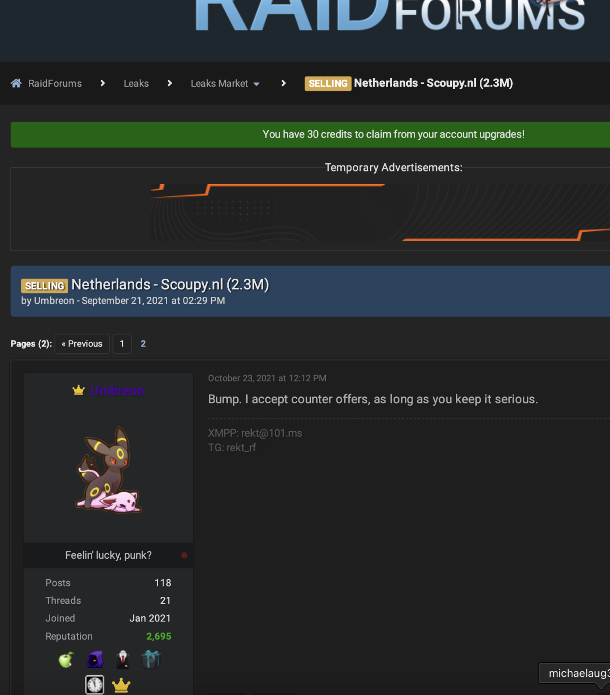

# ShinyHunters Suspect "Rey" Detained in Jordan

**ShinyHunters**{.cve-chip} **Law Enforcement Action**{.cve-chip} **Rey / ReyXBF**{.cve-chip} **Cybercrime Investigation**{.cve-chip} **Extortion Ecosystem**{.cve-chip}

## Overview

Jordanian authorities reportedly detained Saif al-Din Khader, identified in public reporting as an alleged ShinyHunters-linked suspect known online as "Rey" or "ReyXBF."

Multiple sources report that he is cooperating with the FBI and international law-enforcement partners. Reporting indicates this cooperation may support efforts to identify and locate other suspected ShinyHunters members.

The detention follows other arrests connected to broader investigations into ShinyHunters activity.

## Technical Details

- Investigators are reportedly examining seized electronic devices and digital communications.
- The investigation seeks attribution-relevant data including aliases, communication channels, member relationships, and supporting infrastructure.
- Public reporting states ShinyHunters has claimed responsibility for compromise of the FBI jobs portal and alleged theft of 2-3 TB of data; the full extent of those claims remains publicly unverified.
- The event represents investigative and disruption activity rather than disclosure of a newly patched software vulnerability.

## Technical Specifications

| **Attribute** | **Details** |
|---|---|
| **Event Type** | Law-enforcement detention and cooperation in cybercrime investigation |
| **Entity of Interest** | Alleged ShinyHunters-linked suspect ("Rey" / "ReyXBF") |
| **Primary Jurisdiction Mentioned** | Jordan (with FBI/international coordination in reporting) |
| **Core Investigative Focus** | Devices, communications, aliases, member mapping, and infrastructure links |
| **Claimed Prior Campaign Context** | FBI jobs portal compromise claim and multi-terabyte theft allegations (not fully publicly verified) |
| **Security Relevance** | Potential operational disruption and attribution enhancement against extortion ecosystem |

## Affected Products

- No single software product or CVE is identified in this report.
- The reported impact area is criminal infrastructure and victim organizations previously affected by ShinyHunters-linked intrusions and extortion campaigns.

## Attack Scenario

1. ShinyHunters-linked actors conduct large-scale data theft campaigns against organizations.
2. Stolen data is used for extortion pressure and threatened public disclosure.
3. Following high-profile allegations such as the FBI-jobs-related incident, cross-border investigations intensify.
4. Authorities detain suspected members in multiple jurisdictions and collect digital evidence.
5. Reported cooperation from detained suspects may provide leads on additional members, aliases, and operational infrastructure.

## Impact Assessment

=== "Investigation Impact"

    - Potential identification of additional suspected ShinyHunters members
    - Improved ability to correlate online aliases with real-world identities
    - Potential disruption of group coordination and infrastructure

=== "Operational Security Impact"

    - Increased pressure on affiliate and support networks linked to extortion workflows
    - Possible acceleration of takedowns, seizures, and coordinated legal actions

=== "Scale Context"

    - Public reporting cites allegations that the wider campaign affected 140+ organizations and generated at least $70 million in extortion payments (per referenced FBI-related reporting context)
    - Exact campaign compromise totals and claim verification remain subject to ongoing investigation

## Mitigation Strategies

1. Continue monitoring official law-enforcement and CERT advisories for attribution and IOC updates tied to ShinyHunters investigations.
2. Reassess exposure of previously compromised accounts, credentials, and extortion-related data if your organization was in prior victim scopes.
3. Enforce phishing-resistant MFA and privileged-account hardening to reduce reuse of stolen credentials.
4. Expand dark-web/extortion-leak monitoring for organization-specific identifiers and leaked-data indicators.
5. Validate incident-response playbooks for extortion scenarios, including legal-notification and law-enforcement coordination procedures.
6. Preserve relevant logs and forensic artifacts to support potential retrospective attribution matching.

## Resources and References

!!! info "Public Reporting"
    - [ShinyHunters Suspect Detained in Jordan Helps FBI Track Down the Group](https://securityaffairs.com/200338/cyber-crime/shinyhunters-suspect-detained-in-jordan-helps-fbi-track-down-the-group.html)
    - [ShinyHunters hacker reportedly detained in Jordan, aiding FBI](https://www.bleepingcomputer.com/news/security/shinyhunters-hacker-reportedly-detained-in-jordan-aiding-fbi/)
    - [EXCLUSIVE: ShinyHunters hacker in FBI data theft detained in Jordan, cooperating with bureau, sources say | Reuters](https://www.reuters.com/world/middle-east/key-shinyhunters-hacker-detained-jordan-is-cooperating-sources-say-2026-10-03/)
    - [ShinyHunters Suspect Rey Reportedly Detained in Jordan, Helping FBI Identify Group Members](https://thehackernews.com/2026/10/shinyhunters-suspect-rey-reportedly.html?m=1)
    - [Exclusive-ShinyHunters hacker in FBI data theft detained in Jordan, cooperating with bureau, sources say By Reuters](https://www.investing.com/news/stock-market-news/exclusiveshinyhunters-hacker-in-fbi-data-theft-detained-in-jordan-cooperating-with-bureau-sources-say-4930978)

---

*Last Updated: October 6, 2026*
