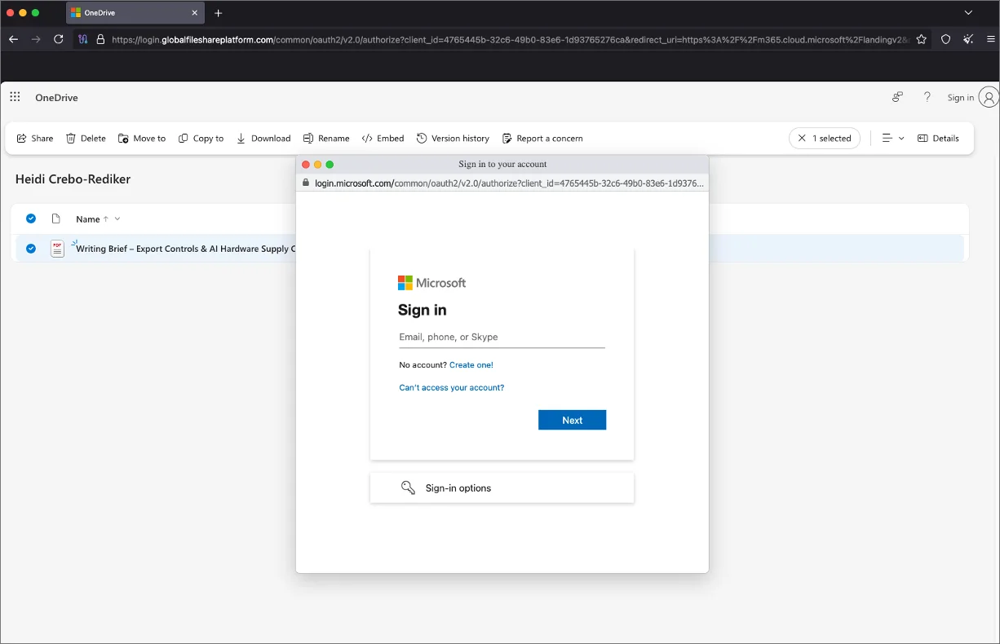

# TA419 - China-Aligned Targeted Phishing

**TA419**{.cve-chip} **AitM Phishing**{.cve-chip} **Frameless BitB**{.cve-chip} **Microsoft 365**{.cve-chip} **AI Policy Targeting**{.cve-chip}

## Overview

China-aligned threat actor TA419 targeted U.S. AI-policy experts through tailored relationship-based phishing.

Attackers impersonated real AI-policy figures and other prominent professionals, using credible invitations tied to AI policy, advisory committees, export controls, and supply-chain topics.

Reporting indicates the objective was intelligence collection on U.S. AI policy and regulation rather than broad indiscriminate credential theft.

## Technical Details

- Initial access: targeted spear-phishing and social engineering.
- Impersonation themes reportedly included former White House OSTP personnel, economists/foreign-policy experts, and an Anthropic employee.
- URL shorteners were used to redirect victims through attacker-controlled infrastructure.
- Cloudflare Turnstile appeared in the redirection/filtering flow.
- Fake OneDrive pages were used as lures.
- Adversary-in-the-middle (AitM) infrastructure proxied Microsoft authentication traffic.
- Primary identity target: Microsoft 365 and Microsoft Entra ID users.
- Frameless BitB (Browser-in-the-Browser) was used to present convincing fake Microsoft sign-in interfaces.
- Credential and MFA information could be captured.
- Authentication session cookies were captured post-login for potential session hijacking.
- Attacker-controlled scripts monitored victim authentication progress and automated portions of the workflow.

## Technical Specifications

| **Attribute** | **Details** |
|---|---|
| **Threat Actor** | TA419 (China-aligned in reporting context) |
| **Initial Vector** | Highly targeted spear-phishing/social engineering |
| **Impersonation Strategy** | Trusted policy and professional persona abuse |
| **Phishing Infrastructure** | URL shorteners, fake OneDrive, Turnstile-gated redirect chain |
| **Credential Capture Method** | AitM proxy plus Frameless BitB login simulation |
| **Post-Auth Objective** | Session-cookie theft and cloud-account access for intelligence collection |

## Affected Products

- Microsoft 365 user accounts and related cloud resources.
- Microsoft Entra ID authentication and session workflows.
- Organizations involved in AI policy, export-control analysis, and strategic technology research.

## Attack Scenario

1. TA419 selects an AI-policy expert target.
2. Attacker sends a tailored message impersonating a trusted policy professional.
3. Victim receives realistic collaboration/invitation content.
4. Victim engages, increasing trust.
5. TA419 sends shortened URL infrastructure.
6. Victim is redirected through attacker-controlled chain.
7. Fake OneDrive content is shown.
8. Cloudflare Turnstile appears in flow.
9. Victim reaches AitM phishing stack.
10. Frameless BitB fake Microsoft login interface is displayed.
11. Authentication is relayed to legitimate Microsoft infrastructure.
12. Victim credentials/MFA succeed.
13. TA419 captures credentials and session material for potential account access.

## Impact Assessment

=== "Primary Impact"

    - Compromise risk for Microsoft 365 and Entra ID accounts
    - Theft of credentials, MFA artifacts, and session information
    - Potential unauthorized access to email and cloud-hosted data

=== "Strategic Impact"

    - Possible exposure of sensitive AI-policy research and communications
    - Intelligence value tied to U.S. AI regulation, export controls, supply chains, military AI applications, and U.S.-China technology competition

=== "Follow-On Risk"

    - Session hijacking can enable persistent cloud access after initial phishing success
    - Elevated exposure for organizations active in strategic AI research and policymaking

## Mitigation Strategies

1. Deploy phishing-resistant MFA, preferably FIDO2/WebAuthn/passkeys.
2. Do not rely only on SMS or traditional OTP MFA for high-value accounts.
3. Verify unexpected professional invitations through independent channels.
4. Provide relationship-based phishing awareness training for high-value personnel.
5. Monitor Microsoft 365/Entra ID for unusual sign-ins, impossible travel, unfamiliar sessions/devices, suspicious token activity, and anomalous OAuth/application behavior.
6. Block or investigate suspicious URL-shortening services.
7. Monitor newly registered domains resembling Microsoft, OneDrive, or internal organization brands.
8. Apply Conditional Access and device-compliance enforcement.
9. Revoke active sessions/tokens immediately after suspected compromise.
10. Centralize identity/cloud logging for rapid detection and response.
11. Conduct targeted awareness programs for executives, researchers, policy experts, and administrators.

## Resources and References

!!! info "Public Reporting"
    - [China-Aligned TA419 Targets U.S. AI Policy Experts With Microsoft AitM Phishing](https://thehackernews.com/2026/10/china-aligned-ta419-targets-us-ai.html)
    - [Chinese hackers impersonated ex-US official to steal emails from AI experts | Reuters](https://www.reuters.com/legal/government/chinese-hackers-impersonated-ex-us-official-steal-emails-ai-experts-2026-10-01/)
    - [Hallucinating Credibility: China-Aligned TA419 Impersonates its Way into US AI Policy Circles | Proofpoint US](https://www.proofpoint.com/us/blog/threat-insight/hallucinating-credibility-china-aligned-ta419-impersonates-its-way-us-ai-policy)

---

*Last Updated: October 6, 2026*
