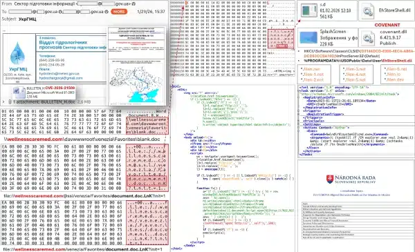

# Russian APT28 Exploit Zero-Day Hours After Microsoft Discloses Office Vulnerability

**CVE-2026-21509**{.cve-chip}  **APT28 (Fancy Bear)**{.cve-chip}  **Zero-Day Exploitation**{.cve-chip}

## Overview
CVE-2026-21509 is a security feature bypass vulnerability in Microsoft Office that allows attackers to craft specially crafted documents which bypass Object Linking and Embedding (OLE) mitigations. Russian state-sponsored threat actor APT28 (also known as Fancy Bear, UAC-0001) began exploiting this zero-day vulnerability within hours of Microsoft's disclosure, targeting Ukraine and EU organizations. Opening the malicious document leads to arbitrary code execution and deployment of the COVENANT post-exploit framework through a sophisticated multi-stage attack chain.

## Technical Specifications

| **Attribute** | **Details** |
|---------------|-------------|
| **CVE ID** | CVE-2026-21509 |
| **Vulnerability Type** | Security Feature Bypass (OLE/COM controls) |
| **CVSS Score**| 7.8 (High) |
| **Attack Vector** | Phishing with malicious Office document |
| **Threat Actor** | APT28 (Fancy Bear, UAC-0001) |
| **Attribution** | Russian state-sponsored |
| **User Interaction** | Required (open document) |
| **Post-Exploit Framework** | COVENANT |

## Affected Products
- Microsoft Office 2016
- Microsoft Office 2019
- Microsoft Office LTSC 2021
- Microsoft Office LTSC 2024
- Microsoft 365 Apps for Enterprise
- Status: Zero-day actively exploited / Emergency patches available

## Technical Details

The exploitation chain involves multiple sophisticated stages:

1. **Initial Exploitation**: Malicious Office document bypasses OLE/COM security controls
2. **WebDAV Connection**: Document connects to attacker infrastructure via WebDAV protocol
3. **Payload Retrieval**: Downloads malicious components:
    - Shortcut file with embedded code
    - DLL disguised as "EhStoreShell.dll"
    - Image file containing shellcode
4. **COM Hijacking**: Registry modifications to load malicious DLL when Explorer reloads
5. **Persistence**: Scheduled tasks and COM hijacking establish persistent foothold
6. **C2 Deployment**: COVENANT framework provides command-and-control over legitimate cloud infrastructure (Filen cloud storage)

## Attack Scenario
1. APT28 operators send phishing emails to targeted users in Ukraine and EU organizations
2. User opens the weaponized Office document in vulnerable Office installation
3. Office connects to attacker-controlled WebDAV server and retrieves payload components
4. Malicious persistent mechanisms (COM hijack, scheduled tasks) are established automatically
5. The COVENANT framework provides command and control capabilities for expanded espionage operations

## Impact Assessment

=== "Confidentiality"
    * Credential theft through advanced post-exploit framework
    * Data exfiltration capability targeting sensitive government and military information
    * Espionage activities focused on Ukraine and EU strategic assets
    * Access to classified or sensitive organizational communications

=== "Integrity"
    * Unauthorized system compromise and persistent backdoor installation
    * Modification of system registry and COM components
    * Deployment of attacker-controlled frameworks and tools
    * Potential manipulation of sensitive documents and data

=== "Availability"
    * Persistent access enabling long-term compromise
    * Lateral movement potential affecting multiple systems
    * Risk of disruptive operations following espionage phase
    * Operational disruption through malware deployment

## Mitigation Strategies

### Immediate Actions
- Apply emergency Microsoft patches for all affected Office versions immediately
- Restart Office applications for service-side protections on newer versions to take effect
- Hunt for indicators of compromise related to APT28 exploitation (WebDAV connections, COM hijacking artifacts)
- Isolate and investigate systems showing suspicious Office or Explorer behavior

### Short-term Measures
- Harden email defenses and filter attachments from external/untrusted senders
- Block or monitor WebDAV traffic to external destinations
- Monitor or restrict traffic to Filen cloud storage infrastructure used by attackers
- Implement strict macro and OLE object policies
- Deploy behavioral monitoring for abnormal COM/OLE activity

### Monitoring & Detection
- Use EDR/behavioral monitoring to detect abnormal COM/OLE activity
- Alert on suspicious WebDAV connections from Office processes
- Monitor for registry modifications related to COM hijacking
- Track creation of scheduled tasks by Office processes
- Watch for connections to Filen cloud storage or other suspicious C2 infrastructure
- Monitor for "EhStoreShell.dll" or similarly named suspicious DLLs

### Long-term Solutions
- Implement zero-trust architecture to limit lateral movement
- Deploy advanced email security with attachment sandboxing
- Maintain continuous vulnerability management and rapid patching cycles
- Conduct regular security awareness training on APT-level phishing campaigns
- Use application control to restrict Office macro and OLE execution
- Implement network segmentation to contain compromises

## Resources and References

!!! info "Official Documentation"
    - [Russian APT28 Exploit Zero-Day Hours After Microsoft Discloses Office Vulnerability - The Cyber Express](https://thecyberexpress.com/russian-apt28-exploit-zero-day-cve-2026-21509/)
    - [Russia-linked attackers abuse new Microsoft Office zero-day • The Register](https://www.theregister.com/2026/02/02/russialinked_apt28_microsoft_office_bug/)
    - [Russian hackers exploit recently patched Microsoft Office bug in attacks](https://www.bleepingcomputer.com/news/security/russian-hackers-exploit-recently-patched-microsoft-office-bug-in-attacks/amp/)
    - [APT28 Exploits Zero-Day Microsoft Office Flaw in Ukraine](https://www.ctrlaltnod.com/news/russian-apt28-exploits-zero-day-ms-office-flaw-in-ukraine-attack/)
    - [Fancy Bear Returns: APT28 Exploits Office Flaw in "Operation Neusploit"](https://securityonline.info/fancy-bear-returns-apt28-exploits-office-flaw-in-operation-neusploit/)
    - [UAC-0001 (APT28) Attack Detection: russia-Backed Actor Actively Exploits CVE-2026-21509 Targeting Ukraine and the EU | SOC Prime](https://socprime.com/blog/detect-uac-0001-attacks-exploiting-cve-2026-21509/)
    - [Actively exploited Microsoft Office Zero‑Day (CVE‑2026‑21509)](https://insights.integrity360.com/threat-advisories/actively-exploited-microsoft-office-zero-day-cve-2026-21509)
    - [APT28 Group Exploits New Microsoft Office Zero-Day in Attacks Targeting Ukraine and EU](https://abit.ee/en/cybersecurity/hackers-and-attacks/apt28-fancy-bear-microsoft-office-vulnerability-cve-2026-21509-cert-ua-cyber-attack-phishing-covenan-en)
    - [Hackers Actively Exploit Microsoft Office Zero-Day to Deliver Malware](https://cyberpress.org/microsoft-office-zero-day-to-deliver-malware/)

---

*Last Updated: February 3, 2026* 