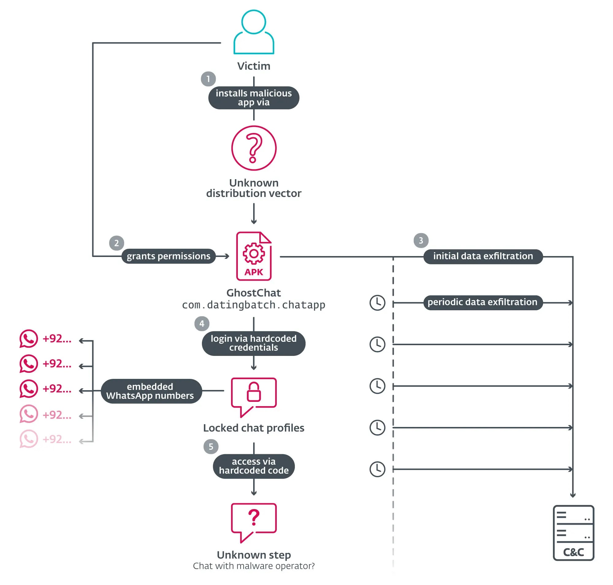

# GhostChat – Android Spyware Disguised as Chat/Dating Application

**Android Spyware**{.cve-chip}  **Sideloaded APK**{.cve-chip}  **Data Exfiltration**{.cve-chip}

## Overview
GhostChat is malicious Android spyware disguised as a harmless chat or dating application. It tricks users into installing it via manual sideloading (enabling "unknown sources") to bypass official store protections. Once installed, it runs silently to perform data collection and exfiltration while presenting a bogus user interface with fake female profiles. The spyware continuously monitors and steals contacts, images, PDFs, and Office documents while maintaining persistence across device reboots.

## Technical Specifications

| **Attribute** | **Details** |
|---------------|-------------|
| **Malware Type** | Android Spyware |
| **Distribution** | Sideloaded APK (not on Google Play) |
| **Delivery Vector** | Social media, malicious links, social engineering |
| **User Interaction** | Required (enable unknown sources, install APK) |
| **Persistence** | BOOT_COMPLETED intent, foreground service |
| **C2 Communication** | HTTPS (encrypted) |
| **Data Exfiltration** | Contacts, images, documents, device identifiers |

## Affected Products
- Android devices with sideloading enabled
- Users targeted through social engineering campaigns
- Victims redirected to attacker-controlled WhatsApp numbers
- Status: Active campaign

## Technical Details

### Delivery Mechanism
- Sideloaded APK distributed via social media or malicious links (not available on Google Play)
- Requires users to enable installation from "unknown sources"

### Permissions & Capabilities
- Requests broad permissions that appear normal for a chat app
- Enables extensive access to files, contacts, and device data
- Uses content observers to monitor new media and documents

### Persistence
- Registers with Android's `BOOT_COMPLETED` intent to restart after reboot
- Uses foreground persistence techniques to avoid termination by battery optimizers
- Scans for new content every few minutes

### Data Exfiltration
- Collects device identifiers, contacts, images, PDFs, and Office documents
- Sends stolen data to command-and-control server via HTTPS
- Continuous monitoring for new media and documents

### Social Engineering Interface
- Displays fake female profiles to simulate a dating app
- Profiles locked behind hardcoded "exclusive access" codes
- Redirects users into WhatsApp chats with attacker-controlled numbers

## Attack Scenario
1. Attacker distributes GhostChat disguised as a dating/chat app through social media or malicious links
2. Victim is tricked into downloading the APK from an external source
3. Victim enables installation from unknown sources and installs the application
4. App shows fake female profiles locked behind codes to simulate exclusivity
5. Victim is redirected to attacker-controlled WhatsApp numbers for further social engineering
6. Spyware component silently activates and begins collecting sensitive data
7. Malware establishes persistence and continuously harvests new content after reboots

## Impact Assessment

=== "Confidentiality"
    * Theft of contacts and personal information
    * Exfiltration of images and private photos
    * Stealing of PDF, Word, and Excel documents
    * Collection of device identifiers and system information

=== "Integrity"
    * Unauthorized access to device storage and files
    * Manipulation through fake dating profiles
    * Social engineering via redirected WhatsApp conversations
    * Potential installation of additional malicious payloads

=== "Availability"
    * Persistent surveillance and continuous monitoring
    * Battery drain from foreground services
    * Performance degradation from continuous file scanning
    * Privacy violation affecting device usability

## Mitigation Strategies

### Immediate Actions
- Remove GhostChat and any suspicious sideloaded applications immediately
- Review and revoke excessive app permissions on all installed apps
- Change passwords for accounts accessed from the compromised device
- Scan device with reputable mobile security software

### Short-term Measures
- Disable installation from unknown sources in Android settings
- Review recently installed applications and remove suspicious ones
- Block attacker-controlled WhatsApp numbers identified in campaigns
- Factory reset device if compromise is confirmed

### Monitoring & Detection
- Monitor unusual outbound connections and data usage patterns
- Alert on apps requesting excessive permissions
- Track background processes and foreground services
- Review boot-time application launches
- Watch for redirects to external messaging applications

### Long-term Solutions
- Only install apps from official app stores (Google Play Store)
- Enforce mobile device management (MDM) policies to block sideloading in enterprise environments
- Deploy mobile threat detection solutions that monitor app behaviors
- Conduct regular security awareness training on social engineering and sideloaded app risks
- Implement application vetting processes for enterprise BYOD programs
- Use Android Enterprise work profiles to separate personal and business data
- Regularly review installed applications and their permissions

## Resources and References

!!! info "Official Documentation"
    - [Fake Dating App Delivers Android Spyware in Targeted Campaign  | eSecurity Planet](https://www.esecurityplanet.com/threats/fake-dating-app-delivers-android-spyware-in-targeted-campaign/)
    - [GhostChat Spyware Attacking Android Users Via WhatsApp to Exfiltrate Sensitive Details](https://cybersecuritynews.com/ghostchat-spyware-attacking-android-users/amp/)
    - [GhostChat Spyware Targets Android Users Through WhatsApp, Steals Sensitive Data](https://gbhackers.com/ghostchat-targets-whatsapp-users/)
    - [Fake dating app used as lure in spyware campaign targeting](https://www.globenewswire.com/news-release/2026/01/28/3228114/0/en/Fake-dating-app-used-as-lure-in-spyware-campaign-targeting-Pakistan-ESET-Research-discovers.html)
