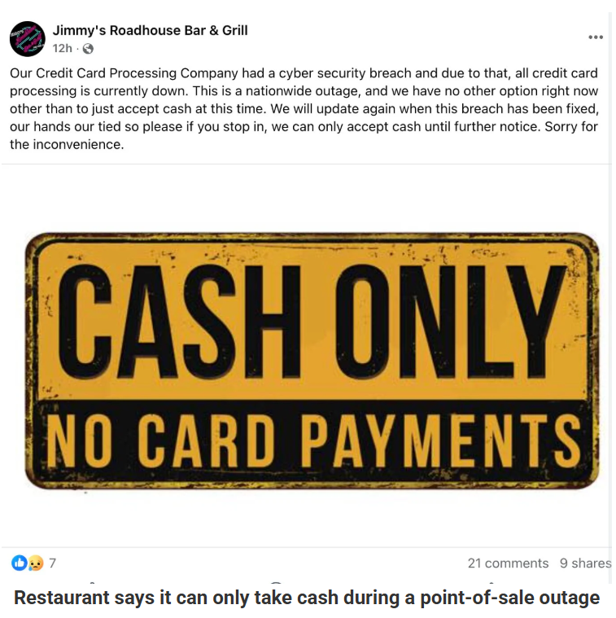

# BridgePay Network Solutions Ransomware Attack

**Ransomware**{.cve-chip}  **Payment Systems Outage**{.cve-chip}  **Critical Infrastructure**{.cve-chip}

## Overview
BridgePay Network Solutions, a major U.S. payment gateway and processing services provider, confirmed that a ransomware attack knocked key systems offline. The incident caused a nationwide outage of payment APIs, virtual terminals, hosted payment pages, and related services. Early forensic findings indicate encryption of files but no evidence that payment card data was compromised. Federal law enforcement and external cybersecurity teams are engaged in forensic analysis and recovery.

## Technical Specifications

| **Attribute** | **Details** |
|---------------|-------------|
| **Incident Type** | Ransomware Attack |
| **Target** | BridgePay Network Solutions |
| **Scope** | Payment APIs, virtual terminals, hosted payment pages |
| **Data Exposure** | No evidence of payment card compromise (early findings) |
| **Forensics** | FBI, U.S. Secret Service, external IR teams engaged |
| **Ransomware Group** | Not publicly disclosed |

## Affected Products
- BridgePay Gateway API (BridgeComm)
- PayGuardian Cloud API
- MyBridgePay virtual terminal and reporting
- Hosted payment pages
- PathwayLink gateway and boarding portals
- Status: Major service outages and ongoing recovery

## Technical Details

BridgePay confirmed ransomware as the root cause after internal investigation. Systems were encrypted, causing service unavailability across multiple production services. The precise intrusion vector and lateral movement details have not been disclosed publicly.

## Attack Scenario
1. Initial compromise via an unknown vector (phishing, credential theft, exposed service, or other intrusion method)
2. Ransomware deployment encrypts critical systems, causing API and payment service outages
3. Detection and confirmation through internal and external investigation
4. Containment and response involving federal law enforcement and cybersecurity teams
5. Ongoing recovery and restoration of services

## Impact Assessment

=== "Confidentiality"
    * No evidence of payment card data compromise (based on early findings)
    * Potential exposure of operational data during incident response
    * Risk of sensitive system data access remains under investigation

=== "Integrity"
    * Encryption and disruption of critical backend systems
    * Potential corruption or alteration of service configurations
    * Integrity of payment processing workflows affected

=== "Availability"
    * Nationwide outages of payment APIs and virtual terminals
    * Municipal billing portals and government payment systems went offline
    * Merchants forced into cash-only operations
    * Ongoing service degradation with unclear recovery timeline

## Mitigation Strategies

### Long-term Solutions
- Implement regular offline backups and ransomware recovery drills
- Enforce multi-factor authentication across critical systems
- Segment payment processing networks to limit lateral movement
- Conduct regular penetration tests and security audits

## Resources and References

!!! info "Incident Reports"
    - [Payments platform BridgePay confirms ransomware attack behind outage](https://www.bleepingcomputer.com/news/security/payments-platform-bridgepay-confirms-ransomware-attack-behind-outage/)
    - [BridgePay Network Solutions Status](https://status.bridgepaynetwork.com/)
    - [BridgePay Payment Gateway Hit by Ransomware, Causing Nationwide Transaction Outages](https://cybersecuritynews.com/bridgepay-ransomware-attack/)

---

*Last Updated: February 8, 2026* 
