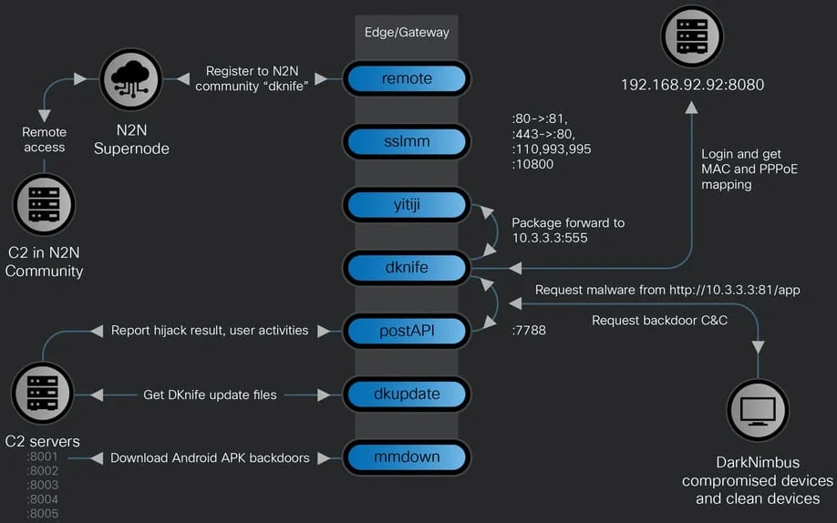
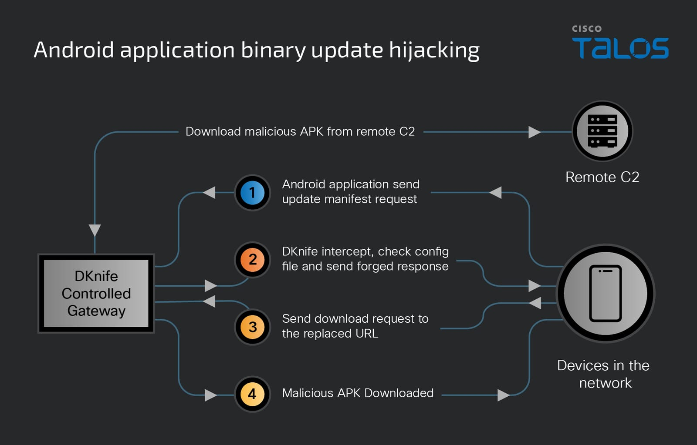

# DKnife – Linux-based Adversary-in-the-Middle (AiTM) Traffic-Hijacking Toolkit

**Adversary-in-the-Middle**{.cve-chip}  **Traffic Hijacking**{.cve-chip}  **Router Malware**{.cve-chip}

## Overview
DKnife is a modular post-compromise toolkit that runs on Linux-based routers and edge devices. Once installed, it intercepts and manipulates network traffic to spy on users, harvest credentials, hijack downloads and updates, and deliver additional malware such as ShadowPad and DarkNimbus. The framework enables adversary-in-the-middle (AiTM) operations by creating a virtual network bridge to inspect and alter traffic in real time.

## Technical Specifications

| **Attribute** | **Details** |
|---------------|-------------|
| **Threat Type** | AiTM Traffic Hijacking Toolkit |
| **Target Platform** | Linux-based routers and edge devices |
| **Deployment Stage** | Post-compromise | 
| **Core Capability** | Traffic interception, manipulation, and malware delivery |
| **Persistence** | Watchdog/updater component |
| **C2 Channels** | P2P VPN, relay infrastructure |

## Affected Products
- Linux-based routers and edge gateways
- Network infrastructure devices with compromised access
- Organizations relying on edge routing for traffic security
- Status: Active threat toolkit

## Technical Details

### Toolkit Components
- **dknife.bin** – Central DPI and activity logic
- **postapi.bin** – Command-and-control relay
- **sslmm.bin** – Reverse proxy for TLS interception
- **yitiji.bin** – Creates a virtual TAP interface to reroute traffic
- **remote.bin** – P2P VPN C2 channel
- **mmdown.bin** – Android APK downloader
- **dkupdate.bin** – Updater/watchdog

### Capabilities
- Create a bridged TAP interface to manipulate packets in real time
- Perform DNS hijacking and redirect traffic
- Intercept Android application update manifests
- Hijack Windows and other binary downloads for malicious payloads
- Harvest credentials via decrypted POP3/IMAP sessions
- Host phishing pages and disrupt security product traffic
- Monitor detailed user activity (e.g., app usage patterns)

## Attack Scenario
1. Router or edge device is compromised (initial access vector undisclosed)
2. DKnife components are deployed on the compromised device
3. **yitiji.bin** creates a TAP interface to intercept LAN traffic
4. Deep packet inspection analyzes traffic flows for manipulation
5. Downloads are hijacked to deliver malware and updates are swapped
6. Credentials are harvested from intercepted sessions
7. Additional payloads are delivered and persistence is maintained

## Impact Assessment

=== "Confidentiality"
    * Credential theft from email and messaging sessions
    * Exposure of sensitive communications and account data
    * Monitoring of user activity and application usage

=== "Integrity"
    * Manipulation of downloaded binaries and updates
    * Injection of malicious payloads into legitimate traffic
    * DNS tampering and redirection to attacker infrastructure

=== "Availability"
    * Disruption of security product traffic
    * Potential service degradation from traffic manipulation
    * Reduced trust and control over network infrastructure

## Mitigation Strategies

### Immediate Actions
- Update router firmware and apply latest security patches
- Replace unsupported or end-of-life network devices
- Rotate router admin credentials and revoke exposed access
- Disable or restrict remote management interfaces

### Short-term Measures
- Monitor network traffic for anomalies and unexpected TAP interfaces
- Deploy network-level IDS/IPS to detect DNS hijacking and traffic manipulation
- Enforce strong, unique admin credentials and MFA where possible
- Segment sensitive systems from general networks

### Monitoring & Detection
- Alert on creation of virtual interfaces or changes to routing tables
- Monitor DNS logs for suspicious resolution changes
- Detect unusual update manifest requests and binary download swaps
- Monitor outbound connections to unknown C2 infrastructure

### Long-term Solutions
- Implement Zero Trust network segmentation
- Adopt continuous network security monitoring and anomaly detection
- Use secure gateway appliances with integrity monitoring
- Establish incident response playbooks for router compromise scenarios
- Maintain inventory and lifecycle management for edge devices

## Resources and References

!!! info "Incident Reports"
    - [DKnife Linux toolkit hijacks router traffic to spy, deliver malware](https://www.bleepingcomputer.com/news/security/dknife-linux-toolkit-hijacks-router-traffic-to-spy-deliver-malware/)
    - [Knife Cutting the Edge: Disclosing a China-nexus gateway-monitoring AitM framework](https://blog.talosintelligence.com/knife-cutting-the-edge/)
    - [China-Linked DKnife AitM Framework Targets Routers for Traffic Hijacking, Malware Delivery](https://thehackernews.com/2026/02/china-linked-dknife-aitm-framework.html)
    - [DKnife - nowy cyberzagrożenie w routerach zmienia zasady bezpieczeństwa sieci | PressMind Labs](https://pressmind.org/dknife-nowy-cyberzagrozenie-w-routerach-zmienia-zasady-bezpieczenstwa-sieci/)
    - ['DKnife' Implant Used by Chinese Threat Actor for Adversary-in-the-Middle Attacks - SecurityWeek](https://www.securityweek.com/dknife-implant-used-by-chinese-threat-actor-for-adversary-in-the-middle-attacks/)

---

*Last Updated: February 8, 2026* 