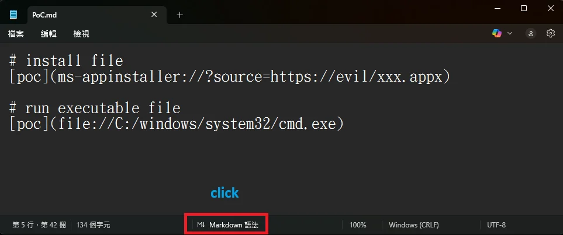
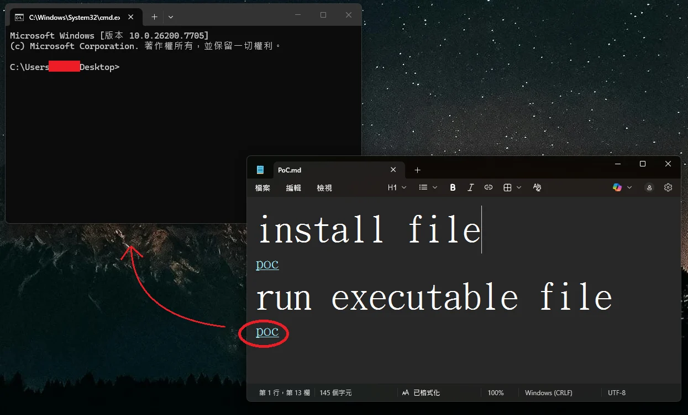

# Windows 11 Notepad Markdown Remote Code Execution Vulnerability

**CVE-2026-20841**{.cve-chip}  **Remote Code Execution**{.cve-chip}  **Markdown Link Handling**{.cve-chip}

## Overview
Microsoft's built-in Windows 11 Notepad app, redesigned with Markdown support, contained a critical flaw in its Markdown link handling that could allow attackers to trick users into executing malicious links embedded in .md files. This exploit could launch unverified protocols and run remote or local files without normal Windows security warnings. The vulnerability was patched in the February 2026 security update, with Notepad version 11.2510 and later now displaying warnings when clicking non-HTTP/HTTPS links.

## Technical Specifications

| **Attribute** | **Details** |
|---------------|-------------|
| **CVE ID** | CVE-2026-20841 |
| **CVSS Score** | 8.8 (High) |
| **Vulnerability Type** | Command Injection (CWE-77) |
| **Attack Vector** | Network (via email, download) |
| **Authentication** | None |
| **Complexity** | Low |
| **User Interaction** | Required (open .md file and click link) |
| **Affected Component** | Markdown link handling in Windows 11 Notepad |
| **Affected Versions** | Windows 11 Notepad < 11.2510 |

## Affected Products
- Windows 11 Notepad app (pre-version 11.2510)
- Systems with modern Windows 11 Notepad with Markdown support enabled
- Status: Patched in February 2026 / No known active exploitation

## Technical Details

### Vulnerability Characteristics
- **Type**: Improper neutralization of special elements used in commands (CWE-77)
- **Attack Surface**: Markdown link handling in Windows 11 Notepad
- **Execution Context**: Code runs with the same privileges as the logged-in user

### Exploit Mechanism
- Malicious links (e.g., `file:` or custom protocol URIs) embedded in Markdown files
- When clicked in Notepad, the app triggers protocol handlers that fetch and execute remote files
- Bypasses normal Windows security warnings for unverified content
- Can launch arbitrary executables or scripts from local or remote sources

## Attack Scenario
1. Attacker crafts a malicious `.md` Markdown file with embedded exploit links
2. File is delivered via email, messaging platform, or malicious download
3. Victim opens the `.md` file in Windows 11 Notepad
4. Victim clicks a specially crafted link rendered by Notepad
5. Notepad launches an unverified protocol handler without security warnings
6. Arbitrary software executes on the victim's system with user privileges

## Impact Assessment

=== "Confidentiality"
    * Potential data theft through malicious payload execution
    * Access to files and credentials under user privileges
    * Exposure of sensitive information stored on the system

=== "Integrity"
    * Malware installation and system modification
    * Alteration of files and system configurations
    * Backdoor deployment for persistent access

=== "Availability"
    * Potential system compromise affecting operations
    * Risk of ransomware or destructive payloads
    * Service disruption through malicious code execution

## Patch & Verification

### Windows 11 Notepad Security Update

*Windows 11 Notepad displays a warning when opening non-standard URLs*

The February 2026 security update introduced enhanced link validation in Notepad version 11.2510 and later. Users now receive explicit warnings before executing non-HTTP/HTTPS protocols, providing a critical security gate against silent exploitation.

## Mitigation Strategies

### Immediate Actions
- Apply the February 2026 security updates for Windows 11 Notepad
- Verify Notepad is updated to version 11.2510 or later
- Review systems for suspicious Markdown files or recent executions
- Educate users about the risk of untrusted Markdown files

### Short-term Measures
- Do not open untrusted Markdown (`.md`) files from unknown sources
- Avoid clicking links in Markdown files unless the source is verified
- Configure email and download filters to flag or quarantine `.md` attachments
- Use application control policies to restrict execution from user-writable directories

### Monitoring & Detection
- Monitor for unusual protocol handler invocations from Notepad.exe
- Alert on execution of files downloaded from suspicious sources
- Track Notepad.exe spawning child processes unexpectedly
- Review Windows security logs for abnormal file executions

### Long-term Solutions
- Maintain regular patching and update cycles for Windows components
- Implement least-privilege access controls to limit impact of code execution
- Use endpoint detection and response (EDR) to identify malicious behavior
- Conduct security awareness training on social engineering and file handling risks
- Establish file type restrictions or sandboxing for untrusted content

## Resources and References

!!! info "Incident Reports"
    - [Windows 11 Notepad flaw let files execute silently via Markdown links](https://www.bleepingcomputer.com/news/microsoft/windows-11-notepad-flaw-let-files-execute-silently-via-markdown-links/)
    - [Microsoft confirms 8.8-rated security issue in Windows 11 Notepad due to modernization efforts, Patch Tuesday fix rolling out](https://www.windowslatest.com/2026/02/12/microsoft-confirms-8-8-rated-security-issue-in-windows-11-notepad-due-to-modernization-efforts-patch-tuesday-fix-rolling-out/)
    - [Billions at Risk: Critical Windows Notepad Flaw Allows Remote Code Execution](https://securityonline.info/billions-at-risk-critical-windows-notepad-flaw-allows-remote-code-execution/)
    - [CVE Alert: CVE-2026-20841 - Microsoft - Windows Notepad - RedPacket Security](https://www.redpacketsecurity.com/cve-alert-cve-2026-20841-microsoft-windows-notepad/)
    - [Microsoft Patch Tuesday Fixes Notepad Markdown RCE CVE-2026-20841 | Windows Forum](https://windowsforum.com/threads/microsoft-patch-tuesday-fixes-notepad-markdown-rce-cve-2026-20841.400915/#post-957949)

---

*Last Updated: February 12, 2026* 