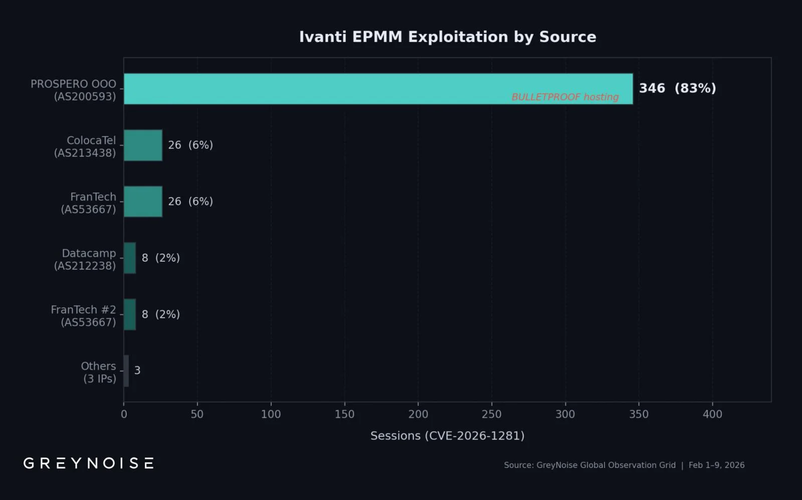

# CVE-2026-1340 — Ivanti Endpoint Manager Mobile (EPMM) Pre-Auth Remote Code Execution


**CVE-2026-1340**{.cve-chip}  **CVE-2026-1281**{.cve-chip}  **Remote Code Execution**{.cve-chip}  **Pre-Authentication**{.cve-chip}  **Zero-Day**{.cve-chip}

## Overview
CVE-2026-1340 is a severe code-injection vulnerability in Ivanti Endpoint Manager Mobile (EPMM) that allows unauthenticated attackers to send crafted HTTP requests that execute arbitrary system commands on vulnerable servers. The flaw has been actively exploited in the wild and is often chained with CVE-2026-1281 for enhanced exploitation capability. According to BleepingComputer reporting, 83% of observed exploitation activity was linked to a single threat actor conducting mass exploitation campaigns. The vulnerability stems from improper input handling in legacy scripts processed by the EPMM server, leading to unsafe command execution without authentication requirements.

## Technical Specifications

| **Attribute** | **Details** |
|---------------|-------------|
| **CVE ID** | CVE-2026-1340 (often chained with CVE-2026-1281) |
| **Product** | Ivanti Endpoint Manager Mobile (EPMM) |
| **Vulnerability Type** | Code Injection → Remote Code Execution (RCE) |
| **CVSS Score** | 9.8 (Critical) |
| **Authentication Required** | None (Pre-Authentication) |
| **Attack Vector** | Network (HTTP) |
| **User Interaction** | None |
| **Privileges Required** | None |
| **Impact** | Complete system compromise |
| **Root Cause** | Improper input handling in legacy EPMM scripts |
| **Exploitation Status** | Actively exploited in the wild |

## Affected Products
- **Ivanti Endpoint Manager Mobile (EPMM)** - vulnerable versions
- Internet-exposed EPMM servers
- Government agencies and enterprise organizations using EPMM
- Mobile device management infrastructure
- Status: Actively exploited by automated campaigns and targeted threat actors

## Technical Details

### Vulnerability Characteristics
- **Type**: Code Injection enabling Remote Code Execution
- **Authentication**: None required (pre-authentication vulnerability)
- **Root Cause**: Improper input handling in legacy scripts processed by EPMM server
- **Unsafe Behavior**: User-controlled input passed directly to system command execution
- **Attack Surface**: Internet-facing EPMM server HTTP endpoints

### Exploitation Method
Attackers send specially crafted HTTP requests containing injected shell commands to vulnerable EPMM servers. The server processes unsanitized input from these requests and executes attacker-controlled commands with the privileges of the EPMM service account:

```
POST /vulnerable-endpoint HTTP/1.1
Host: target-epmm.example.com
Content-Type: application/x-www-form-urlencoded

parameter=value; malicious_command; additional_commands
```

### Observed Attack Activity
- **Automated Scanning**: Mass internet scanning for exposed EPMM servers
- **User-Agent Rotation**: Approximately 300 rotating User-Agent strings to evade detection
- **DNS Callback Verification**: Use of Out-of-Band Application Security Testing (OAST) techniques with DNS callbacks to verify exploitation success
- **Mass Exploitation**: Coordinated campaigns tracked by GreyNoise and other threat intelligence platforms
- **Single Threat Actor**: 83% of exploitation activity attributed to one threat actor

### Exploit Chaining
CVE-2026-1340 is frequently chained with CVE-2026-1281 to enhance exploitation capabilities:

- CVE-2026-1281 may provide alternative access vectors or privilege escalation
- Combined exploitation enables more robust compromise
- Chaining increases attacker flexibility and persistence options




## Attack Scenario
1. **Internet Reconnaissance**: 
    - Attacker scans internet for exposed Ivanti EPMM servers
    - Identifies vulnerable versions through banner grabbing or service fingerprinting
    - Maps accessible HTTP endpoints and server configuration

2. **Exploitation Preparation**:
    - Crafts HTTP requests with malicious command injection payloads
    - Prepares DNS callback infrastructure for exploitation verification (OAST)
    - Rotates User-Agent strings to avoid signature-based detection

3. **Initial Exploitation**:
    - Sends specially crafted HTTP requests with injected shell commands
    - Server processes unsanitized input through vulnerable legacy scripts
    - Commands execute with EPMM service account privileges
    - DNS callbacks confirm successful exploitation

4. **Remote Shell Access**:
    - Establishes interactive shell access to compromised EPMM server
    - Executes reconnaissance commands to profile system and network
    - Identifies managed devices, policies, and stored credentials

5. **Persistence & Malware Deployment**:
    - Installs web shells for persistent backdoor access
    - Deploys malware, ransomware, or data exfiltration tools
    - Creates additional backdoor mechanisms for redundant access
    - May establish C2 communication channels

6. **Lateral Movement & Expansion**:
    - Pivots to managed mobile devices through EPMM infrastructure
    - Accesses connected enterprise networks and systems
    - Leverages EPMM credentials to compromise additional infrastructure
    - Uses EPMM as trusted pivot point for broader enterprise compromise

## Impact Assessment

=== "System & Server Compromise"
    * Complete remote compromise of Ivanti EPMM server
    * Full control over mobile device management infrastructure
    * Ability to execute arbitrary commands with service account privileges
    * Deployment of ransomware, backdoors, and persistent malware
    * Operational disruption of mobile device management capabilities
    * Loss of administrative control over EPMM platform

=== "Mobile Device & Endpoint Impact"
    * Unauthorized control of all managed mobile devices
    * Ability to push malicious profiles, applications, or policies to devices
    * Access to device configurations, certificates, and credentials
    * Potential for mass mobile device compromise across enterprise
    * Exposure of employee personal and corporate data on devices
    * Remote wipe or lock capabilities abused by attackers

=== "Enterprise & Network Impact"
    * Credential theft for EPMM administrative and service accounts
    * Configuration data exfiltration exposing network topology
    * Lateral movement capability across enterprise networks
    * Pivot point for attacking connected systems and applications
    * Government and enterprise breaches already reported
    * Regulatory exposure and compliance violations
    * Reputational damage and loss of customer trust
    * Potential for widespread ransomware deployment

## Mitigation Strategies

### Immediate Actions (CRITICAL)
- **Patch Immediately**: Apply official Ivanti security patches without delay
- **Upgrade EPMM**: Update to latest secure EPMM version recommended by Ivanti
- **Emergency Isolation**: If patching not immediately possible, isolate EPMM servers from public internet
- **Incident Investigation**: Review logs for indicators of compromise and suspicious HTTP requests

### Network Exposure Reduction
- **Remove Public Access**: Eliminate direct internet exposure of EPMM servers immediately
- **VPN Requirement**: Require VPN with multi-factor authentication for all EPMM administrative access
- **IP Allowlisting**: Restrict access to EPMM to specific trusted IP ranges only
- **Firewall Rules**: Implement strict firewall rules blocking public HTTP/HTTPS access
- **Network Segmentation**: Isolate EPMM infrastructure in secure network segment with egress filtering

### Detection & Monitoring
- **Log Analysis**: Monitor EPMM logs for:
    - Suspicious HTTP requests with special characters or command separators
    - Unusual User-Agent strings or rapidly rotating User-Agents
    - Abnormal process execution from EPMM service account
    - Unexpected outbound connections or DNS queries
    - Failed and successful authentication attempts from unusual sources
- **IDS/IPS Deployment**: Deploy intrusion detection/prevention signatures for CVE-2026-1340 exploitation attempts
- **Network Traffic Analysis**: Alert on unusual outbound connections from EPMM servers

### Long-term Security Hardening
- **Security Scanning**: Regularly scan EPMM infrastructure for vulnerabilities
- **Access Control**: Enforce least privilege for all EPMM administrative access
- **Monitoring Automation**: Implement automated alerting for suspicious EPMM activity
- **Zero Trust Architecture**: Apply zero trust principles to mobile device management infrastructure

## Resources and References

!!! info "Incident Reports"
    - [One threat actor responsible for 83% of recent Ivanti RCE attacks](https://www.bleepingcomputer.com/news/security/one-threat-actor-responsible-for-83-percent-of-recent-ivanti-rce-attacks/)
    - [Dutch Authorities Confirm Ivanti Zero-Day Exploit Exposed Employee Contact Data](https://thehackernews.com/2026/02/dutch-authorities-confirm-ivanti-zero.html)
    - [CVE-2026-1281, CVE-2026-1340: Ivanti EPMM Zero-Day Vulnerabilities - Tenable](https://www.tenable.com/blog/cve-2026-1281-cve-2026-1340-ivanti-endpoint-manager-mobile-epmm-zero-day-vulnerabilities)
    - [Critical vulnerabilities in Ivanti EPMM](https://www.cert.europa.eu/publications/security-advisories/2026-001/pdf)
    - [CVE-2026-1281 & CVE-2026-1340: Actively Exploited Pre-Authentication RCE - Security Boulevard](https://securityboulevard.com/2026/02/cve-2026-1281-cve-2026-1340-actively-exploited-pre-authentication-rce-in-ivanti-epmm/)

---

*Last Updated: February 17, 2026* 