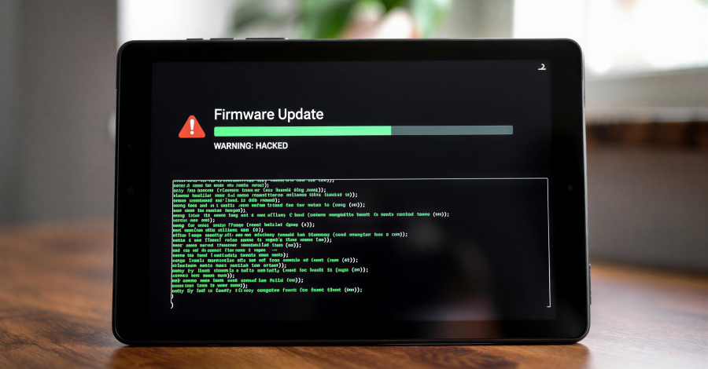

# Keenadu — An Android Firmware-Embedded Backdoor Malware

**Supply Chain Compromise**{.cve-chip}  **Android Backdoor**{.cve-chip}  **Firmware-Level**{.cve-chip}  **Preinstalled Malware**{.cve-chip}

## Overview
Keenadu is a sophisticated backdoor malware found pre-installed in Android device firmware as a result of a supply-chain compromise. It is integrated into core system components and loaded into every application process via the Android Zygote system, the master process that launches all apps. This positions the malware below the application layer, subverting Android sandboxing and enabling persistent control even across factory resets. Keenadu operates as a multi-stage loader, fetching additional modules for various functions, and can be delivered through compromised firmware images, signed OTA updates, or modified system apps.

## Technical Specifications

| **Attribute** | **Details** |
|---------------|-------------|
| **Malware Family** | Keenadu |
| **Platform** | Android (firmware-level) |
| **Infection Vector** | Supply-chain compromise / preinstalled firmware |
| **Persistence** | OS-level (Zygote injection) |
| **Distribution** | Compromised firmware, signed OTA updates, modified system apps |
| **Execution Context** | Loaded into every app process via Zygote |
| **Primary Objectives** | Ad fraud, device control, data access |
| **Estimated Impact** | 13,000+ devices infected worldwide |

## Affected Products
- Android devices with compromised firmware images
- Tablets and low-cost Android devices reported in telemetry
- Devices receiving contaminated OTA updates
- Systems with modified system apps (launcher, facial recognition service)
- Status: Ongoing exposure until clean firmware updates are applied

## Technical Details

### Firmware-Level Integration
- Embedded in firmware libraries (e.g., deep in `libandroid_runtime.so`)
- Loaded into every app process at startup via Android Zygote
- Subverts Android sandboxing by operating below app layer
- Survives factory reset due to firmware persistence

### Multi-Stage Loader Architecture
- Initial loader embedded in system library
- Pulls additional modules on demand for specific functions
- Supports remote payload delivery for varied operator objectives
- Can update or replace modules through OTA channels

### Distribution Vectors
- Compromised firmware images in device manufacturing pipeline
- Signed OTA updates distributed through legitimate channels
- Modified system apps (e.g., launcher, facial recognition service)
- Malicious apps on official stores (in some cases)

### Capabilities
- Hijack browser searches for ad fraud
- Act as botnet clickers for advertising revenue
- Install or monitor apps and user actions
- Potential theft of sensitive data (messages, credentials, media)
- Remote command execution and device control

## Attack Scenario
1. **Supply Chain Compromise**: Malicious code injected into firmware build or distribution process
2. **Device Shipment**: Devices shipped to customers with infected firmware preinstalled
3. **Zygote Injection**: Keenadu loads into Zygote and propagates into every app process
4. **Remote Module Delivery**: Operators issue payloads for ad fraud, surveillance, or data theft
5. **Persistence**: Contaminated OTA firmware updates maintain long-term presence
6. **Expansion**: Additional devices infected through compromised firmware and OTA channels

## Impact Assessment

=== "Device Control"
    * Full remote control of affected Android devices
    * Persistent execution below application sandboxing controls
    * Ability to deploy new payloads on demand
    * Survives factory reset due to firmware-level presence

=== "Data Exposure"
    * Potential theft of user messages, credentials, and media
    * Monitoring of installed apps and user behavior
    * Collection of device identifiers and telemetry
    * Unauthorized access to sensitive personal information

=== "Operational & Economic Impact"
    * Advertising fraud through search hijacking and click botnets
    * Loss of trust in device integrity and firmware supply chain
    * Difficult remediation due to firmware-level compromise
    * Potential regulatory and reputational damage for vendors

## Mitigation Strategies

### For Users & Device Owners
- Avoid use of affected devices until clean firmware is available
- Apply trusted firmware updates from manufacturers as soon as released
- Avoid installing apps from unofficial or third-party sources
- Validate device models against vendor advisories or security reports
- Consider replacing affected devices if clean firmware is unavailable

### For Manufacturers & Vendors
- Enhance supply chain security and firmware build integrity controls
- Monitor firmware signing pipelines and validate all components before release
- Audit OTA infrastructure for compromise and unauthorized updates
- Implement reproducible builds and integrity verification for firmware
- Publish verified hashes and transparency reports for firmware releases

### Long-term Hardening
- Adopt secure boot and verified boot mechanisms across device fleets
- Implement hardware-backed integrity measurements for firmware
- Reduce third-party firmware components in the build chain
- Establish incident response procedures for supply-chain compromises

## Resources and References

!!! info "Incident Reports"
    - [Supply Chain Attack Embeds Malware in Android Devices](https://www.darkreading.com/mobile-security/supply-chain-attack-embeds-malware-android-devices)
    - [Keenadu Firmware Backdoor Infects Android Tablets via Signed OTA Updates](https://thehackernews.com/2026/02/keenadu-firmware-backdoor-infects.html)
    - [Kaspersky discovers Keenadu - a multifaceted Android malware](https://www.kaspersky.com/about/press-releases/kaspersky-discovers-keenadu-a-multifaceted-android-malware-that-can-come-preinstalled-on-new-devices)
    - [Dangerous new Keenadu malware found pre-installed on Android devices - Tom's Guide](https://www.tomsguide.com/computing/malware-adware/dangerous-new-keenadu-malware-found-pre-installed-on-cheap-android-phones-and-tablets-how-to-stay-safe)
    - [Firmware-level Android backdoor found on tablets - Help Net Security](https://www.helpnetsecurity.com/2026/02/17/firmware-level-android-backdoor-keenadu-tablets/)
    - [New Keenadu Android backdoor found pre-installed in tablet firmware](https://cyberinsider.com/new-keenadu-android-backdoor-found-pre-installed-in-tablet-firmware/)

---

*Last Updated: February 18, 2026* 