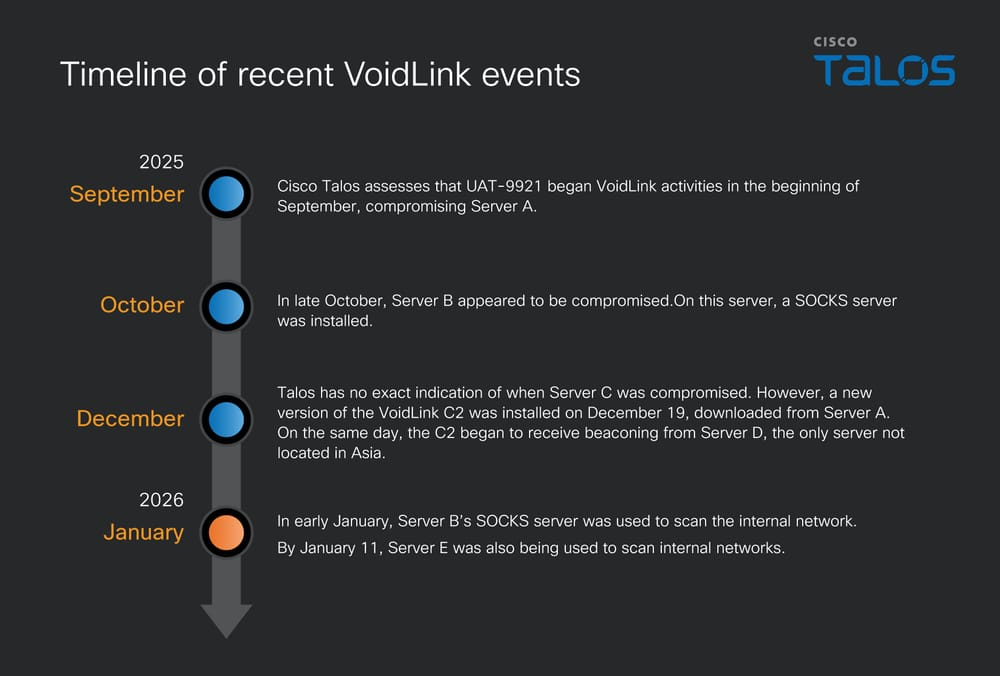

# UAT-9921 Deploys VoidLink Malware to Target Technology and Financial Sectors

**VoidLink Malware**{.cve-chip}  **Enterprise Espionage**{.cve-chip}  **Linux Targeting**{.cve-chip}  **Cloud Infrastructure**{.cve-chip}

## Overview
VoidLink is a modular, cloud-focused malware framework used by the newly identified threat actor UAT-9921 to compromise primarily Linux-based servers in technology and financial sectors, with opportunistic targeting in Europe and beyond. 

Explicitly described as "defense-contractor-grade" by Cisco Talos in terms of structure and capabilities, VoidLink is designed for long-term espionage and deep network access rather than smash-and-grab attacks. 

The framework uses a sophisticated multi-component architecture with implants written in Zig, plugins in C, and backend services in Go, supporting modular plugin deployment, mesh peer-to-peer C2, rootkit-level evasion, and cross-platform capability including Windows variants.

## Technical Specifications

| **Attribute** | **Details** |
|---------------|-------------|
| **Malware Family** | VoidLink (Modular Framework) |
| **Threat Actor** | UAT-9921 (Chinese-linked, established ~2019+) |
| **Primary Target Sectors** | Technology, Financial Services |
| **Primary Platform** | Linux (servers, cloud infrastructure) |
| **Secondary Platforms** | Windows (DLL side-loading variant) |
| **Development Languages** | Zig (implants), C (plugins), Go (backend services) |
| **Architecture** | Modular plugin system with mesh C2 |
| **Initial Access Vectors** | Stolen credentials, Java deserialization exploits |
| **Key Capabilities** | Rootkit deployment, EDR bypass, lateral movement, data theft |
| **Evasion Methods** | eBPF/LKM rootkits, cloud-environment awareness, anti-analysis |

## Affected Products
- Linux servers in technology and financial sectors across Europe and globally
- Apache Dubbo and similar Java-based middleware and RPC services
- Systems vulnerable to Java deserialization/serialization attacks
- Cloud environments (containers, orchestrators, Kubernetes)
- Enterprise and SaaS providers hosting customer workloads
- Windows systems with exposed DLL side-loading attack vectors
- Status: Actively targeted in ongoing campaigns

## Technical Details

### VoidLink Framework Architecture

**Multi-Component Design**

- **Implants**: Written in Zig for efficiency and portability
- **Plugins**: Developed in C for custom capability loading
- **Backend Services**: Built in Go for cross-platform control infrastructure
- **Modular System**: Operators compile and deploy custom plugins on demand

**Plugin Capabilities**

- Reconnaissance and system enumeration
- Lateral movement and network scanning
- Exploitation and privilege escalation
- Anti-forensics and log manipulation
- Data theft and exfiltration
- Persistence and rootkit installation
- EDR/XDR evasion and detection bypass

### Advanced Evasion & Persistence

**Kernel-Level Operations**

- eBPF (Extended Berkeley Packet Filter) rootkits for stealth
- LKM (Linux Kernel Module) rootkits for system compromise
- Kernel-level visibility and behavioral hiding
- Anti-analysis features to frustrate malware research

**Cloud-Environment Awareness**

- Container detection and adaptation
- Kubernetes and orchestrator compatibility
- Cloud service reconnaissance and exploitation
- Virtual machine and hypervisor detection

**EDR Bypass & Evasion**

- Advanced evasion of endpoint detection and response systems
- Anti-analysis and debugging defeat mechanisms
- Behavior obfuscation and signature evasion
- Detection-resistant execution patterns

### Mesh Command & Control (C2)

**Peer-to-Peer Architecture**

- Compromised hosts act as SOCKS proxies for other nodes
- Decentralized relay network between infected systems
- Traffic routing through multiple compromised nodes
- Enhanced evasion of network segmentation and egress controls

**Advanced Command Infrastructure**

- Dynamic plugin compilation and deployment
- Operator-driven customization of malware behavior
- Exfiltration through mesh nodes to avoid direct egress detection
- Multiple communication channels and redundancy

### Cross-Platform Capability

- **Primary**: Linux implants for servers and cloud infrastructure
- **Secondary**: Windows variant delivered via DLL side-loading
- **Flexibility**: Framework designed for multi-OS compromise support
- **Consistency**: Core capabilities and command structure unified across platforms

### Intelligence Assessment

- Chinese-language proficiency indicators suggest origin
- Development and operations split between distinct teams
- Potential AI-assisted development patterns ("compile-on-demand" indicators)
- Evolution from traditional tooling (since ~2019) to VoidLink framework (recent years)
- Despite AI-assisted patterns, overall campaign execution is operator-driven

## Attack Scenario
1. **Reconnaissance & Targeting**:
    - UAT-9921 scans for exposed internet-facing services in technology and financial sectors
    - Identifies Java deserialization vulnerabilities in Apache Dubbo and similar middleware
    - Profiles organizations for high-value targets and opportunistic victims

2. **Initial Access**:
    - Uses stolen credentials (from prior breaches, phishing, credential stuffing)
    - Exploits Java deserialization flaws (e.g., Apache Dubbo RCE, similar vulnerabilities)
    - Gains initial shell access to internet-facing service or application server

3. **Implant Deployment**:
    - Downloads and executes VoidLink implant on compromised Linux server
    - Establishes persistent C2 communication with UAT-9921 infrastructure
    - Configures compromised host as SOCKS proxy for internal network access

4. **Internal Reconnaissance**:
    - Deploys reconnaissance plugins to enumerate internal network
    - Scans for additional systems using tools like Fscan
    - Maps network topology, asset inventory, and security controls
    - Performs lateral-movement planning and target prioritization

5. **Credential & Privilege Escalation**:
    - Dynamically loads credential-theft plugins
    - Harvests local and domain credentials from compromised system
    - Exploits privilege escalation vulnerabilities
    - Compromises service accounts and administrative credentials

6. **Lateral Movement & Expansion**:
    - Uses stolen credentials and mesh C2 to move laterally
    - Deploys VoidLink implants to additional systems
    - Builds interconnected compromised-host network
    - Expands access across cloud infrastructure and on-premises systems

7. **Persistence & Long-Term Access**:
    - Deploys kernel-level rootkits (eBPF/LKM) for deep persistence
    - Implements anti-forensics capabilities to hide malware presence
    - Maintains resilient backdoors across multiple systems
    - Establishes long-term operational access for espionage

8. **Data Collection & Exfiltration**:
    - Dynamically loads data-theft plugins for targeted exfiltration
    - Collects intellectual property and sensitive business data
    - Harvests customer information and internal communications
    - Routes exfiltration through mesh nodes to evade detection

## Impact Assessment

=== "Confidentiality & Data Theft"
    * Unauthorized access to sensitive intellectual property and trade secrets
    * Exfiltration of financial data, customer information, and internal communications
    * Access to proprietary source code and development systems
    * Theft of strategic business plans and competitive intelligence
    * Long-term undetected access enabling comprehensive data harvesting

=== "System Compromise & Control"
    * Complete compromise of critical Linux server infrastructure
    * Kernel-level control through rootkit deployment
    * Persistent backdoor access enabling ongoing attacker operations
    * Compromised systems used as pivot points for further exploitation
    * Degraded trust in system integrity and administrative controls

=== "Network Propagation & Escalation"
    * Mesh C2 network enables wide internal propagation
    * Circumvention of network segmentation and access controls
    * Lateral movement to hundreds or thousands of systems
    * Potential compromise of entire cloud infrastructure and workloads
    * Service-account compromise enabling administrative-level access

=== "Enterprise Impact"
    * Severe data breach liabilities and regulatory consequences
    * Loss or disruption of critical cloud services and operations
    * Reputational damage especially for financial and SaaS providers
    * Customer data compromise affecting trust and compliance standing
    * Prolonged incident response due to advanced evasion capabilities
    * Months-long undetected compromise before discovery

## Mitigation Strategies

### Internet-Facing Service Hardening
- **Critical Patches**: Immediately patch Apache Dubbo and all Java middleware frameworks for deserialization vulnerabilities
- **RPC Security**: Disable unnecessary remote procedure call services and serialization mechanisms
- **Vendor Mitigations**: Apply all vendor-recommended deserialization protections and input validation
- **Service Inventory**: Maintain complete inventory of all internet-exposed services and versions
- **Regular Scanning**: Continuously scan for unpatched or misconfigurations of external services

### Credential & Access Security
- **Unique Credentials**: Use unique, long, randomly-generated credentials for all external-facing services
- **Credential Rotation**: Implement regular credential rotation for service accounts and administrative access
- **MFA Enforcement**: Enable multi-factor authentication on all external-facing applications and portals
- **Credential Monitoring**: Monitor for unauthorized credential usage and suspicious authentication patterns
- **Privileged Access Management (PAM)**: Vault and manage administrative credentials through PAM systems
- **Avoid Credential Reuse**: Never reuse credentials across systems or applications

### Network Detection & Monitoring
- **SOCKS Proxy Detection**: Monitor for unauthorized SOCKS proxy activity and suspicious process patterns
- **Outbound Connection Monitoring**: Alert on unusual outbound connections from Linux servers to unknown hosts
- **Lateral Scan Detection**: Detect and alert on internal network scanning (Fscan patterns, port scans, service enumeration)
- **C2 Traffic Analysis**: Monitor for mesh C2 communication patterns and command relay traffic
- **DNS Monitoring**: Watch for suspicious DNS queries and domain resolution patterns
- **Egress Filtering**: Implement strict egress firewall rules to limit outbound connections

### Endpoint & Kernel Detection
- **EDR/XDR with Linux Support**: Deploy endpoint detection and response with Linux-specific visibility
- **eBPF Monitoring**: Monitor for suspicious eBPF program loading and execution
- **Kernel Module Monitoring**: Alert on unauthorized kernel module (LKM) loading or execution
- **Process Behavior Analysis**: Detect rootkit-level process hiding and behavioral anomalies
- **Anomalous Kernel Activity**: Monitor system calls for unusual patterns indicating kernel compromise
- **Anti-Rootkit Scanning**: Deploy tools specifically designed to detect and identify rootkit presence

### Network Architecture & Segmentation
- **Zero Trust Architecture**: Implement zero trust principles with assumed breach mindset
- **Network Segmentation**: Segment cloud and on-premises networks to prevent lateral movement
- **Service Isolation**: Isolate critical services and databases from general network access
- **Least Privilege Access**: Minimize inter-service communication and enforce principle of least privilege
- **Service Account Restrictions**: Limit privileges of service accounts to only required functionality
- **Egress Control**: Implement granular egress controls limiting where systems can communicate

## Resources and References

!!! info "Incident Reports"
    - [UAT-9921 Deploys VoidLink Malware - Live Threat Intelligence (OffSeq.com)](https://radar.offseq.com/threat/uat-9921-deploys-voidlink-malware-to-target-techno-ff44eb2e)
    - [New threat actor UAT-9921 deploys VoidLink against enterprise sectors](https://securityaffairs.com/187969/ai/new-threat-actor-uat-9921-deploys-voidlink-against-enterprise-sectors.html)
    - [VoidLink and the Rise of AI-Generated Malware - EM360Tech](https://em360tech.com/tech-articles/voidlink-ai-generated-malwar)

---

*Last Updated: February 16, 2026* 