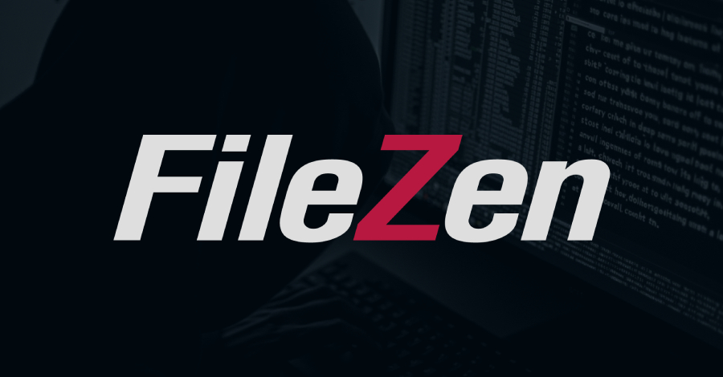

# Active Exploitation of FileZen OS Command Injection Vulnerability (CVE-2026-25108)

**CVE-2026-25108**{.cve-chip}  **OS Command Injection**{.cve-chip}  **CWE-78**{.cve-chip}  **KEV Listed**{.cve-chip}

## Overview
A high-severity OS command injection vulnerability in Soliton Systems K.K.’s FileZen file transfer product enables authenticated users to execute arbitrary operating system commands. Due to confirmed exploitation in the wild, U.S. authorities added the flaw to the CISA Known Exploited Vulnerabilities (KEV) Catalog to drive urgent mitigation.

## Technical Specifications

| **Attribute** | **Details** |
|---------------|-------------|
| **CVE ID** | CVE-2026-25108 |
| **Vulnerability Type** | OS command injection (CWE-78) |
| **CVSS Score** | CVSS v4: 8.7 (High), CVSS v3: 8.8 (High) |
| **Affected Versions** | FileZen 4.2.1–4.2.8 and 5.0.0–5.0.10 |
| **Prerequisites** | Authenticated access (general user privileges sufficient) |
| **Trigger Condition** | Antivirus Check Option must be enabled |
| **Patched Version** | FileZen 5.0.11 or later |
| **Exploitation Status** | Confirmed active exploitation; listed in CISA KEV |

## Affected Products
- Soliton Systems K.K. FileZen
- Vulnerable branches: 4.2.1 to 4.2.8
- Vulnerable branches: 5.0.0 to 5.0.10
- Deployments with Antivirus Check Option enabled
- Status: Patched in 5.0.11+

## Technical Details

### Vulnerability Mechanics
- The flaw is an OS command injection issue (CWE-78) in FileZen request handling.
- An authenticated user can send crafted HTTP requests that inject system commands.
- Exploitation path requires the Antivirus Check Option to be enabled.

### Access Requirements
- No pre-existing admin role is required.
- Any valid authenticated account (including general user privilege levels) may be sufficient.
- Attackers commonly obtain access via stolen credentials, weak passwords, or credential reuse.

### Exploitation & Exposure
- Successful exploitation executes arbitrary OS commands with FileZen process privileges.
- Depending on host configuration, this can enable deeper compromise and privilege escalation.
- Confirmed real-world exploitation raised urgency and led to KEV catalog inclusion.

## Attack Scenario
1. **Credential Acquisition**:
    - Attacker obtains valid FileZen credentials through phishing, brute-force, or credential stuffing.

2. **Authenticated Access**:
    - Attacker logs into the vulnerable FileZen web interface as a normal authenticated user.

3. **Command Injection Trigger**:
    - With Antivirus Check Option enabled, attacker sends specially crafted HTTP requests.

4. **Arbitrary Command Execution**:
    - FileZen processes injected input and executes attacker-supplied OS commands.

5. **Post-Exploitation Progression**:
    - Attacker pivots to underlying OS access, performs reconnaissance, and may move laterally into connected systems.

## Impact Assessment

=== "Integrity"
    * Unauthorized OS command execution can alter application and host configurations
    * Attackers can modify files, scripts, and transfer workflows
    * Potential installation of persistence mechanisms or backdoors

=== "Confidentiality"
    * Access to sensitive transferred files and stored data
    * Potential credential harvesting from application/server context
    * Increased risk of data exposure during post-exploitation activity

=== "Availability"
    * Service disruption from malicious command execution
    * Potential process crashes or system instability
    * Elevated risk of broader business impact if lateral movement succeeds

## Mitigation Strategies

### Immediate Actions
- Apply vendor patch: upgrade to FileZen version 5.0.11 or later
- Reset all user passwords if compromise is suspected
- Validate and minimize accounts with access to FileZen

### Access Controls
- Restrict FileZen web interface access to VPN/internal trusted networks
- Enforce strong password policies and account lockout controls
- Implement multi-factor authentication where available

### Monitoring & Detection
- Monitor authentication logs for unusual login patterns and locations
- Inspect HTTP/application logs for suspicious request patterns and command-injection indicators
- Alert on abnormal process execution linked to FileZen services

## Resources and References

!!! info "Incident Reports"
    - [CISA Confirms Active Exploitation of FileZen CVE-2026-25108 Vulnerability](https://thehackernews.com/2026/02/cisa-confirms-active-exploitation-of.html)
    - [NVD - CVE-2026-25108](https://nvd.nist.gov/vuln/detail/CVE-2026-25108)

---

*Last Updated: February 25, 2026* 
