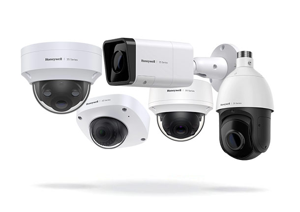

# CVE-2026-1670 – Authentication Bypass in Honeywell CCTV Cameras


**CVE-2026-1670**{.cve-chip}  **Authentication Bypass**{.cve-chip}  **CCTV Security**{.cve-chip}  **Unauthenticated Access**{.cve-chip}

## Overview
An authentication bypass flaw in certain Honeywell CCTV camera models allows attackers to use a password recovery API endpoint without needing valid login credentials. By changing the password recovery email address through an unauthenticated endpoint, attackers can trigger a password reset to an attacker-controlled email address, gaining full administrative access to affected devices. This flaw requires no prior credentials or user interaction—only network reachability of the vulnerable device—enabling attackers to access live video feeds, camera controls, and potentially pivot into adjacent networks.

## Technical Specifications

| **Attribute** | **Details** |
|---------------|-------------|
| **CVE ID** | CVE-2026-1670 |
| **Vulnerability Type** | Authentication Bypass / Missing Authentication |
| **CVSS Score** | 9.3 (Critical) |
| **Product** | Honeywell CCTV Cameras |
| **Attack Vector** | Network (HTTP/HTTPS API) |
| **Authentication Required** | None (unauthenticated API endpoint) |
| **User Interaction** | None |
| **Privileges Required** | None |
| **Impact** | Full administrative access to camera |
| **Exploitation Required** | Network reachability only |

## Affected Products
- Honeywell I-HIB2PI-UL 2MP IP (firmware 6.1.22.1216)
- Honeywell SMB NDAA MVO-3 WDR_2MP_32M_PTZ_v2.0
- Honeywell PTZ WDR 2MP 32M WDR_2MP_32M_PTZ_v2.0
- Honeywell 25M IPC WDR_2MP_32M_PTZ_v2.0
- Other Honeywell CCTV models with similar vulnerable API implementations
- Status: No confirmed active exploitation in the wild to date

## Technical Details

### Vulnerability Characteristics
- **Type**: Missing Authentication on Password Recovery API
- **Root Cause**: Password recovery API endpoint lacks authentication requirement
- **Attack Surface**: HTTP/HTTPS API exposed without authorization checks
- **Endpoint**: Password recovery functionality
- **Method**: POST request with attacker-controlled email address

### Attack Vector
The vulnerability stems from a missing authentication requirement on the API endpoint handling the password recovery function. The endpoint is exposed without requiring login, allowing attackers to directly access it:

```
POST /api/password-recovery HTTP/1.1
Host: target-camera-ip:port
Content-Type: application/json

{
  "email": "attacker@example.com"
}
```

### Exploitation Flow
1. **Password Recovery Email Change**: Attacker sends POST request to unauthenticated password recovery API
2. **Email Address Override**: Controlled email is set as the recovery address
3. **Password Reset Triggering**: Attacker initiates password reset process
4. **Reset Link Delivery**: Password reset link sent to attacker's email
5. **Credential Reset**: Attacker uses reset link to set new administrative password
6. **Administrative Access**: Attacker logs in as administrator with new credentials
7. **Full Camera Control**: Full access to live feeds, controls, and configuration

## Attack Scenario
1. **Target Discovery**: Attacker identifies externally reachable Honeywell camera IP address through:
    - Internet scanning and reconnaissance
    - Shodan or similar search engines for exposed cameras
    - Public vulnerability disclosures mentioning IP ranges
    - Open source intelligence (OSINT)

2. **Unauthenticated API Access**: Attacker calls the password recovery API endpoint without any credentials

3. **Email Address Takeover**: Attacker POSTs an attacker-controlled email address as the password recovery email

4. **Password Reset Initiation**: Attacker triggers password reset via legitimate reset mechanism

5. **Reset Link Access**: Reset link sent to attacker's email (now configured as recovery address)

6. **Administrative Credential Creation**: Attacker uses reset link to set new administrative password

7. **Full Camera Access**: Attacker logs in as administrator and gains:
    - Live video feed access
    - Complete camera controls
    - Configuration modification capabilities
    - Potential network pivoting to adjacent systems

## Impact Assessment

=== "Physical Security Breach"
    * Unauthorized access to live surveillance video feeds
    * Complete visibility into monitored areas and activities
    * Observation of personnel, facility layouts, and security procedures
    * Potential exposure of sensitive facilities or critical infrastructure areas
    * Compromise of physical security monitoring effectiveness

=== "Administrative Access & Control"
    * Full account takeover at administrative privilege level
    * Complete control over camera configuration and settings
    * Ability to disable, redirect, or manipulate camera operation
    * Access to stored video footage and recordings
    * Modification of access controls and user accounts

=== "Operational & Organizational Impact"
    * Disruption of surveillance and physical security operations
    * Potential for attacker to monitor personnel, facilities, or secrets
    * Reputational damage from security breach of physical infrastructure
    * Privacy violations for individuals being monitored
    * Compliance and regulatory exposure (especially government/critical infrastructure)

=== "Network Impact"
    * Compromised cameras used as pivots into adjacent networks
    - Potential for lateral movement from perimeter to internal networks
    * Access to internal network topology and connected systems
    * VLAN hopping or network segmentation bypassing possibilities
    * Use of camera infrastructure for reconnaissance of organizational network

## Mitigation Strategies

### Network Isolation
- **Remove Public Exposure**: Do NOT expose CCTV management interfaces to the public internet
- **Firewall Segmentation**: Place all cameras behind firewalls in isolated VLAN or network segment
- **Network Segmentation**: Separate CCTV infrastructure from general corporate networks
- **Access Control**: Implement strict network access policies limiting camera management access
- **DMZ Segregation**: Never expose camera management in DMZ or external-facing networks

### Secure Remote Access
- **VPN Only**: Use VPN for any remote management access to cameras
- **Jump Host/Bastion**: Route all administrative access through secure bastion/jump host
- **Zero Trust Access**: Verify and authorize every access request through multi-factor authentication
- **Disable Direct API**: Disable direct HTTP/HTTPS API exposure; use secure management tunnels only
- **Access Logging**: Log all remote access attempts and management activities

### Patch & Firmware Management
- **Contact Honeywell**: Reach out to Honeywell support immediately for patches or firmware updates
- **Firmware Assessment**: Verify current firmware versions against known vulnerable versions
- **Update Process**: Deploy patches on a schedule allowing testing while minimizing exposure
- **Rollback Plan**: Maintain ability to rollback if patches cause operational issues

### Detection & Monitoring
- **Network Monitoring**: Monitor for suspicious API calls to password recovery endpoints
- **Access Logs**: Monitor CCTV system logs for unexpected login attempts or administrative changes
- **Failed Auth Detection**: Alert on multiple failed authentication attempts
- **Email Change Detection**: Monitor camera logs for unauthorized email address modifications
- **IP Monitoring**: Track unusual IP addresses accessing camera management interfaces

## Resources and References

!!! info "Incident Reports"
    - [CISA alerts to critical auth bypass CVE-2026-1670 in Honeywell CCTVs](https://securityaffairs.com/188234/security/cisa-alerts-to-critical-auth-bypass-cve-2026-1670-in-honeywell-cctvs.html)
    - [Critical infra Honeywell CCTVs vulnerable to auth bypass flaw](https://www.bleepingcomputer.com/news/security/critical-infra-honeywell-cctvs-vulnerable-to-auth-bypass-flaw/)
    - [CISA Warns: Honeywell CCTV Flaw Enables Remote Account Takeover](https://vpncentral.com/cisa-warns-honeywell-cctv-flaw-enables-remote-account-takeover/)
    - [Honeywell CCTV cameras vulnerable to hijacking - TechRadar](https://www.techradar.com/pro/security/honeywell-cctv-cameras-vulnerable-to-hijacking-which-allows-hackers-to-crack-passwords-easily)
    - [CISA Alerts Organizations to Honeywell CCTV Flaw Enabling Account Takeovers](https://gbhackers.com/cisa-alerts-organizations-to-honeywell-cctv-flaw/)
    - [CVE-2026-25715 - Tenable](https://www.tenable.com/cve/CVE-2026-25715)
    - [NVD - CVE-2026-1670](https://nvd.nist.gov/vuln/detail/CVE-2026-1670)

---

*Last Updated: February 23, 2026* 