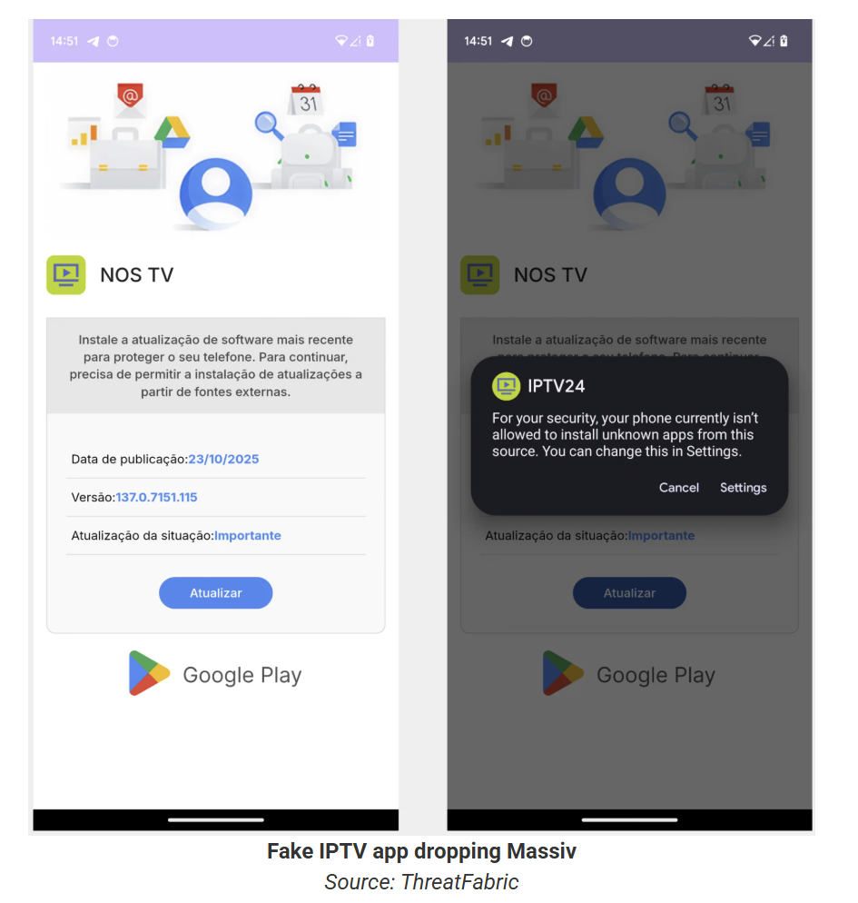
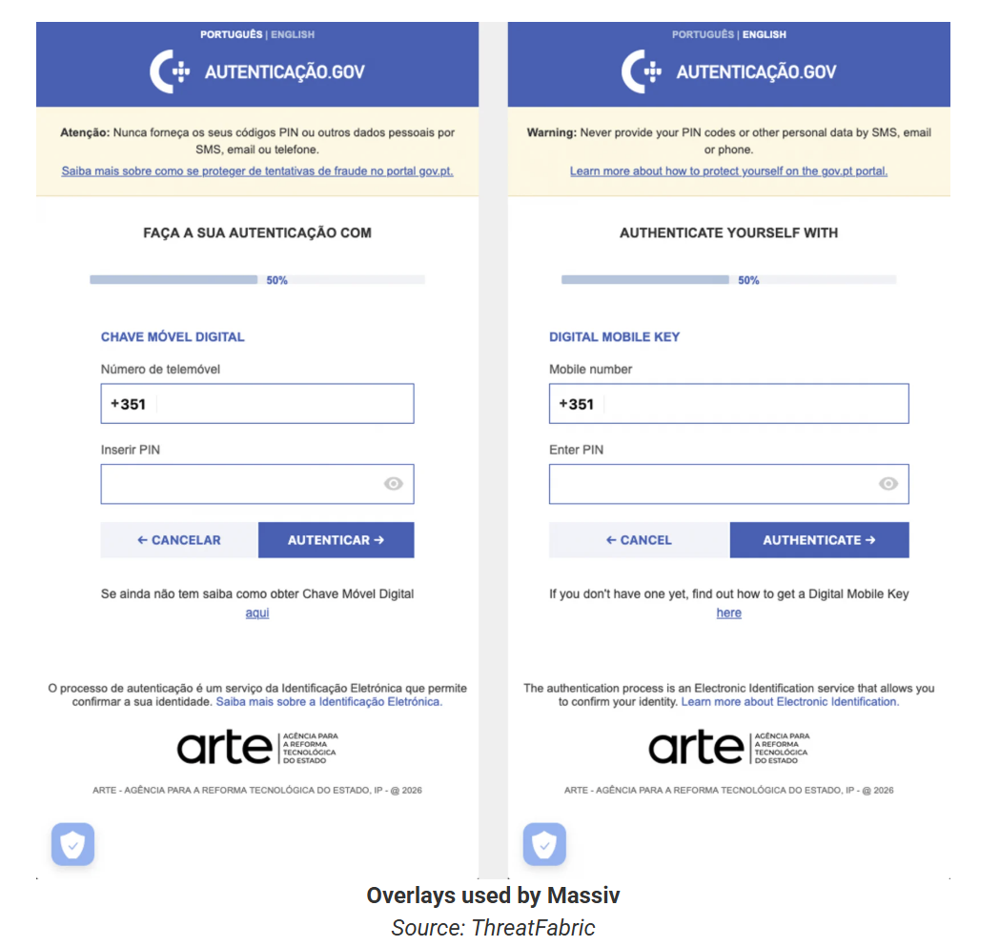

# Fake IPTV Apps Spread Massiv Android Malware Targeting Mobile Banking Users

**Android Banking Trojan**{.cve-chip}  **Mobile Malware**{.cve-chip}  **IPTV Lure**{.cve-chip}  **Device Takeover**{.cve-chip}

## Overview
Massiv is a newly discovered Android banking trojan that masquerades as fake IPTV streaming apps to hijack devices and steal banking and digital identity data, with campaigns primarily hitting mobile users in Portugal, Spain, France, and Turkey. Designed for device takeover (DTO) and financial fraud rather than simple credential theft, Massiv grants attackers near-full remote control of infected phones through abuse of Android Accessibility Services. The malware supports live screen streaming and sophisticated UI-tree extraction modes that enable attackers to bypass screen-capture protections and operate banking apps in real-time, opening fraudulent accounts and conducting unauthorized transactions in victims' names.

## Technical Specifications

| **Attribute** | **Details** |
|---------------|-------------|
| **Malware Family** | Massiv (Android Banking Trojan) |
| **Platform** | Android |
| **Distribution** | Sideloaded APK files disguised as IPTV apps |
| **Primary Lure** | Fake IPTV streaming applications |
| **Distribution Channels** | Social media, Telegram, IPTV-focused websites |
| **Key Capability** | Device takeover, banking fraud, identity theft |
| **Target Regions** | Portugal, Spain, France, Turkey (expanding) |
| **Campaign Duration** | Active for at least 8 months, trending upward |
| **Privilege Abuse** | Android Accessibility Services |

## Affected Products
- Android devices in Portugal, Spain, France, and Turkey (primary targets)
- Mobile banking applications across targeted regions
- Portuguese government Chave Móvel Digital authentication system
- Digital identity and signature applications
- Fintech and financial services mobile apps
- Status: Active ongoing campaigns

## Technical Details

### Distribution & Installation
- Distributed as sideloaded APK files outside Google Play Store
- Masquerades as IPTV streaming applications ("IPTV Pro," "Premium TV," etc.)
- Advertised on social media, Telegram channels, and IPTV-focused websites
- Not available on Google Play due to policy violations around copyright
- Users tricked into manual APK installation outside official app stores

### Accessibility Service Abuse
Once installed, Massiv requests and abuses Android Accessibility Services to gain extensive privileges:

- **Keylogging**: Captures all user input including passwords and PINs
- **Screen Overlays**: Draws fake screens on top of legitimate banking and government apps
- **Input Simulation**: Programmatically clicks buttons and fills form fields
- **Permission Escalation**: Grants itself additional privileges silently
- **Screen Reading**: Extracts all visible text and UI elements

### Remote Control Capabilities

**Mode 1: Live Screen Streaming**

- Uses Android MediaProjection API to stream victim's display in real-time
- Enables attackers to watch all user activity live
- Provides contextual awareness for targeted attacks
- Allows operators to time overlay attacks and credential theft

**Mode 2: UI-Tree Extraction Mode**

- Extracts structured data from Accessibility Service including:
    - Visible text and field values
    - UI element names and identifiers
    - Screen coordinates and layout information
    - Interaction attributes and button states
- Enables programmatic navigation and interaction with apps
- Allows attackers to click buttons, fill fields, and navigate screens remotely
- **Bypasses screen-capture protections** used by banking, authentication, and communications apps
- Defeats traditional "screen cannot be recorded" security controls

### Financial Fraud Capabilities
- **Credential Theft**: Steals banking login credentials and 2FA codes
- **Overlay Attacks**: Displays fake screens to capture sensitive information
- **Account Opening**: Opens new bank or fintech accounts in victim's name
- **Money Laundering**: Uses fraudulent accounts for illicit fund transfers
- **Loan Fraud**: Applies for loans using stolen identity data
- **Account Draining**: Conducts unauthorized transfers from existing accounts

### Identity Theft Targeting
- Targets Portuguese Chave Móvel Digital (national digital authentication system)
- Harvests government app credentials and digital signature tokens
- Collects identity documents and personal information
- Enables full identity takeover at national e-ID system level
- Facilitates KYC/AML fraud through stolen identity data

## Attack Scenario
1. **Initial Lure & Distribution**:
    - User seeking free IPTV streaming finds APK link on forum, Telegram, or shady website
    - Fake app advertised as "IPTV Pro," "Premium TV," or similar enticing name
    - User downloads and sideloads APK since such apps rarely appear on Google Play

2. **Installation & Permission Request**:
    - After installation, app requests Accessibility permissions
    - Permissions justified under pretext of "enabling certain features" or "improved playback"
    - User grants intrusive rights expecting legitimate IPTV functionality
    - Massiv silently activates overlay, keylogging, and remote-control capabilities

3. **Targeting Financial & Government Apps**:
    - Malware monitors for opening of mobile banking apps
    - Watches for government apps (e.g., Chave Móvel Digital)
    - Detects digital ID/signature applications
    - Triggers attack workflow when sensitive apps are launched

4. **Credential & Data Harvesting**:
    - **Option A - Overlay Attack**: Shows fake screens mimicking legitimate app to harvest credentials, 2FA codes, and sensitive data
    - **Option B - Live Control**: Streams screen or uses UI-tree mode for direct real-time operation

5. **Real-Time Fraudulent Operations**:
    - Attacker directly operates banking app through remote control
    - Performs unauthorized transfers using stolen credentials
    - Opens new financial accounts in victim's name
    - Completes fraudulent KYC flows using harvested identity data
    - Applies for loans or credit using stolen identity

6. **Financial Impact & Money Laundering**:
    - New accounts used for money laundering operations
    - Fraudulent loans leave victim with debt obligations
    - Existing accounts drained of funds
    - Victim left with financial liabilities for accounts never knowingly opened

## Impact Assessment

=== "Individual Victim Impact"
    * Complete account takeover of banking and financial services
    * Unauthorized transfers draining accounts
    * New bank accounts and loans opened in victim's name
    * Identity theft at national e-ID system level (e.g., Chave Móvel Digital)
    * Long-term financial liabilities and credit damage
    * Loss of digital identity trust and authentication capabilities

=== "Security Control Bypass"
    * UI-tree extraction defeats screen-capture protections
    * Traditional "screen cannot be recorded" defenses rendered insufficient
    * Accessibility Service abuse bypasses app-level security controls
    * 2FA and multi-factor authentication circumvented through real-time control
    * Banking app security features undermined by legitimate Android APIs

=== "Scale & Geographic Impact"
    * Active campaigns for 8+ months with upward trend
    * Primary impact in Portugal, Spain, France, Turkey
    * Technique easily expandable globally
    * IPTV lure effective across demographics and regions
    * Potential for mass-scale fraud operations

## Mitigation Strategies

### For Mobile Users
- **Avoid Sideloading**: Do NOT sideload IPTV/streaming APKs from untrusted sources
- **Official Stores Only**: Install apps exclusively from Google Play Store and reputable publishers
- **Permission Scrutiny**: Be extremely cautious about granting Accessibility Service permissions
    - Media/streaming apps should NOT need Accessibility access
    - Review and revoke unnecessary Accessibility permissions in Android Settings → Accessibility
- **Security Tools**: 
    - Keep Google Play Protect enabled and run periodic scans
    - Maintain up-to-date Android security patches
    - Install reputable mobile security applications
- **Suspicious Activity**: Report unusual banking activity or unexpected account openings immediately

## Resources and References

!!! info "Incident Reports"
    - [Fake IPTV Apps Spread Massiv Android Malware Targeting Mobile Banking Users](https://thehackernews.com/2026/02/fake-iptv-apps-spread-massiv-android.html)
    - [New 'Massiv' Android banking malware poses as an IPTV app](https://www.bleepingcomputer.com/news/security/new-massiv-android-banking-malware-poses-as-an-iptv-app/)
    - [Dangerous Massiv Android malware poses as IPTV app - TechRadar](https://www.techradar.com/pro/security/dangerous-massiv-android-malware-poses-as-iptv-app-to-infect-devices-and-steal-banking-info)
    - [Massiv Attack: Android Trojan Targets IPTV Users](https://www.bankinfosecurity.com/massiv-attack-android-trojan-targets-iptv-users-a-30794)

---

*Last Updated: February 22, 2026* 