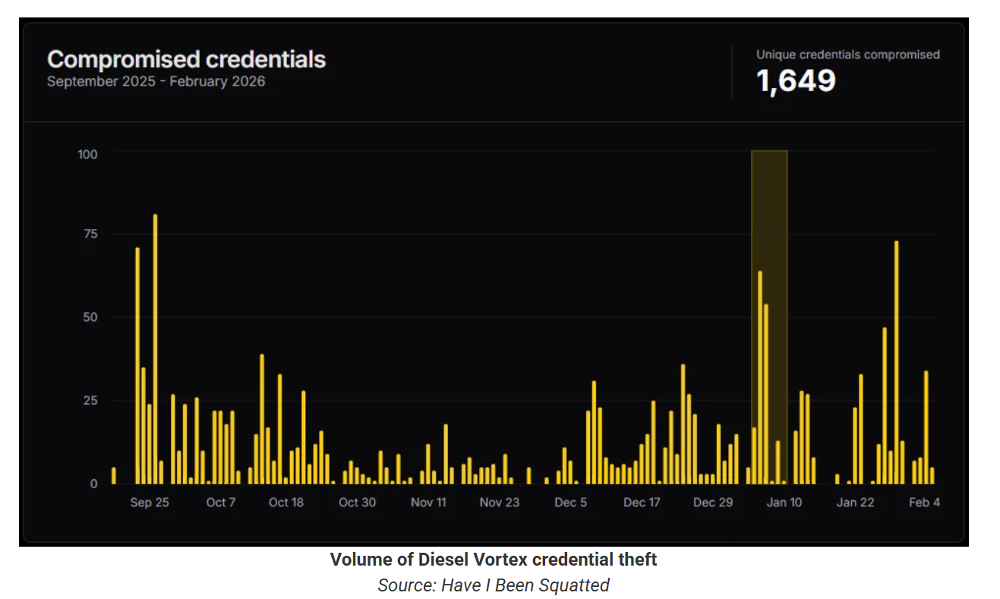
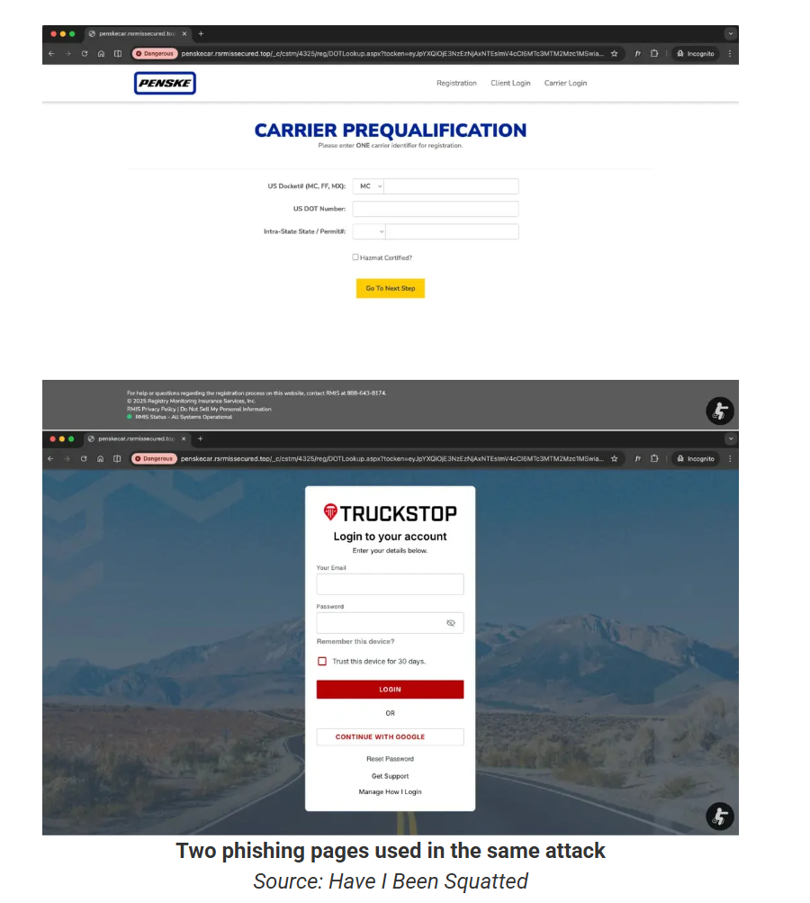

# Phishing Campaign Targets Freight and Logistics Orgs in the US, Europe

**Credential Phishing**{.cve-chip}  **Logistics Sector**{.cve-chip}  **Financially Motivated**{.cve-chip}  **Account Takeover**{.cve-chip}

## Overview
A financially motivated cybercriminal group conducted a targeted phishing campaign against freight and logistics organizations in the US and Europe. The attackers built highly convincing fake login portals that impersonated legitimate freight platforms to steal credentials and financial data. The operation appeared structured and professional, with dedicated infrastructure, automated workflows, and resale of phishing kits. Reporting indicates more than 1,600 unique credential sets were harvested.

## Technical Specifications

| **Attribute** | **Details** |
|---------------|-------------|
| **Incident Type** | Targeted phishing and credential theft campaign |
| **Target Sector** | Freight and logistics organizations |
| **Geographic Scope** | United States and Europe |
| **Motivation** | Financially motivated cybercrime |
| **Initial Access Vector** | Phishing emails via legitimate SMTP services (Zoho, Zeptomail) |
| **Delivery Evasion** | Cyrillic homoglyph spoofing, multi-stage cloaking, conditional content delivery |
| **Redirection Chain** | Up to 9-step cloaking/redirection sequence |
| **Credential/Data Theft** | Usernames, passwords, 2FA codes, security tokens, MC/DOT numbers, RMIS identifiers, payment data |
| **Operational Scale** | 1,600+ unique credential sets reportedly harvested |

## Affected Products
- Freight and load-board platform user accounts
- Logistics payment and dispatch workflows tied to compromised credentials
- Organizational identities and business records (MC/DOT numbers, RMIS identifiers)
- Status: Active phishing tradecraft with potential ongoing copycat activity

## Technical Details

### 1) Initial Access Vector
- Phishing emails were sent through legitimate SMTP providers such as Zoho and Zeptomail.
- Emails used Cyrillic homoglyph domain tricks to bypass spam controls and spoof trusted brands.
- Social-engineering pretexts focused on urgent business workflows (invoice disputes, account suspension, load confirmation).

### 2) Redirect Infrastructure
- Victims were routed through a cloaking chain with up to nine stages before seeing final phishing content.
- Conditional logic controlled who received the phishing page, reducing exposure to scanners and researchers.
- Security evasion techniques were used to limit automated detection.

### 3) Phishing Pages
- Attackers deployed pixel-perfect clones of legitimate freight/login portals.
- Pages were hosted on attacker-controlled infrastructure.
- Captured data included:
    - Usernames and passwords
    - 2FA codes and security tokens
    - MC/DOT numbers
    - RMIS identifiers
    - Payment information

### 4) Operational Structure
- Campaign activity suggests organized role separation (phishing operators and voice/social-engineering support).
- Indicators suggest possible Telegram-based coordination channels.
- Phishing infrastructure and kits were reportedly offered to other criminal actors.

### 5) Attribution Indicators
- Infrastructure and language artifacts indicate links to Russian- and Armenian-speaking operators.
- Exposure of an attacker repository reportedly provided insight into tooling and campaign methods.

## Attack Scenario

1. **Phishing Delivery**:
    - Victim receives an email impersonating a freight/load-board platform.
    - Message uses urgency (invoice issue, account suspension, load confirmation).

2. **Cloaked Redirection**:
    - Victim clicks link and passes through a multi-stage cloaking chain.
    - Conditional delivery filters out many automated scanners.

3. **Credential Harvesting**:
    - Victim reaches a spoofed login portal and submits credentials and MFA token.
    - Session details and identifiers are captured on attacker infrastructure.

4. **Account Takeover & Payment Manipulation**:
    - Attackers immediately access legitimate accounts.
    - Payment details are changed, load data is manipulated, and fraudulent workflow actions are initiated.

5. **Fraud Monetization**:
    - Stolen access enables fuel card abuse, double-brokering fraud, and payment rerouting.
    - Campaign infrastructure may be reused or sold to other actors.

## Impact Assessment

=== "Operational Impact"
    * Unauthorized account access across freight and logistics portals
    * Shipment/load manipulation and potential load diversion
    * Disruption of dispatch and partner trust workflows

=== "Financial Impact"
    * Fraudulent fuel transactions
    * Payment rerouting and invoice theft risk
    * Double-brokering related revenue loss

=== "Strategic/Business Impact"
    * Exposure of sensitive business identifiers (MC/DOT, RMIS)
    * Increased remediation and incident response costs
    * Elevated third-party and partner ecosystem risk

## Mitigation Strategies

### Email Security
- Enforce SPF, DKIM, and DMARC with strict alignment and rejection policies
- Deploy homoglyph and lookalike-domain detection controls
- Use URL detonation/sandboxing for links in inbound email
- Block newly observed phishing domains and fast-flux redirectors

### Monitoring & Detection
- Enable impossible-travel and impossible-session analytics
- Monitor for real-time MFA abuse patterns and token replay indicators
- Apply login anomaly scoring for geolocation/device/behavior mismatches
- Alert on high-risk account events (payment detail changes, unusual load edits)

### User Awareness & Process Controls
- Conduct freight-specific phishing simulations and role-based training
- Require out-of-band verification for payment instruction changes
- Establish strict callback verification for urgent account or load requests
- Harden help-desk/account-recovery workflows against social engineering

### Long-term Resilience
- Expand phishing-resistant MFA where feasible
- Implement conditional access policies for high-risk user cohorts
- Segment critical freight/payment workflows and enforce least privilege
- Regularly test anti-phishing controls through adversary simulation

## Resources and References

!!! info "Incident Reports"
    - [Phishing campaign targets freight and logistics orgs in the US, Europe](https://www.bleepingcomputer.com/news/security/phishing-campaign-targets-freight-and-logistics-orgs-in-the-us-europe/)
    - [Diesel Vortex Russian Cybercrime Group Targets Global Logistics Sector and Steals 1,600+ Credentials](https://cybersecuritynews.com/diesel-vortex-targets-global-logistics-sector/)
    - [Researchers reveal Russian hackers hijacked digital highways to "steal funds" from logistics giants | Cybernews](https://cybernews.com/security/russian-diesel-vortex-logistics-phishing/)
    - [Phishing operation with links to Russia, Armenia compromised Western cargo companies, researchers find | The Record from Recorded Future News](https://therecord.media/phishing-operation-russia-armenia-targeting-us-european-cargo)

---

*Last Updated: February 25, 2026* 
