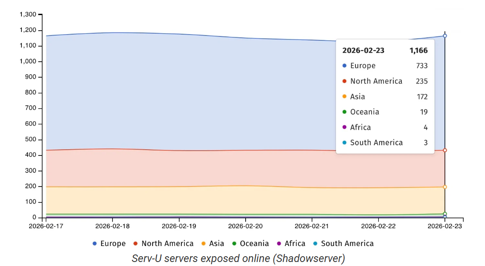

# SolarWinds Serv-U Critical Root Access Vulnerabilities

**CVE-2025-40538**{.cve-chip}  **CVE-2025-40539**{.cve-chip}  **CVE-2025-40540**{.cve-chip}  **CVE-2025-40541**{.cve-chip}  **Root Access Risk**{.cve-chip}

## Overview
SolarWinds released security updates addressing four critical vulnerabilities in Serv-U Managed File Transfer (MFT) and Serv-U Secure FTP software. These flaws could allow attackers with administrative privileges to execute arbitrary code and gain full root/system access on affected servers. The issues were patched in Serv-U version 15.5.4.

## Technical Specifications

| **Attribute** | **Details** |
|---------------|-------------|
| **Vendor** | SolarWinds |
| **Affected Products** | Serv-U Managed File Transfer (MFT), Serv-U Secure FTP |
| **Patched Version** | Serv-U 15.5.4 |
| **CVE IDs** | CVE-2025-40538, CVE-2025-40539, CVE-2025-40540, CVE-2025-40541 |
| **Primary Risk** | Arbitrary code execution with root/system privileges |
| **Privilege Requirement** | Existing administrative access required |
| **Affected Platforms** | Windows and Linux deployments |

## Affected Products
- Serv-U Managed File Transfer (MFT)
- Serv-U Secure FTP
- Deployments running versions prior to 15.5.4
- Windows and Linux server environments
- Status: Patched in 15.5.4; unpatched systems remain at high risk

## Technical Details

### Patched CVEs

#### CVE-2025-40538 — Broken Access Control
- Allows high-privileged users to create new admin accounts.
- Can be abused to enable arbitrary code execution as root/system.

#### CVE-2025-40539 — Type Confusion
- Memory handling flaw that can enable code execution.
- Misinterpreted object/type states may allow unsafe execution flow.

#### CVE-2025-40540 — Type Confusion
- Similar memory misinterpretation vulnerability.
- Can be leveraged for remote code execution under privileged context.

#### CVE-2025-40541 — Insecure Direct Object Reference (IDOR)
- Improper object access validation.
- Enables unauthorized access paths and privilege escalation opportunities.

### Key Technical Notes
- Exploitation requires existing administrative account access.
- Successful exploitation can result in native code execution with root/system privileges.
- Both Windows and Linux Serv-U deployments are affected.

## Attack Scenario
1. **Credential Compromise Chain**:
    - Attacker obtains Serv-U admin credentials via phishing, brute force, or credential stuffing.
    - Attacker logs into the Serv-U administrative interface.
    - Attacker exploits broken access control and related flaws.
    - New rogue admin account is created or arbitrary code is executed.
    - Full root/system compromise is achieved.

2. **Insider Threat Chain**:
    - Malicious internal administrator abuses a vulnerable Serv-U instance.
    - Privileges are escalated beyond intended administrative boundaries.
    - Persistence mechanisms or backdoors are deployed for long-term access.

## Impact Assessment

=== "System/Operational Impact"
    * Full root/system-level access on affected Serv-U servers
    * Unauthorized manipulation of transfer services and administrative settings
    * Potential business disruption in managed file transfer operations

=== "Data & Security Impact"
    * File exfiltration of sensitive enterprise data
    * Credential harvesting and potential reuse across environments
    * Increased risk of lateral movement inside enterprise networks

=== "Business Impact"
    * Elevated ransomware deployment risk from privileged footholds
    * Incident response and recovery overhead due to server compromise
    * Service downtime and trust impact for external transfer partners

## Mitigation Strategies

### Immediate Actions
- Upgrade all Serv-U deployments to version 15.5.4 or later
- Rotate all administrative credentials after patching
- Enforce multi-factor authentication for all admin access
- Restrict administrative interface access to VPN/internal trusted networks

### Detection & Hardening
- Audit for unknown or newly created administrative accounts
- Review authentication and admin activity logs for suspicious behavior
- Alert on unusual privilege changes and unexpected account creation
- Validate least-privilege controls for all Serv-U administrative users

## Resources and References

!!! info "Incident Reports"
    - [Critical SolarWinds Serv-U flaws offer root access to servers](https://www.bleepingcomputer.com/news/security/critical-solarwinds-serv-u-flaws-offer-root-access-to-servers/)
    - [Serv-U 15.5.4 release notes](https://documentation.solarwinds.com/en/success_center/servu/content/release_notes/servu_15-5-4_release_notes.htm)
    - [SolarWinds patches four critical Serv-U flaws enabling root access](https://securityaffairs.com/188454/hacking/solarwinds-patches-four-critical-serv-u-flaws-enabling-root-access.html)
    - [CVE Alert: CVE-2025-40541 - SolarWinds - Serv-U - RedPacket Security](https://www.redpacketsecurity.com/cve-alert-cve-2025-40541-solarwinds-serv-u/)
    - [Root Access Granted: Four Critical RCE Flaws Patched in SolarWinds Serv-U](https://securityonline.info/root-access-granted-four-critical-rce-flaws-patched-in-solarwinds-serv-u/)
    - [NVD - cve-2025-40538](https://nvd.nist.gov/vuln/detail/cve-2025-40538)

---

*Last Updated: February 25, 2026* 
