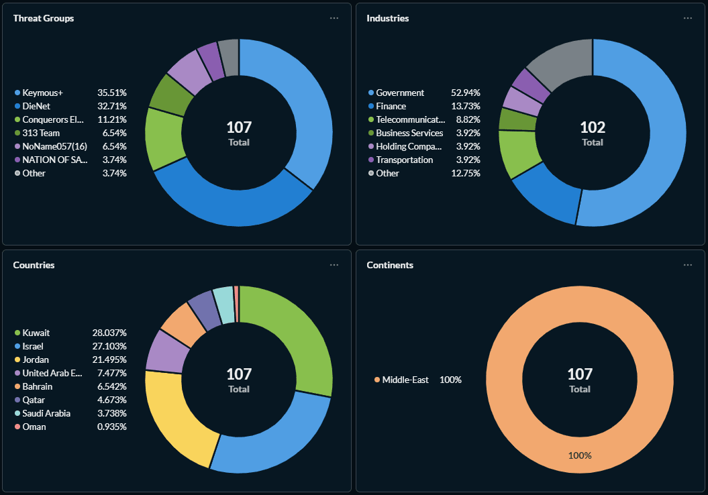

# Hacktivist DDoS Campaign Targeting 110 Organizations Across 16 Countries After Middle East Conflict

**Hacktivist Campaign**{.cve-chip}  **DDoS Operations**{.cve-chip}  **Geopolitical Trigger**{.cve-chip}  **Multi-Country Impact**{.cve-chip}

## Overview
A coordinated wave of hacktivist cyberattacks targeted 110 organizations across 16 countries, with 149 claimed DDoS attacks linked to geopolitical escalation in the Middle East. At least 12 hacktivist groups were reported as participants, with most operations focused on government portals and other public-facing services to maximize disruption and political messaging.

Open-source reporting indicates that two groups—Keymous+ and DieNet—accounted for nearly 70% of claimed activity, suggesting concentrated operational capacity within a broader coalition-style campaign.

## Technical Specifications

| **Attribute** | **Details** |
|---------------|-------------|
| **Campaign Type** | Coordinated hacktivist DDoS operations |
| **Claimed Attack Volume** | 149 DDoS attacks |
| **Organizations Targeted** | 110 |
| **Countries Affected** | 16 |
| **Primary Target Profile** | Government portals and high-visibility public infrastructure |
| **Likely Techniques** | HTTP Layer-7 floods, TCP SYN floods, UDP amplification, botnet flooding |
| **Threat Actor Structure** | 12+ hacktivist groups with distributed coordination |
| **Most Active Groups (Reported)** | Keymous+, DieNet (nearly 70% of attacks) |

## Affected Products
- Public-facing government digital services and citizen portals
- Financial institution web platforms and online service front ends
- Telecom-facing internet services and related edge infrastructure
- Organizations with internet-exposed services lacking robust DDoS resilience
- Status: Ongoing geopolitical DDoS risk with periodic surge potential

## Technical Details

### Attack Methods
- **HTTP Layer-7 Floods**: Application-layer request storms intended to exhaust web/app resources.
- **TCP SYN Floods**: Connection-state exhaustion against firewalls/load balancers/servers.
- **UDP Amplification**: Reflection/amplification abuse through misconfigured intermediary servers.
- **Botnet Traffic Flooding**: High-volume distributed traffic from compromised or rented botnet nodes.

### Campaign Characteristics
- Multi-group participation coordinated through online channels and messaging platforms.
- Targeting emphasized politically symbolic and high-availability public services.
- Claim-and-amplify behavior used social media/telegram-style channels for propaganda effect.

### Threat Group Mentions (Reported)
- Keymous+
- DieNet
- Conquerors Electronic Army (CEA)
- 313 Team
- NoName057(16)
- Nation of Saviors (NOS)
- Handala Hack
- Cyber Islamic Resistance
- Dark Storm Team

## Attack Scenario
1. **Geopolitical Trigger**:
    - Regional military escalation motivates hacktivist mobilization and narrative alignment.

2. **Coordination Phase**:
    - Groups coordinate targeting and timing through forums/messaging platforms.

3. **Target Selection**:
    - Attackers choose high-visibility government, telecom, and financial web services.

4. **Botnet Launch**:
    - Distributed botnets and amplification techniques generate volumetric and application-layer pressure.

5. **Service Degradation/Outage**:
    - Overloaded targets experience downtime or severe performance degradation.

6. **Propaganda Amplification**:
    - Groups publicize claims to maximize media impact and political signaling.

## Impact Assessment

=== "Availability"
    * Temporary disruption of public digital services and citizen-facing portals
    * Performance degradation or outages in telecom/financial online platforms
    * Increased risk during periods of coordinated multi-wave attack activity

=== "Operational & Financial Impact"
    * Elevated incident response and mitigation costs
    * Resource diversion to emergency traffic engineering and service recovery
    * Repeated attack waves can strain SOC/NOC capacity and resilience planning

=== "Reputational & Strategic Impact"
    * Public confidence impact during geopolitical crisis periods
    * Amplified media attention due to politically motivated claim campaigns
    * Demonstrates capability for cross-border hacktivist coordination at scale

## Mitigation Strategies

### Network Protection
- Deploy dedicated DDoS mitigation and traffic scrubbing services
- Use CDNs and anycast architectures to absorb and distribute traffic surges
- Apply rate limiting, WAF controls, and protocol-aware filtering

### Infrastructure Hardening
- Segment critical backend systems from internet-facing presentation layers
- Minimize exposed services and close unnecessary ingress paths
- Build failover and capacity headroom for burst traffic scenarios

### Monitoring & Detection
- Continuously monitor for volumetric anomalies and Layer-7 request spikes
- Integrate threat intelligence feeds tracking hacktivist campaigns and indicators
- Pre-stage playbooks for rapid blackholing, geo/risk filtering, and escalation

## Resources and References

!!! info "Open-Source Reporting"
    - [149 Hacktivist DDoS Attacks Hit 110 Organizations in 16 Countries After Middle East Conflict](https://thehackernews.com/2026/03/149-hacktivist-ddos-attacks-hit-110.html)
    - [149 Hacktivist DDoS Attacks Hit 110 Organizations in 16 Countries After Middle East Conflict | SOC Defenders](https://www.socdefenders.ai/item/e88699d3-cc4a-43be-a235-887f1007a227)

---

*Last Updated: March 5, 2026* 
