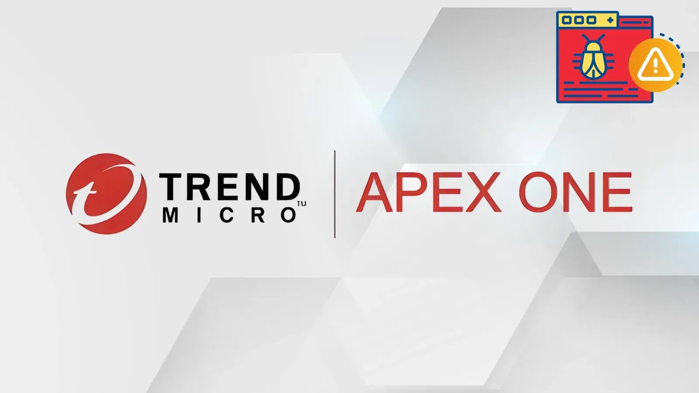

# Trend Micro Apex One Critical RCE Vulnerabilities

**CVE-2025-71210**{.cve-chip}  **CVE-2025-71211**{.cve-chip}  **Path Traversal**{.cve-chip}  **Apex One**{.cve-chip}

## Overview
Trend Micro disclosed and patched multiple vulnerabilities in Apex One, with the most severe issues enabling arbitrary code execution on vulnerable Apex One management servers. The critical risk primarily affects on-premises deployments, while cloud/SaaS customers were automatically patched.

## Technical Specifications

| **Attribute** | **Details** |
|---------------|-------------|
| **Critical CVEs** | CVE-2025-71210, CVE-2025-71211 |
| **Vulnerability Type** | Path traversal / improper input validation |
| **CVSS Score** | 9.8(Critical) |
| **Primary Affected Component** | Apex One management console (on-prem) |
| **Root Cause** | Improper path handling allows file path manipulation |
| **Exploitation Outcome** | File upload/overwrite in unintended directories leading to server-side code execution |
| **Deployment Scope** | On-prem Apex One most affected; cloud/SaaS patched automatically |
| **Additional Risk Area** | High-severity Apex One agent flaws with potential local privilege escalation on Windows/macOS |
| **Patch Reference** | Critical Patch Build 14136 (Apex One 2019 on-prem) |

## Affected Products
- Trend Micro Apex One (on-premises management server deployments)
- Apex One agents with additional high-severity local privilege concerns
- Windows and macOS endpoints in managed environments (agent-side impact)
- Organizations exposing management console interfaces to untrusted networks
- Status: Vendor patch available; urgent patching and hardening required

## Technical Details

### Critical Server-Side Vulnerabilities
- CVE-2025-71210 and CVE-2025-71211 affect the Apex One management console path handling logic.
- Improper input validation enables path traversal conditions.
- Attackers can write or overwrite files outside intended directories.
- Malicious file placement can trigger arbitrary code execution on the management server.

### Additional High-Severity Agent Issues
- Trend Micro also disclosed additional high-severity vulnerabilities in Apex One agents.
- Reported impact includes potential local privilege escalation on Windows/macOS endpoints.
- Combined server + endpoint weakness can amplify enterprise-wide risk.

### Exposure Profile
- Internet-exposed management consoles significantly increase attack surface.
- Internal attackers or adversaries with foothold access may also exploit vulnerable console paths.
- Compromise of a security management server creates a high-trust pivot point.

## Attack Scenario
1. **Initial Reachability**:
    - Organization exposes Apex One management console externally, or attacker gains internal network access.

2. **Exploit Delivery**:
    - Attacker sends crafted requests that exploit path traversal weaknesses.

3. **Malicious File Placement**:
    - Payload is written to attacker-controlled or execution-relevant server locations.

4. **Code Execution**:
    - Payload executes on the Apex One management server with elevated privileges.

5. **Post-Compromise Expansion**:
    - Attacker abuses management authority to push malicious updates, disable endpoint protections, move laterally, and stage ransomware/data theft operations.

## Impact Assessment

=== "Integrity"
    * Full compromise of Apex One management infrastructure
    * Security policy tampering and protection disabling
    * Potential unauthorized endpoint command/update distribution

=== "Confidentiality"
    * Elevated risk of broad enterprise data exposure
    * Access to endpoint/security telemetry and administrative artifacts
    * Increased risk of credential and configuration theft

=== "Availability"
    * Potential malware/ransomware deployment to managed endpoints at scale
    * Disruption of security operations and incident response visibility
    * Domain-wide operational impact from compromise of trusted security platform

## Mitigation Strategies

### Immediate Actions
- Apply Trend Micro Critical Patch Build 14136 for on-prem Apex One 2019 deployments
- Verify current build/version on all Apex One management servers
- Prioritize patching for internet-reachable or high-risk environments

### Hardening Measures
- Do not expose management consoles directly to the public internet
- Restrict console access through VPN or trusted internal administration networks
- Enforce firewall ACLs to tightly limit console reachability

### Monitoring & Validation
- Enable detailed logging and monitor for suspicious console/API activity
- Perform integrity checks on Apex One server files and directories
- Investigate anomalous file writes, unexpected service behavior, and unauthorized admin actions

## Resources and References

!!! info "Vendor and Security Reporting"
    - [Critical Trend Micro Apex One Vulnerabilities Allows Malicious Code Execution](https://cybersecuritynews.com/trend-micro-apex-one-vulnerabilities/)
    - [Critical Trend Micro Apex One Flaws Enable Remote Malicious Code Execution](https://cyberpress.org/critical-trend-micro-apex-one-flaws/)
    - [Critical Trend Micro Apex One Vulnerabilities Allow Remote Malicious Code Execution](https://gbhackers.com/critical-trend-micro-apex-one-vulnerabilities/)
    - [Trend Micro Patches Critical Apex One Vulnerabilities - SecurityWeek](https://www.securityweek.com/trend-micro-patches-critical-apex-one-vulnerabilities/)
    - [Trend Micro warns of critical Apex One code execution flaws](https://www.bleepingcomputer.com/news/security/trend-micro-warns-of-critical-apex-one-rce-vulnerabilities/)
    - [SECURITY BULLETIN: Apex One and Apex One (Mac) - February 2026](https://success.trendmicro.com/en-US/solution/KA-0022458)

---

*Last Updated: March 1, 2026* 
