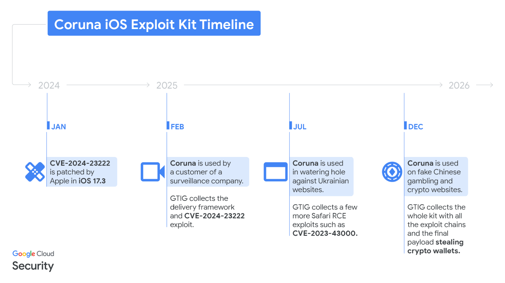
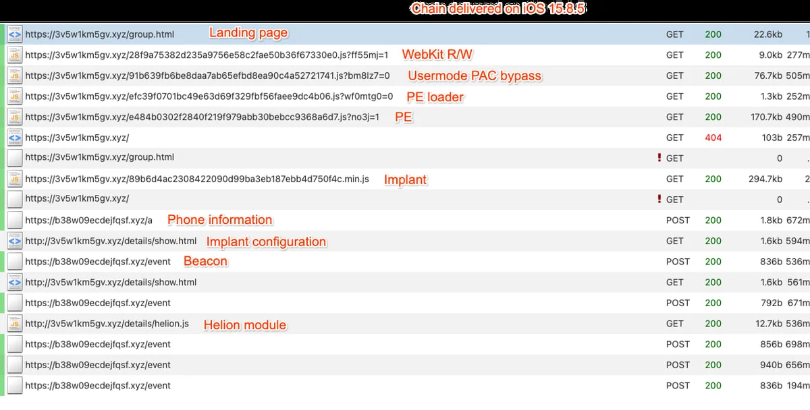

# Coruna iOS Exploit Kit (aka CryptoWaters)

**Coruna/CryptoWaters**{.cve-chip}  **iOS Exploit Kit**{.cve-chip}  **WebKit Chains**{.cve-chip}  **Mobile Surveillance-to-Crime**{.cve-chip}

## Overview
Security researchers identified a sophisticated exploit framework known as **Coruna** (also referenced as **CryptoWaters**) targeting Apple iPhones running iOS 13 through iOS 17.2.1. The toolkit reportedly includes 23 iOS exploits combined into five complete exploit chains capable of compromising devices through malicious or compromised websites.

Initially associated with surveillance-style operations, reporting indicates the toolkit later proliferated into broader threat ecosystems, including nation-state-linked operators and financially motivated cybercriminal groups.

## Technical Specifications

| **Attribute** | **Details** |
|---------------|-------------|
| **Framework Name** | Coruna (aka CryptoWaters) |
| **Exploit Count** | 23 iOS exploits |
| **Exploit Chains** | 5 complete chains |
| **Delivery Method** | Malicious/compromised websites with JavaScript exploit loader |
| **Affected iOS Range** | iOS 13.0 through 17.2.1 |
| **Primary Components** | WebKit exploitation, sandbox escape, kernel privilege escalation |
| **Post-Exploitation Payload** | PlasmaLoader |
| **C2 Resilience** | DGA-based fallback behavior |

## Affected Products
- Apple iPhones running iOS versions 13.0 to 17.2.1
- Devices browsing attacker-controlled or compromised websites
- Users in financial/crypto-targeted lure ecosystems
- Mobile environments lacking rapid patch and threat-defense controls
- Status: High-risk historical/version exposure where devices remain unpatched

## Technical Details

### Framework Architecture
- Modular exploit framework orchestrated by hidden JavaScript loaders.
- Device fingerprinting logic selects chain by model and iOS version.
- Exploit stages progress from browser compromise to deeper privilege control.

### Example Vulnerabilities Referenced in Reporting
- CVE-2024-23222 (WebKit type confusion)
- CVE-2023-43000 (WebKit use-after-free)
- CVE-2023-32434
- CVE-2023-32409
- CVE-2021-30952

### Execution Chain Model
- Initial WebKit remote-code execution vector from web content.
- Sandbox escape stage to break application confinement.
- Kernel privilege escalation for high-privilege device control.
- Payload deployment and modular post-exploitation extension.

### Post-Exploitation Behavior
- PlasmaLoader used to fetch/execute additional modules.
- DGA-based fallback supports resilient C2 connectivity.
- Reported data-theft focus includes crypto wallet artifacts, financial credentials, and sensitive app data.

## Attack Scenario
1. **Initial Access (Web Lure)**:
    - Threat actors compromise legitimate sites or host lure pages, often finance/crypto themed.

2. **Stealth Loader Execution**:
    - Hidden iFrame/JavaScript framework fingerprints visiting device and iOS version.

3. **Exploit Chain Selection**:
    - Matching chain is selected and executed against vulnerable target profile.

4. **Privilege Escalation Sequence**:
    - WebKit RCE is chained with sandbox escape and kernel-level escalation.

5. **Payload Deployment**:
    - PlasmaLoader installs and retrieves follow-on modules.

6. **Data Exfiltration / Monetization**:
    - Sensitive app data, wallet information, and credentials are extracted for espionage or financial theft.

## Impact Assessment

=== "Technical Impact"
    * Remote compromise of vulnerable iOS devices via web-driven chains
    * Data theft from mobile apps and cryptocurrency wallet ecosystems
    * Spyware-like capabilities through modular post-exploitation payloads

=== "Operational Impact"
    * Potential large-scale infection across targeted mobile populations
    * Expands practical mass exploitation of iOS in criminal operations
    * Higher incident response complexity due to chain modularity and stealth

=== "Strategic Impact"
    * Evidence of advanced exploit capability transfer/leakage beyond initial operators
    * Reinforces secondary market dynamics for high-end mobile exploit tooling
    * Increases threat convergence between surveillance tradecraft and financially motivated crime

## Mitigation Strategies

### For Users
- Update iOS to latest available security release immediately
- Enable Lockdown Mode for high-risk users
- Avoid suspicious or untrusted websites, especially finance/crypto lure pages

### For Organizations
- Enforce mobile OS patch compliance via MDM/EMM controls
- Deploy Mobile Threat Defense (MTD) with exploit/behavioral detection
- Monitor mobile web traffic and restrict access to suspicious domains

### Detection & Response
- Hunt for unusual mobile browser behavior and suspicious outbound C2 patterns
- Investigate signs of unauthorized wallet/app data access
- Maintain rapid incident response workflows for suspected mobile compromise

## Resources and References

!!! info "Open-Source Reporting"
    - [Coruna iOS Exploit Kit Uses 23 Exploits Across Five Chains Targeting iOS 13–17.2.1](https://thehackernews.com/2026/03/coruna-ios-exploit-kit-uses-23-exploits.html)
    - [Coruna: Spy-grade iOS exploit kit powering financial crime - Help Net Security](https://www.helpnetsecurity.com/2026/03/03/coruna-ios-exploit-kit/)
    - [Spyware-grade Coruna iOS exploit kit now used in crypto theft attacks](https://www.bleepingcomputer.com/news/security/spyware-grade-coruna-ios-exploit-kit-now-used-in-crypto-theft-attacks/)
    - [Google uncovers Coruna iOS Exploit Kit targeting iOS 13–17.2.1](https://securityaffairs.com/188928/security/google-uncovers-coruna-ios-exploit-kit-targeting-ios-13-17-2-1.html)
    - [Nation-State iOS Exploit Kit ‘Coruna’ Found Powering Global Attacks - SecurityWeek](https://www.securityweek.com/nation-state-ios-exploit-kit-coruna-found-powering-global-attacks/)
    - [Coruna Exploit Kit With 23 Exploits Hacked Thousands of iPhones](https://cybersecuritynews.com/coruna-ios-exploit-kit/)

---

*Last Updated: March 5, 2026* 
