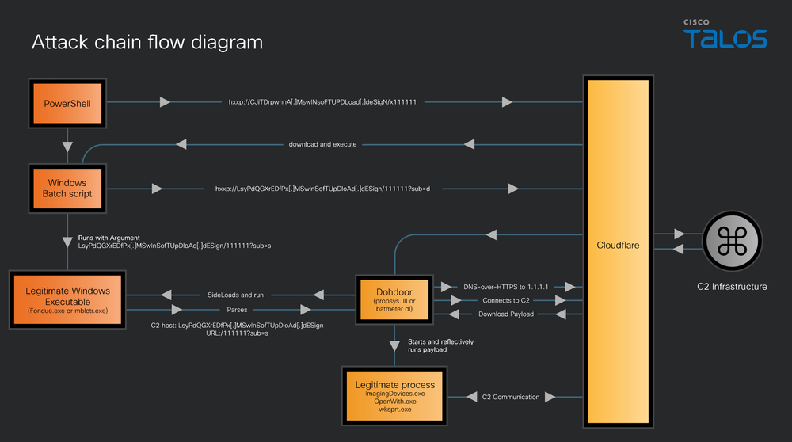

# UAT-10027 Targets U.S. Education and Healthcare with Dohdoor Backdoor

**Dohdoor Backdoor**{.cve-chip}  **UAT-10027**{.cve-chip}  **DoH C2**{.cve-chip}  **Healthcare/Education**{.cve-chip}

## Overview
UAT-10027 is an ongoing malicious cyber campaign delivering a previously undocumented backdoor known as Dohdoor into Windows environments. Activity has been observed since at least December 2025 and is focused on U.S. education and healthcare organizations.

The campaign uses a multi-stage execution chain, trusted Windows binaries for DLL sideloading, and DNS-over-HTTPS (DoH) command-and-control over port 443 to blend malicious traffic with legitimate encrypted web traffic. Reporting indicates robust evasion methods and post-compromise delivery of in-memory payloads associated with Cobalt Strike behavior.

## Technical Specifications

| **Attribute** | **Details** |
|---------------|-------------|
| **Threat Cluster** | UAT-10027 |
| **Malware Family** | Dohdoor (backdoor, previously undocumented) |
| **Target Sectors** | U.S. education and healthcare |
| **Campaign Activity** | Ongoing since at least December 2025 |
| **Initial Delivery** | Suspected phishing-linked PowerShell execution |
| **C2 Channel** | DNS-over-HTTPS (DoH) over TCP 443 |
| **Evasion Techniques** | DLL sideloading, in-memory payload staging, ntdll.dll syscall-monitoring unhooking |
| **Likely Follow-on Payload** | In-memory Cobalt Strike Beacon-like activity |

## Affected Products
- Microsoft Windows endpoint environments
- Organizations running endpoints where PowerShell execution is insufficiently restricted
- Networks with limited visibility into encrypted DoH traffic
- Sectors observed: U.S. education and healthcare
- Status: Active campaign, ongoing operational risk

## Technical Details

### Initial Access and Staging
- Initial access is likely phishing-driven, resulting in malicious PowerShell execution.
- PowerShell downloads a batch-script loader from remote infrastructure.
- The loader creates hidden directories and stages malicious components.

### DLL Sideloading Chain
- Staged DLL names include `propsys.dll` and `batmeter.dll` in observed reporting.
- Attackers sideload via trusted Windows binaries such as `Fondue.exe`, `mblctr.exe`, and `ScreenClippingHost.exe`.
- This tactic helps execution blend into expected process behavior.

### C2 and In-Memory Operations
- Dohdoor communicates with C2 over DoH on port 443, often routed through Cloudflare infrastructure.
- Additional payloads are reflectively loaded into trusted processes.
- Follow-on in-memory activity appears consistent with Cobalt Strike Beacon deployment.

### Evasion Behavior
- Malware reportedly interferes with syscall-monitoring visibility in `ntdll.dll`.
- Irregular domain naming and encrypted DNS transport complicate network-based detection.
- Reduced on-disk artifacts and memory-centric execution hinder traditional forensic workflows.

## Attack Scenario
1. **Initial Access**:
    - Victim receives phishing content and executes malicious PowerShell.

2. **Downloader Stage**:
    - PowerShell retrieves a remote batch loader script.

3. **Installation Stage**:
    - Batch loader creates hidden directories and writes malicious DLL payloads.

4. **Execution and Persistence**:
    - Trusted Windows binaries sideload malicious DLLs and establish Dohdoor access.

5. **Post-Compromise Expansion**:
    - Dohdoor connects via DoH C2, retrieves in-memory tooling, and enables deeper operations (e.g., beaconing, lateral movement).

## Impact Assessment

=== "Integrity"
    * Persistent unauthorized control over compromised Windows hosts
    * Potential tampering with system and security configurations
    * Increased risk of malicious policy/script deployment

=== "Confidentiality"
    * Elevated risk of credential theft and sensitive data access
    * Covert C2 channels reduce defender visibility into attacker communications
    * Post-compromise tooling may enable broad reconnaissance and data collection

=== "Availability"
    * Ongoing attacker presence may degrade endpoint reliability and security tooling efficacy
    * Potential for broader operational disruption if lateral movement succeeds
    * High risk of escalation to additional disruptive payloads

## Mitigation Strategies

### Network & Detection Controls
- Monitor encrypted DNS (DoH) activity for unusual endpoints, long-lived sessions, and abnormal client patterns
- Enforce approved DoH resolvers only, or apply controls that inspect/block unauthorized DoH usage
- Alert on suspicious use of LOLBins associated with DLL sideloading patterns

### Endpoint & System Hardening
- Maintain current EDR/AV with detections for in-memory execution and DLL sideloading behavior
- Restrict and monitor PowerShell usage through policy controls and script logging
- Harden process execution and application control policies for trusted binary abuse pathways

### Threat Hunting Priorities
- Hunt for hidden staging directories and suspicious DLL placement near trusted binaries
- Investigate anomalous execution chains involving `Fondue.exe`, `mblctr.exe`, and `ScreenClippingHost.exe`
- Correlate DoH beacon-like traffic with suspicious endpoint process trees
- Apply available signatures and behavioral rules for reported Dohdoor artifacts where validated

## Resources and References

!!! info "Open-Source Reporting"
    - [New Dohdoor malware Attacking Schools and Health Care Sectors in U.S. via Multi-Stage Attack Chain](https://cybersecuritynews.com/new-dohdoor-malware-attacking-schools-and-health-care/)
    - [UAT-10027 Targets U.S. Education and Healthcare with Dohdoor Backdoor](https://thehackernews.com/2026/02/uat-10027-targets-us-education-and.html)
    - [New Dohdoor malware campaign targets education and health care](https://blog.talosintelligence.com/new-dohdoor-malware-campaign/)
    - [Dohdoor Backdoor Hits U.S. Schools and Hospitals Through Stealthy DoH-Based Attacks](https://vpncentral.com/dohdoor-backdoor-hits-u-s-schools-and-hospitals-through-stealthy-doh-based-attacks/)
    - [Dohdoor Malware Targets U.S. Schools and Healthcare with Multi-Stage Attack](https://gbhackers.com/dohdoor-malware/)
    - [UAT-10027 Targets U.S. Education and Healthcare with Dohdoor Backdoor | by SOCFortress | Feb, 2026 | Medium](https://socfortress.medium.com/uat-10027-targets-u-s-education-and-healthcare-with-dohdoor-backdoor-f3b89e944278)

---

*Last Updated: March 1, 2026* 
