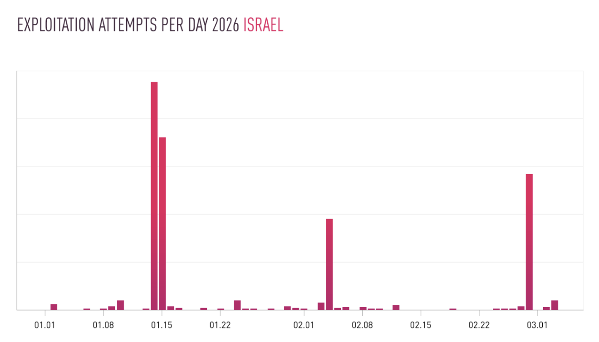
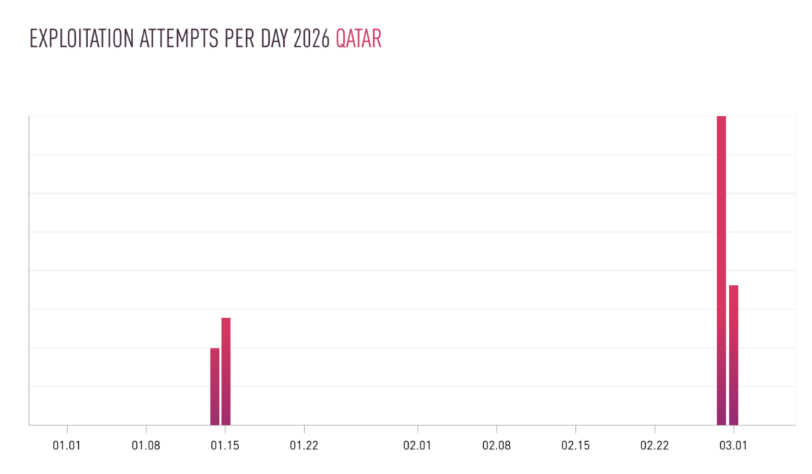
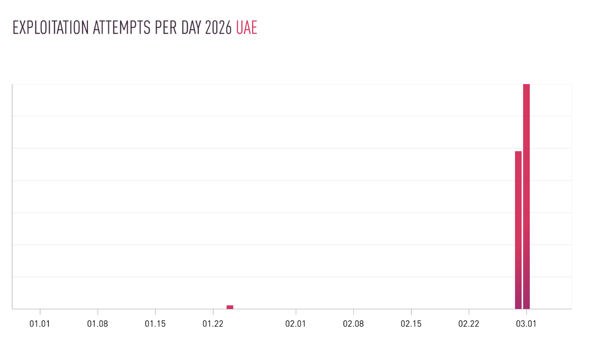

# Iran-linked Cyber Espionage Campaign Targeting Internet-Connected Surveillance Cameras

**Iran-Linked Activity**{.cve-chip}  **IP Camera Targeting**{.cve-chip}  **Reconnaissance Operations**{.cve-chip}  **IoT Exposure**{.cve-chip}

## Overview
Researchers reported a surge in cyber-attack attempts associated with infrastructure linked to Iranian threat activity, targeting internet-connected surveillance cameras across multiple **Middle Eastern countries**. The objective appears to be unauthorized access to live/recorded video feeds from cameras in public spaces, infrastructure zones, and potentially sensitive locations.

The campaign aligns with conflict-driven reconnaissance goals, where compromised surveillance systems can provide real-time visibility for operational monitoring and intelligence collection.

## Technical Specifications

| **Attribute** | **Details** |
|---------------|-------------|
| **Campaign Type** | Cyber espionage / reconnaissance via surveillance infrastructure |
| **Primary Targets** | Internet-exposed IP cameras in Middle Eastern regions |
| **Vendors Highlighted** | Hikvision, Dahua Technology |
| **Likely Access Methods** | Exploitation of known firmware flaws and weak/default credentials |
| **Common Exposure Ports** | 80 (HTTP), 443 (HTTPS), 554 (RTSP) |
| **Typical Vulnerability Classes** | Authentication bypass, command injection, RCE, insecure API paths |
| **Attack Automation** | Large-scale scanning and device fingerprinting |
| **Mission Objective** | Access live streams/recordings for situational and strategic intelligence |

## Affected Products
- Internet-connected IP cameras and NVR-adjacent camera management surfaces
- Commonly deployed camera ecosystems from Hikvision and Dahua (per reporting)
- Devices with default credentials or weak authentication settings
- Cameras exposing management/streaming services directly to untrusted networks
- Status: Elevated regional risk where IoT surveillance is externally reachable

## Technical Details

### Initial Exposure Surface
- Many deployments expose camera management and streaming interfaces directly to the internet.
- Frequently reachable services include web management and RTSP endpoints.
- Weak segmentation often places cameras on routable or weakly filtered networks.

### Exploitation Paths
- Attackers may leverage known firmware issues such as authentication bypass, command injection, remote code execution, or insecure API behavior.
- Credential-based compromise remains common where factory defaults or weak passwords persist.
- Misconfigured remote administration expands reachable attack surface.

### Automation and Target Selection
- Automated scanners identify exposed devices at scale.
- Fingerprinting techniques classify vendor/model/firmware versions.
- Exploit attempts are then tailored to observed device profile and weakness type.

### Post-Compromise Utility
- Unauthorized viewing of real-time and archived video streams.
- Monitoring of activity near strategic or sensitive locations.
- Potential support to physical-world planning and battle-damage assessment.

## Attack Scenario
1. **Mass Reconnaissance**:
    - Attacker scans internet ranges to locate exposed camera interfaces and RTSP services.

2. **Fingerprinting**:
    - Identifies vendor/model/firmware to select suitable exploit or credential strategy.

3. **Initial Compromise**:
    - Uses known vulnerabilities or weak/default credentials to obtain administrative access.

4. **Feed Access and Persistence**:
    - Retrieves live/recorded video streams and may alter configuration for continued access.

5. **Operational Intelligence Use**:
    - Monitors movement/activity near military, infrastructure, and transportation targets for ongoing situational awareness.

## Impact Assessment

=== "Operational Intelligence Leakage"
    * Real-time observation of movement and response activity near sensitive sites
    * Enhanced adversary awareness during active regional hostilities
    * Potential use for battle-damage assessment and tactical planning

=== "Infrastructure Security Impact"
    * Large camera fleets can become reconnaissance nodes if internet-exposed
    * Compromised surveillance undermines physical-security trust models
    * Potential pivot risk into adjacent network segments if controls are weak

=== "Privacy and Civilian Risk"
    * Unauthorized access to civilian and organizational video footage
    * Exposure of location patterns, routines, and sensitive operational activity
    * Broader data protection and compliance implications for affected operators

## Mitigation Strategies

### Network Protection
- Do not expose camera interfaces directly to the internet
- Use VPNs or secure gateways for remote administration access
- Segment IoT surveillance systems from critical IT and operational networks

### Authentication Hardening
- Replace default credentials immediately
- Enforce strong unique passwords and account policy controls
- Enable multi-factor authentication where supported by platform

### Firmware and Vulnerability Management
- Apply vendor firmware/security updates on a defined patch cadence
- Track vendor advisories for newly disclosed camera vulnerabilities
- Prioritize remediation for internet-reachable devices first

### Monitoring and Detection
- Log and review camera access attempts and admin operations
- Deploy IDS/IPS visibility for anomalous traffic to camera subnets
- Restrict RTSP access to internal trusted zones and monitor unexpected stream pulls

### Device Configuration Hygiene
- Disable unnecessary services and close unused ports
- Limit management endpoints to approved administration hosts
- Regularly audit configuration drift from secure baselines

## Resources and References

!!! info "Open-Source Reporting"
    - [Interplay between Iranian Targeting of IP Cameras and Physical Warfare in the Middle East - Check Point Research](https://research.checkpoint.com/2026/interplay-between-iranian-targeting-of-ip-cameras-and-physical-warfare-in-the-middle-east/)
    - ['Hundreds' of Iranian hacking attempts hit IP cameras • The Register](https://www.theregister.com/2026/03/04/iranian_hacking_attempts_ip_cameras/)
    - [Iran-Linked Hackers Target Surveillance Cameras Across Middle East, Researchers Say](https://ground.news/article/iran-linked-hackers-target-surveillance-cameras-across-middle-east-researchers-say_8ace23)
    - [Iran-nexus hackers target flaws in surveillance cameras | Cybersecurity Dive](https://www.cybersecuritydive.com/news/iran-hackers-target-flaws-ip-cameras/813795/)

---

*Last Updated: March 5, 2026* 
