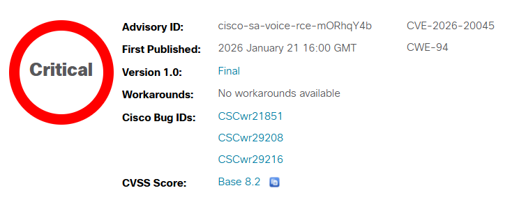
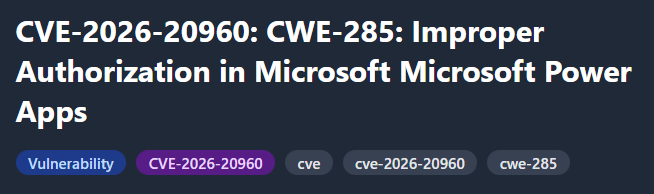

---
hide:
  - navigation
  - toc
---

# Last Week's Security Incidents
 

-   

    **Cisco Unified Communications Products Remote Code Execution Vulnerability**

    **CVE-2026-20045**{.cve-chip} **Remote Code Execution**{.cve-chip} **Unauthenticated**{.cve-chip} **Zero-Day**{.cve-chip} **Active Exploitation**{.cve-chip} **CVSS 8.2**{.cve-chip}

    A critical zero-day vulnerability (CVE-2026-20045) in Cisco's Unified Communications Manager, Unity Connection, IM & Presence, and Webex Calling Dedicated Instance allows unauthenticated remote attackers to execute arbitrary OS commands by sending specially crafted HTTP requests to the device's web management interface. The flaw stems from improper validation of user-supplied input in HTTP request processing (CWE-94 code injection), enabling complete system compromise without requiring any authentication or user interaction. 
    
    Active exploitation has been confirmed in the wild, with attackers achieving user-level command execution and escalating privileges to root access on vulnerable UC servers. The vulnerability affects Cisco CUCM versions prior to 14SU5 and 15SU4, Unity Connection, and related products managing enterprise voice, video, and messaging infrastructure for millions of organizations worldwide. CISA added CVE-2026-20045 to the Known Exploited Vulnerabilities Catalog.

    [:octicons-arrow-right-24: Read more](2026/Week3/cisco.md)

-   

    **LinkedIn Phishing Malware Campaign via DLL Sideloading**

    **Social Engineering**{.cve-chip} **DLL Sideloading**{.cve-chip} **Remote Access Trojan**{.cve-chip} **In-Memory Execution**{.cve-chip} **Python RAT**{.cve-chip} **Executive Targeting**{.cve-chip}

    A sophisticated phishing campaign exploits LinkedIn's professional credibility to deliver Remote Access Trojan (RAT) malware through direct messages targeting C-level executives, HR professionals, and business development personnel. Attackers impersonate recruiters or business partners, sending WinRAR self-extracting archives containing legitimate signed PDF readers bundled with malicious DLLs that exploit Windows' DLL search order mechanism (T1574.002). The attack chain deploys a portable Python interpreter executing Base64-encoded shellcode entirely in memory to evade file-based detection, establishing persistent C2 communication via HTTPS beaconing and registry run keys.
    
    The campaign demonstrates advanced evasion through legitimate software abuse (signed executables), proxy DLL forwarding to maintain application functionality, and fileless execution avoiding disk artifacts. Attack scenarios include fake job offers, partnership proposals, and supplier RFPs tailored to victim LinkedIn profiles. In a documented aerospace defense contractor breach, attackers maintained 8-week access after compromising a CTO via fake recruitment message, exfiltrating 247 GB of classified designs and autonomous flight algorithms, resulting in $238.5M total costs including $89M IP loss, $125M in suspended contracts, and DFARS/CMMC compliance revocations.

    [:octicons-arrow-right-24: Read more](2026/Week3/linkedin.md)

-   

    **Command Injection Vulnerability in Zoom Node Multimedia Routers (MMRs)**

    **CVE-2026-22844**{.cve-chip} **Command Injection**{.cve-chip} **CWE-78**{.cve-chip} **CVSS 9.9**{.cve-chip} **Meeting Interception**{.cve-chip} **Critical**{.cve-chip}

    A critical command injection vulnerability (CVE-2026-22844) in Zoom Node Multimedia Routers allows authenticated meeting participants with low-level privileges to execute arbitrary OS commands on vulnerable MMR servers through specially crafted network requests without any user interaction. The vulnerability stems from improper input validation when processing meeting participant data (CWE-78), affecting all MMR versions prior to 5.2.1716.0. Zoom Node MMRs serve as critical infrastructure bridging legacy video conferencing hardware (Cisco, Polycom, Lifesize) with Zoom's cloud platform, managing media transcoding, encryption, and routing for enterprise hybrid conferencing deployments.
    
    Attackers joining Zoom meetings can send malicious SIP/H.323 protocol messages or Zoom control packets with injected commands that execute with root privileges on MMR appliances, providing complete system control, real-time meeting interception capabilities, credential theft from configuration files, and lateral movement pivot points into conference room VLANs. The low attack complexity and minimal privileges required (meeting participant access) make this highly exploitable by threat actors targeting confidential communications in legal, healthcare, financial services, defense, and government sectors.

    [:octicons-arrow-right-24: Read more](2026/Week3/zoom.md)

-   

    **Multiple GitLab Vulnerabilities Enable 2FA Bypass and DoS Attacks**

    **CVE-2026-0723**{.cve-chip} **2FA Bypass**{.cve-chip} **CWE-252**{.cve-chip} **CVSS 7.4**{.cve-chip} **WebAuthn**{.cve-chip} **Supply Chain**{.cve-chip}

    A critical authentication bypass vulnerability (CVE-2026-0723) affecting GitLab Community Edition and Enterprise Edition allows attackers to circumvent two-factor authentication protections through unchecked return values in WebAuthn authentication services. The vulnerability stems from improper handling of device credential responses during second-factor verification (CWE-252), enabling attackers with knowledge of a victim's credential ID to submit forged WebAuthn device responses that the system incorrectly accepts as valid 2FA proof. GitLab's authentication logic fails to properly validate return values from WebAuthn operations, allowing programmatically generated fake responses to bypass multi-factor authentication with only password knowledge required.
    
    The vulnerability affects GitLab versions 18.6.0-18.6.3, 18.7.0-18.7.1, and 18.8.0-18.8.1 across all deployment models including self-managed installations and SaaS environments serving 30 million+ users across 100,000+ organizations. Attackers obtaining credential IDs through OSINT reconnaissance, information disclosure vulnerabilities, or social engineering can gain unauthorized access to protected repositories, CI/CD pipelines, container registries, and sensitive source code. The attack requires medium complexity (credential ID knowledge) but no user interaction, with changed scope enabling access beyond intended authentication boundaries to compromise entire software development infrastructures.

    [:octicons-arrow-right-24: Read more](2026/Week3/gitlab.md)

-   

    **Oracle HTTP Server / WebLogic Server Proxy Plug-in Vulnerability (CVE-2026-21962)**

    **CVE-2026-21962**{.cve-chip} **Oracle HTTP Server**{.cve-chip} **WebLogic**{.cve-chip} **Proxy Plug-in**{.cve-chip} **Unauthenticated RCE**{.cve-chip} **Critical**{.cve-chip} **Scope Change**{.cve-chip}

    Critical unauthenticated remote vulnerability (CVE-2026-21962, CVSS 10 CRITICAL, disclosed Oracle CPU January 2026) affecting Oracle HTTP Server and Oracle WebLogic Server Proxy Plug-in integrating WebLogic application servers with Apache HTTP Server and Microsoft IIS. Vulnerability in request processing logic of proxy plug-in component allows unauthenticated attacker with network access via HTTP to send specially crafted requests exploiting improper input validation or path traversal flaws to bypass authentication mechanisms, access restricted resources, read or modify server-accessible data, potentially achieving remote code execution.
    
    Affects Oracle HTTP Server versions 12.2.1.4.0, 14.1.1.0.0, 14.1.2.0.0, WebLogic Proxy Plug-in for Apache (all versions), WebLogic Proxy Plug-in for IIS (12.2.1.4.0 only). Scope change in CVSS indicates successful exploitation impacts additional Oracle components and backend systems beyond initially compromised HTTP server or proxy plug-in. Enables attackers to read/create/modify/delete server-accessible data, compromise confidentiality and integrity of enterprise applications, pivot to internal network services leveraging compromised proxy as bridge between external attackers and internal WebLogic application servers managing sensitive business logic and databases, potentially deploy web shells or backdoors for persistent access.
    
    Widely deployed in enterprise environments managing critical business applications across finance (core banking, payment processing), healthcare (patient portals, EHR systems), government (citizen services, tax systems), telecommunications (billing platforms), manufacturing (supply chain management). No public exploits or proof-of-concept at disclosure but combination of ease of exploitation (low complexity, no authentication), widespread deployment, critical severity with scope change makes this high-priority patching target demanding immediate attention.

    [:octicons-arrow-right-24: Read more](2026/Week3/weblogic.md)

-   

    **Google Gemini Prompt Injection via Calendar Invites**

    **Gemini Prompt Injection**{.cve-chip} **Indirect Prompt Injection**{.cve-chip} **Google Calendar**{.cve-chip} **AI Security**{.cve-chip} **LLM Vulnerability**{.cve-chip} **Privacy Breach**{.cve-chip} **Data Exfiltration**{.cve-chip}

    Critical indirect prompt injection vulnerability in Google Gemini (January 2026) enabling attackers to embed malicious natural-language instructions in Google Calendar invite descriptions that execute when victims make benign queries about schedules, resulting in unauthorized access to private meeting data without malware, phishing clicks, or user awareness. Exploits fundamental LLM security challenge: Gemini cannot reliably distinguish between trusted system instructions and untrusted user-supplied data from calendar events controlled by external parties.
    
    When victim asks Gemini routine questions like "What's my schedule today?" or "Summarize my meetings," Gemini processes all calendar events including attacker-controlled invites containing hidden instructions directing Gemini to extract sensitive meeting data (participant names, confidential project details, financial discussions, acquisition negotiations) and create new calendar event with compiled summary visible to attacker through shared calendar permissions or attendee access. Attack requires only sending calendar invite and waiting for victim's normal Gemini usage—zero-click exploitation with minimal forensic evidence.
    
    Enterprise environments with Google Workspace shared calendar permissions face severe risks: corporate espionage targeting M&A negotiations, financial intelligence theft from executive calendars, social engineering reconnaissance via travel schedules and meeting patterns, supply chain attacks through compromised service providers with multi-client calendar access. Data at risk includes acquisition offers, revenue figures, strategic plans, personnel changes, board discussions, legal matters, and contact networks of executives and partners.

    [:octicons-arrow-right-24: Read more](2026/Week3/gemini.md)

-   

    **Microsoft Power Apps Remote Code Execution (CVE-2026-20960)**

    **CVE-2026-20960**{.cve-chip} **CWE-285**{.cve-chip} **Power Apps**{.cve-chip} **Improper Authorization**{.cve-chip} **Remote Code Execution**{.cve-chip} **Low-Code Platform**{.cve-chip} **Microsoft 365**{.cve-chip}

    Critical improper authorization vulnerability (CVE-2026-20960, CWE-285, January 2026) in Microsoft Power Apps enabling authenticated attackers with low-level privileges to execute arbitrary code remotely. Flaw stems from insufficient authorization checks within Power Apps platform allowing users to bypass access control mechanisms and run unauthorized code in Power Apps environment context. Significant risks for organizations relying on Power Apps for business-critical workflows including data breaches, service disruption, and lateral movement within enterprise environments.
    
    Vulnerability exploitable over network with low complexity, requiring low privileges and user interaction, with high impact on confidentiality, integrity, and availability. Affects Power Apps builds prior to version 25121. Attackers with legitimate low-level access craft network requests targeting flawed authorization logic to bypass access controls and execute arbitrary code for data manipulation, workflow alteration, or pivoting further into environment. Root cause: Power Apps fails to adequately validate user permissions before executing operations involving code execution or workflow manipulation.

    [:octicons-arrow-right-24: Read more](2026/Week3/power.md)

-   

    **TP-Link VIGI Camera Authentication Bypass (CVE-2026-0629)**

    **CVE-2026-0629**{.cve-chip} **Authentication Bypass**{.cve-chip} **TP-Link VIGI**{.cve-chip} **IP Camera**{.cve-chip} **Password Recovery**{.cve-chip} **Client-Side Bypass**{.cve-chip} **IoT Security**{.cve-chip}

    Critical authentication bypass vulnerability (CVE-2026-0629, CVSS 8.8 HIGH) affecting 32+ models of TP-Link VIGI surveillance cameras (C series fixed/bullet cameras and InSight series PTZ cameras) widely deployed in commercial settings. Vulnerability exists in password recovery feature of web administration interface, allowing unauthenticated attackers on local network (or internet if camera exposed) to reset admin password without proper identity verification by exploiting client-side state manipulation. 
    
    Attacker manipulates browser JavaScript variables or HTTP request parameters (changing verified=false to verified=true) bypassing server-side validation, gaining full administrative access to view live video streams, download historical recordings, modify camera configurations, disable motion detection alerts, change network settings, or use cameras as pivot points for lateral movement into internal networks. 
    
    Discovered by Arko Dhar (Redinent Innovations), affects widespread commercial deployments (retail stores, offices, warehouses, schools, manufacturing facilities). Over 2,500 vulnerable cameras exposed to public internet at discovery time. Enables severe privacy violations (unauthorized surveillance of sensitive areas, executive meetings, proprietary processes), security evasion (disable cameras during physical intrusions, delete footage covering criminal activity), competitor espionage (steal trade secrets visible on camera, pricing strategies, operational procedures), and network compromise (pivot from surveillance VLAN to corporate networks, access connected NVR systems managing hundreds of cameras).

    [:octicons-arrow-right-24: Read more](2026/Week3/vigi.md)

-   

    **CrashFix: Malicious Chrome Extension Browser Crash Social Engineering Campaign**

    **CrashFix**{.cve-chip} **ClickFix Variant**{.cve-chip} **Chrome Extension**{.cve-chip} **ModeloRAT**{.cve-chip} **Social Engineering**{.cve-chip} **NexShield**{.cve-chip} **Browser DoS**{.cve-chip} **Supply Chain Attack**{.cve-chip}

    CrashFix is sophisticated social engineering campaign (ClickFix attack evolution) combining malicious Chrome extensions with browser denial-of-service tactics discovered January 2026. Fake ad blocker extension "NexShield – Advanced Web Guardian" distributed via official Chrome Web Store masquerading as uBlock Origin Lite clone. After installation, extension waits ~60 minutes (delayed activation evading initial scrutiny) before deliberately crashing Chrome browser by exhausting system resources through infinite loops of API calls consuming memory/CPU until browser becomes unresponsive.
    
    Upon restart, extension displays fake "CrashFix" security warning mimicking Windows security alerts claiming browser crashed due to security issues requiring urgent "system scan". Warning instructs victims to open Windows Run dialog (Win+R) and paste pre-loaded command from clipboard (placed by extension using Clipboard API). Command appears as "fix" but actually executes multi-stage malware delivery chain leveraging legitimate Windows utilities (Finger.exe for download, PowerShell for execution) to deploy ModeloRAT (Python-based Remote Access Trojan targeting domain-joined enterprise Windows systems).
    
    ModeloRAT provides persistent access via Registry Run keys and Scheduled Tasks, reconnaissance capabilities (Active Directory enumeration, credential theft), encrypted C2 communications enabling lateral movement, privilege escalation, data exfiltration. Distributed via malicious advertisements promoting fake ad blockers. Particularly effective against IT staff with elevated privileges enabling rapid enterprise-wide compromise. Attack combines supply chain elements (Chrome Web Store abuse), browser DoS (forced crashes creating urgency), social engineering (fake security warnings exploiting trust), Living-off-the-Land techniques (built-in Windows tools evading detection).

    [:octicons-arrow-right-24: Read more](2026/Week3/crashfix.md)

-   

    **GootLoader Malware - Malformed ZIP Evasion Campaign**

    **GootLoader**{.cve-chip} **Malformed ZIP**{.cve-chip} **JavaScript Malware**{.cve-chip} **SEO Poisoning**{.cve-chip} **Evasion Technique**{.cve-chip} **ZIP Bomb**{.cve-chip} **Loader Malware**{.cve-chip}

    GootLoader JavaScript-based malware loader re-emerged with advanced anti-analysis evasion technique using malformed ZIP archives composed of 500-1,000 concatenated ZIP structures. Exploits discrepancy between Windows Explorer's built-in ZIP handler (scans from end, successfully extracts malicious JScript) and third-party tools/security scanners (scan from beginning, fail to parse corrupted structures), bypassing antivirus, sandboxes, email gateways. 
    
    Each ZIP uniquely generated with randomized metadata and hash-busting for signature evasion. Distributed via SEO poisoning targeting business document searches (legal contracts, real estate forms, tax templates), malvertising on compromised WordPress sites. 
    
    Malformed ZIP (10-50MB) extracts to reveal JavaScript file with benign name (Business_Contract_Agreement_2026.js). When double-clicked, Windows Script Host executes payload launching hidden PowerShell chain, establishing persistence via Registry Run keys, downloading secondary payloads (Cobalt Strike beacons, backdoors, ransomware). Serves as initial access broker for ransomware operators. Targets legal, finance, real estate, healthcare industries globally.

    [:octicons-arrow-right-24: Read more](2026/Week3/zip.md)

-   

    **UAT-8837: China-Linked APT Targeting North American Critical Infrastructure**

    **UAT-8837**{.cve-chip} **China APT**{.cve-chip} **Critical Infrastructure**{.cve-chip} **CVE-2025-53690**{.cve-chip} **Sitecore Zero-Day**{.cve-chip} **Credential Theft**{.cve-chip} **Supply Chain Risk**{.cve-chip}

    China-linked advanced persistent threat actor UAT-8837 (tracked by Cisco Talos with medium confidence attribution based on TTP overlap with known China-nexus groups) conducting sophisticated intrusion campaigns against high-value North American critical infrastructure organizations including energy, utilities, telecommunications, transportation, government sectors. 
    
    Primary initial access vectors include exploitation of CVE-2025-53690 (critical Sitecore CMS ViewState deserialization zero-day with CVSS ~9.0 enabling unauthenticated remote code execution) and compromised credential abuse (stolen passwords, password spraying, VPN exploitation). Post-compromise operations leverage open-source offensive tools (GoTokenThief for access token theft, Earthworm for reverse SOCKS tunneling to external C2, DWAgent remote administration for persistence, SharpHound/Certipy/Rubeus for Active Directory enumeration and Kerberos abuse, Impacket/GoExec for lateral movement) combined with Living-off-the-Land techniques using native Windows utilities (setspn, dsquery, nltest, secedit) to evade detection. 
    
    Extensive reconnaissance targeting Active Directory environments, domain trust relationships, security configurations, credential harvesting for privilege escalation. Notably, UAT-8837 exfiltrated sensitive DLL files from compromised critical infrastructure systems raising significant supply chain attack concerns (potential for reverse engineering proprietary code, vulnerability research, trojanization for future distribution). Establishes persistent access via multiple mechanisms (DWAgent services, reverse tunnels, backdoor accounts, Golden Tickets). Strategic objectives likely include espionage, pre-positioning for disruptive attacks, intellectual property theft, long-term intelligence collection against North American economic and security interests.

    [:octicons-arrow-right-24: Read more](2026/Week3/talos.md)

-   

    **Iran State Television Broadcast Hijacking (Badr Satellite Signal Intrusion)**

    **Satellite Hijacking**{.cve-chip} **Broadcast Intrusion**{.cve-chip} **Iran**{.cve-chip} **Badr Satellite**{.cve-chip} **Hacktivism**{.cve-chip} **Signal Injection**{.cve-chip} **Information Warfare**{.cve-chip}

    Anti-regime activists successfully hijacked Iranian state television broadcasts for approximately 10 minutes by compromising Badr satellite uplink infrastructure (Badr-4, Badr-5, Badr-7 operated by Arabsat) used to distribute multiple Iranian state TV channels nationwide. 
    
    Attackers replaced regular programming with anti-government content including protest footage from nationwide demonstrations and recorded video appeal by exiled Crown Prince Reza Pahlavi calling for renewed protests and urging Iranian military/security forces to refuse orders to fire on civilians. Broadcast reached millions of Iranian households during prime viewing hours via Badr satellite transponders covering Iran, Middle East, North Africa. 
    
    Incident occurred during nationwide internet blackouts when state TV was primary mass communication channel accessible to citizens, amplifying impact. Specific technical exploitation method undisclosed but likely involved ground station uplink compromise via insider access, weak uplink authentication exploitation, or third-party broadcast service provider infiltration. Demonstrates critical vulnerability of centralized authoritarian broadcast infrastructure to signal injection attacks and information warfare tactics.

    [:octicons-arrow-right-24: Read more](2026/Week3/stateTV.md)

-   

    **Critical Authentication Bypass in Modular DS WordPress Plugin (CVE-2026-23550)**

    **CVE-2026-23550**{.cve-chip} **WordPress**{.cve-chip} **Authentication Bypass**{.cve-chip} **Admin Takeover**{.cve-chip} **Active Exploitation**{.cve-chip} **REST API**{.cve-chip} **Zero-Day**{.cve-chip}

    Critical authentication bypass vulnerability in Modular DS WordPress plugin (versions ≤2.5.1) affecting ~40,000 WordPress installations globally, actively exploited in the wild as zero-day. Improper validation of "direct requests" in REST API endpoint `/api/modular-connector/` allows unauthenticated attackers to bypass authentication by adding crafted parameters (origin=mo) to trick plugin into trusting unauthorized requests. 
    
    Vulnerable `/login/` endpoint automatically authenticates attackers as WordPress administrators without credentials, granting full site control. Mass scanning campaigns target vulnerable installations for complete takeovers. 
    
    Successful exploitation enables creation of backdoor admin accounts, malicious plugin uploads (web shells, payment skimmers), data exfiltration (customer PII, payment details, credentials), SEO spam injection, website defacement, ransomware deployment. E-commerce sites particularly targeted for credit card theft via Magecart-style skimmers. 
    
    CVSS 10 CRITICAL. Patched in version 2.5.2 (January 2026).

    [:octicons-arrow-right-24: Read more](2026/Week3/wordpress.md)

-   

    **Credential-Stealing Chrome Extensions Target Enterprise HR Platforms**

    **Chrome Extensions**{.cve-chip} **Session Hijacking**{.cve-chip} **Cookie Theft**{.cve-chip} **Enterprise HR**{.cve-chip} **Workday**{.cve-chip} **NetSuite**{.cve-chip} **SuccessFactors**{.cve-chip} **Supply Chain**{.cve-chip}

    Five malicious Chrome extensions (DataByCloud Access, Tool Access 11, DataByCloud 1, DataByCloud 2, Software Access) discovered by Socket security researchers targeting enterprise HR/ERP platforms with ~2,300 combined installations. Extensions disguised as legitimate productivity and security tools on Chrome Web Store requested excessive permissions (cookies, webRequest, scripting, <all_urls>) to steal authentication session cookies every 60 seconds from Workday, NetSuite, and SuccessFactors. 
    
    Advanced techniques include DOM manipulation blocking access to administrative/security pages (hindering incident response with fake maintenance errors), and bidirectional cookie injection capability in Software Access extension enabling complete session hijacking by replaying stolen tokens into victim browsers without password/MFA prompts. Shared infrastructure (identical code patterns, common C2 endpoints, same hosting provider) indicates coordinated campaign. 
    
    Successful exploitation grants attackers access to sensitive employee PII (SSNs, salaries, banking details), financial data, HR records, enabling payroll fraud, data exfiltration to dark web, ransomware deployment, and corporate espionage. MFA and password protections bypassed via session token theft.

    [:octicons-arrow-right-24: Read more](2026/Week3/chrome.md)

