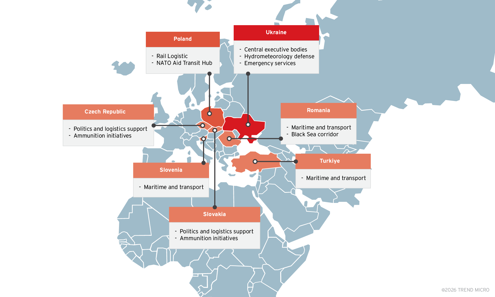
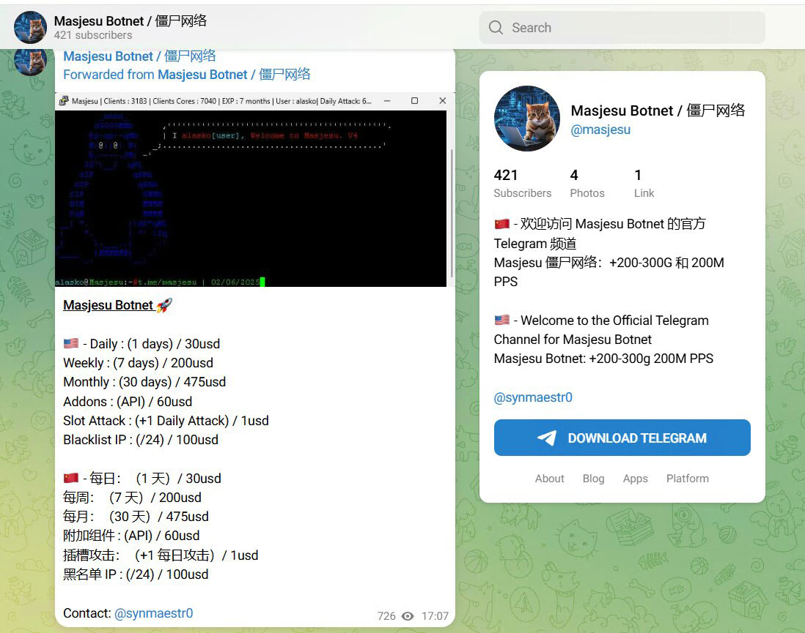
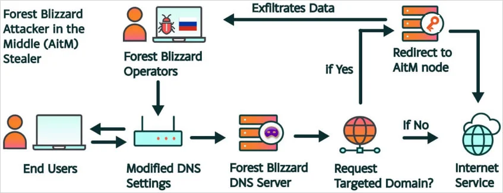
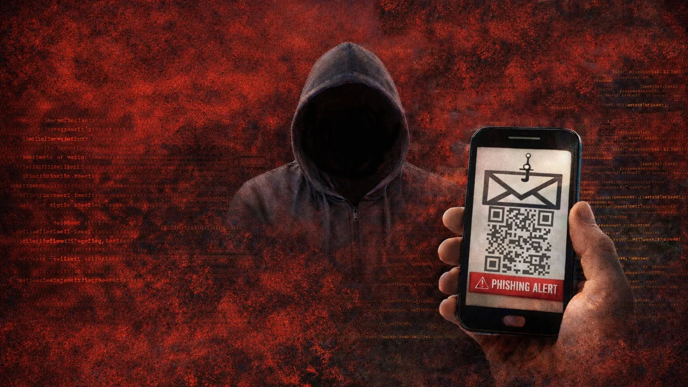
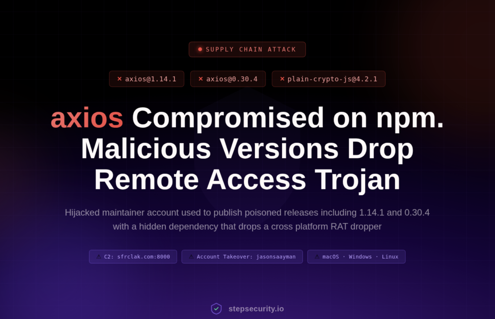

---
hide:
  - navigation
  - toc
---

# Last Week's Security Incidents
 

-   

    **APT28 PRISMEX Campaign**

    **Russia-Linked APT**{.cve-chip} **Spear-Phishing**{.cve-chip} **Cyber Espionage**{.cve-chip}
    
    APT28 targets Ukrainian and NATO-linked entities with a sophisticated multi-stage malware framework using steganographic payload concealment, COM hijacking persistence, fileless execution, and cloud-based C2 to conduct long-term espionage against military and logistics operations.
    
    [Read more](2026/Week14/PRISMEX.md)

-   

    **Masjesu Botnet Emerges as DDoS-for-Hire Service Targeting Global IoT Devices**

    **IoT Botnet**{.cve-chip} **DDoS-for-Hire**{.cve-chip} **Critical Infrastructure**{.cve-chip}
    
    A multi-architecture IoT botnet sold as a DDoS-for-hire service on Telegram, infecting routers and embedded devices to launch TCP, UDP, HTTP, and ICMP floods. Layered XOR-encrypted C2, signal-resistant persistence, and evasion of sensitive IP ranges make Masjesu a stealthy, accessible threat.
    
    [Read more](2026/Week14/Masjesu.md)

-   

    **Hackers Use Pixel-Large SVG Trick to Hide Credit Card Stealer**

    **Web Skimming**{.cve-chip} **Magecart**{.cve-chip} **Payment Card Theft**{.cve-chip}
    
    A Magecart-style campaign injects malicious JavaScript inside a 1×1 pixel invisible SVG on Magento checkout pages. A fake payment overlay silently captures card details, encrypts them with XOR+Base64, and exfiltrates to attacker-controlled servers disguised as analytics traffic.
    
    [Read more](2026/Week14/SVG.md)

-   

    **Iran-Linked Hackers Disrupt U.S. Critical Infrastructure**

    **Iran-Linked APT**{.cve-chip} **ICS/OT Attack**{.cve-chip} **Critical Infrastructure**{.cve-chip}
    
    Iran-linked threat actors exploited internet-exposed PLCs and SCADA systems to disrupt U.S. critical infrastructure operations. Attackers manipulated PLC logic and falsified HMI data, marking a shift from espionage toward cyber-physical sabotage.
    
    [Read more](2026/Week14/Iran-Linked.md)

-   

    **APT28 Exploiting Network Devices for Cyber Espionage**

    **Russia-Linked APT**{.cve-chip} **Network Device Exploitation**{.cve-chip} **Cyber Espionage**{.cve-chip}
    
    Russian military intelligence group APT28 is exploiting vulnerabilities in internet-facing routers and edge devices to build covert proxy networks, intercept traffic, and pivot into the internal networks of government and military targets for long-term espionage.
    
    [Read more](2026/Week14/APT28.md)

-   

    **Russia Nationwide Banking & Payment Outage (April 2026)**

    **Banking Outage**{.cve-chip} **Payment System Failure**{.cve-chip} **Critical Infrastructure**{.cve-chip}
    
    Aggressive VPN-blocking rules by Russian regulators accidentally disrupted critical IP ranges, taking down mobile banking apps, POS terminals, ATMs, and metro payment systems for millions of customers nationwide — exposing severe centralization risks in Russia's financial infrastructure.
    
    [Read more](2026/Week14/Banking.md)

-   

    **GPUBreach / GPU Rowhammer Attack**

    **GPU Vulnerability**{.cve-chip} **Memory Attack**{.cve-chip} **Privilege Escalation**{.cve-chip}
    
    A newly disclosed Rowhammer-style attack technique against GPU memory (VRAM). Attackers can manipulate memory integrity, bypass isolation mechanisms, and escalate privileges to gain full system control.
    
    [Read more](2026/Week14/GPUBreach.md)

-   

    **China-Linked Storm-1175 Zero-Day Exploitation Campaign**

    **China-Linked APT**{.cve-chip} **Zero-Day Exploitation**{.cve-chip} **Medusa Ransomware**{.cve-chip}
    
    A sophisticated China-linked threat actor rapidly exploiting zero-day and recently disclosed vulnerabilities in enterprise software. The group completes full system compromise within hours, exfiltrating data and deploying Medusa ransomware through double extortion tactics.
    
    [Read more](2026/Week14/Storm-1175.md)

-   

    **Pay2Key Pseudo-Ransomware Campaign (Iran-linked)**

    **Iran-Linked Threats**{.cve-chip} **Pseudo-Ransomware**{.cve-chip} **Operational Disruption**{.cve-chip}

    Iran-linked operators revived Pay2Key activity with pseudo-ransomware tactics that may prioritize disruption and sabotage over direct profit.

    Campaign behavior includes phishing/VPN-access tradecraft, lateral movement, and payload execution that can resemble ransomware while causing destructive outcomes.

    [Read more](2026/Week14/Pay2Key.md)

-   

    **QR Code Traffic Violation Phishing Campaign (Quishing Scam)**

    **Smishing**{.cve-chip} **QR Phishing (Quishing)**{.cve-chip} **Financial Fraud**{.cve-chip}

    Attackers are sending SMS traffic-violation lures that use QR codes to redirect victims to fake government-style payment portals.

    The campaign harvests payment and personal data through low-fee urgency prompts and QR-based evasion of traditional URL scrutiny.

    [Read more](2026/Week14/QR.md)

-   

    **CVE-2026-35616 - FortiClient EMS Authentication Bypass**

    **Fortinet EMS**{.cve-chip} **Authentication Bypass**{.cve-chip} **Active Exploitation**{.cve-chip}

    CVE-2026-35616 is a critical FortiClient EMS flaw that can allow unauthenticated API-based authentication bypass and remote command execution.

    Active exploitation risk makes exposed vulnerable EMS servers high-priority patch targets to prevent endpoint-wide compromise.

    [Read more](2026/Week14/EMS.md)

-   

    **Axios npm Supply Chain Attack (Linked to UNC1069 / North Korea)**

    **Supply Chain Attack**{.cve-chip} **npm Ecosystem**{.cve-chip} **RAT Deployment**{.cve-chip}

    Attackers compromised an Axios maintainer account and published malicious package versions embedding hidden dependency and post-install malware behavior.

    The campaign risked developer endpoints and CI/CD pipelines through transitive dependency exposure, with reporting linking activity to UNC1069.

    [Read more](2026/Week14/npm.md)

-   

    **Chrome Zero-Day Vulnerability - CVE-2026-5281**

    **CVE-2026-5281**{.cve-chip} **Chrome Zero-Day**{.cve-chip} **WebGPU/Dawn**{.cve-chip} **Active Exploitation**{.cve-chip}

    A zero-day flaw in Chrome's Dawn WebGPU engine was reportedly exploited in real-world attacks before patch availability, with crafted web content triggering memory-corruption conditions.

    Successful exploitation can enable browser-context code execution and may be chained with additional vulnerabilities for broader system compromise.

    [Read more](2026/Week14/Chrome.md)

-   

    **FBI Warning on Risks from Foreign (Chinese) Mobile Applications**

    **FBI Advisory**{.cve-chip} **Mobile App Risk**{.cve-chip} **Data Privacy**{.cve-chip} **National Security**{.cve-chip}

    The FBI warned that some foreign-developed mobile applications may collect extensive personal and device data, including contacts and location information, with potential exposure under foreign legal requirements.

    The advisory highlights privacy, profiling, and national-security risks from excessive app permissions, background collection, and opaque data-transfer practices.

    [Read more](2026/Week14/FBI_Mobile.md)

-   

    **Handala Hack Team Breach Claim Against PSK Wind Technologies**

    **Handala**{.cve-chip} **Hacktivist Activity**{.cve-chip} **Defense Sector Targeting**{.cve-chip} **Data Exfiltration Claim**{.cve-chip}

    The pro-Iranian Handala group claimed it breached PSK Wind Technologies and exfiltrated sensitive command-and-control and communications-related information.

    While official confirmation is pending, the reported activity reflects combined cyber intrusion and information-warfare pressure through selective data leak publication.

    [Read more](2026/Week14/Handala.md)

-   

    **TrueConf Zero-Day Exploitation (Operation TrueChaos) - CVE-2026-3502**

    **CVE-2026-3502**{.cve-chip} **TrueConf**{.cve-chip} **Malicious Update Abuse**{.cve-chip} **Operation TrueChaos**{.cve-chip}

    A TrueConf client update-validation weakness was reportedly exploited in targeted Southeast Asian government intrusions by replacing trusted updates on compromised on-prem servers.

    The campaign enabled simultaneous endpoint compromise and follow-on activity including reconnaissance, persistence, and command-and-control operations.

    [Read more](2026/Week14/TrueConf.md)

-   

    **WhatsApp Fake App Spyware Campaign**

    **WhatsApp Impersonation**{.cve-chip} **Mobile Spyware**{.cve-chip} **Social Engineering**{.cve-chip} **Italy Targeting**{.cve-chip}

    Around 200 users in Italy were reportedly lured into installing a fake WhatsApp app carrying spyware through off-store social-engineering delivery.

    Although WhatsApp end-to-end encryption was not broken, compromised devices enabled covert collection of sensitive local data, contacts, and message-related information.

    [Read more](2026/Week14/WhatsApp.md)

