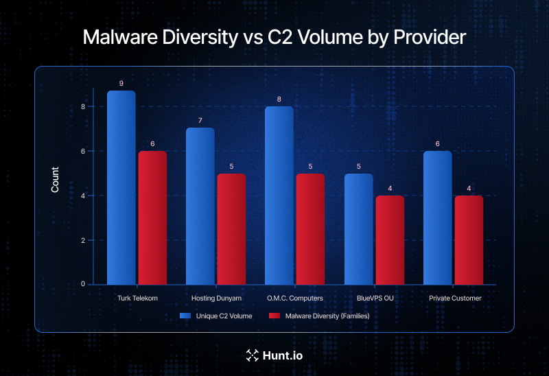
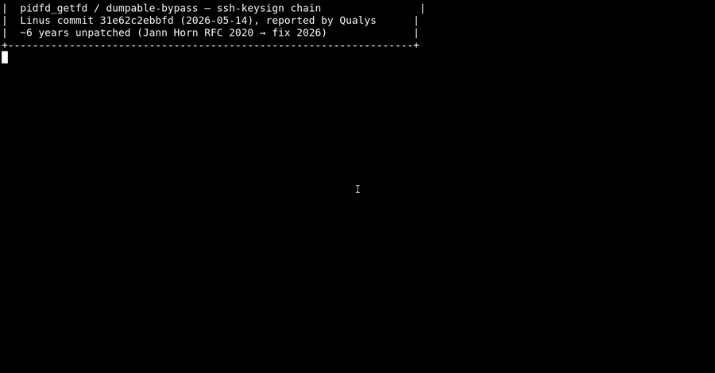

---
hide:
  - navigation
  - toc
---

# Last Week's Security Incidents
 

-   

    **Trump Mobile Customer Data Exposure**

    **Data Exposure**{.cve-chip} **Broken Access Control**{.cve-chip} **IDOR Risk**{.cve-chip} **Ecommerce Security**{.cve-chip}

    Reported insecure API behavior on the Trump Mobile preorder platform allegedly allowed unauthorized access to customer order records through parameter manipulation and insufficient authorization checks.

    Exposed data reportedly included names, emails, phone numbers, addresses, and order details, increasing phishing and social-engineering risk.

    [Read more](2026/Week21/TrumpMobile.md)

-   

    **One Telecom Provider Hosted Most of the Middle East's Active C2 Infrastructure**

    **C2 Infrastructure**{.cve-chip} **Threat Intelligence**{.cve-chip} **Telecom Hosting Abuse**{.cve-chip} **Middle East**{.cve-chip}

    Hunt.io reported concentrated malicious C2 hosting across regional telecom/cloud providers, with STC allegedly accounting for most observed active C2 nodes during the study period.

    The infrastructure supported malware control, phishing operations, botnets, and espionage-linked activity, complicating detection by blending with legitimate telecom traffic.

    [Read more](2026/Week21/Telecom.md)

-   

    **CVE-2026-46333 - ssh-keysign-pwn Linux Kernel Privilege Escalation**

    **CVE-2026-46333**{.cve-chip} **Linux Kernel**{.cve-chip} **Privilege Escalation**{.cve-chip} **Local Root**{.cve-chip}

    A long-lived flaw in Linux kernel `__ptrace_may_access()` logic can allow local attackers to abuse privileged-process interactions and escalate from low privileges to root.

    Researchers reported successful exploitation against modern Ubuntu and Debian systems, increasing risk to cloud, shared-hosting, and containerized environments.

    [Read more](2026/Week21/Linux.md)

