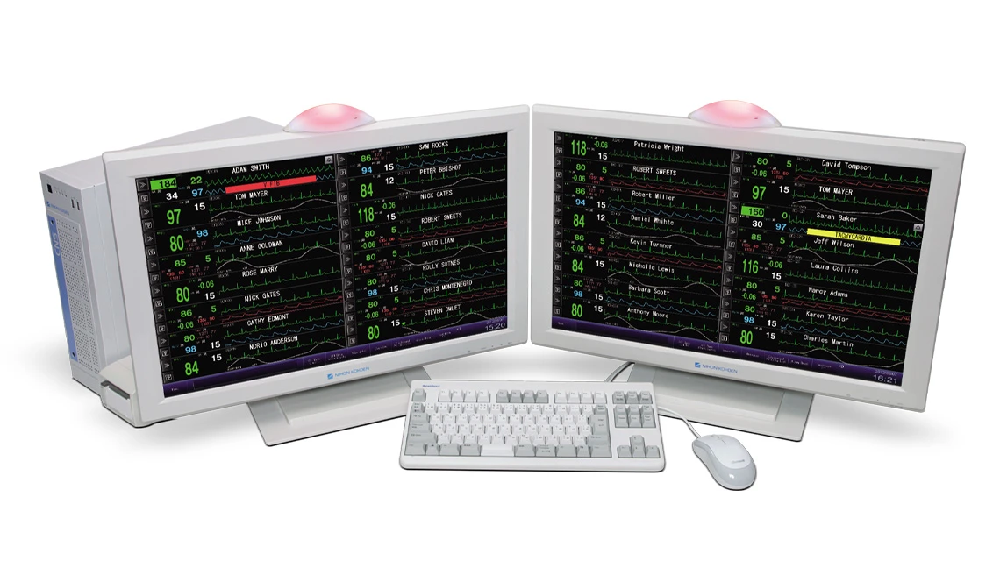
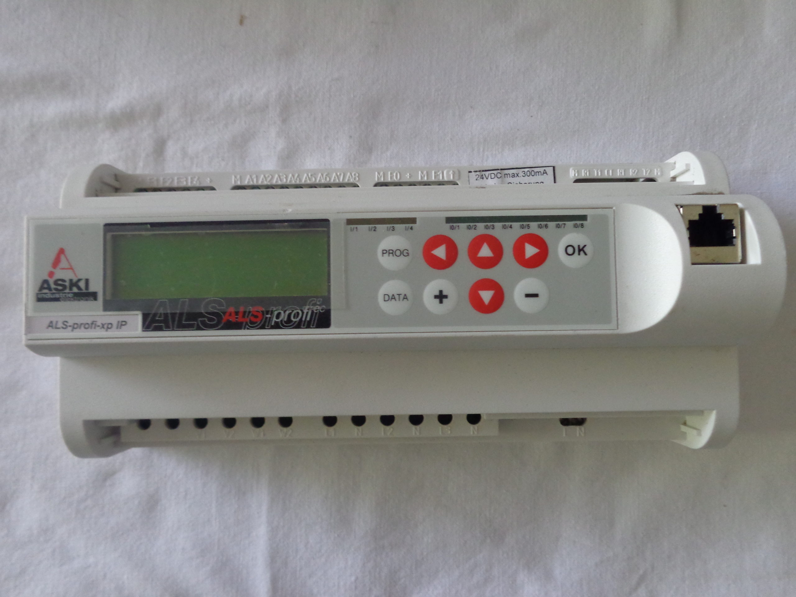
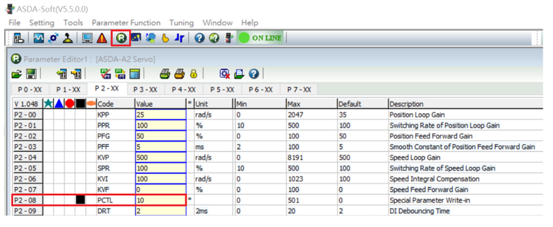
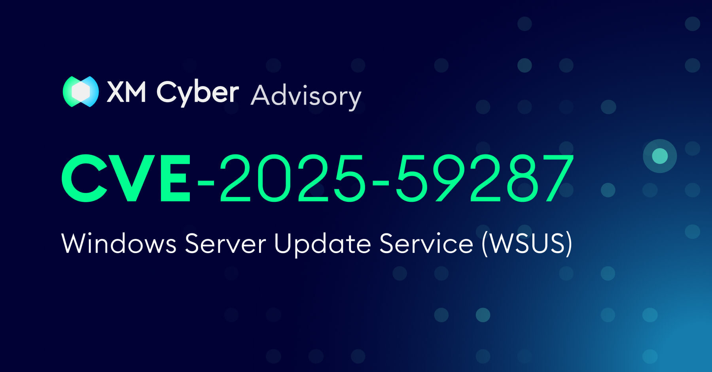
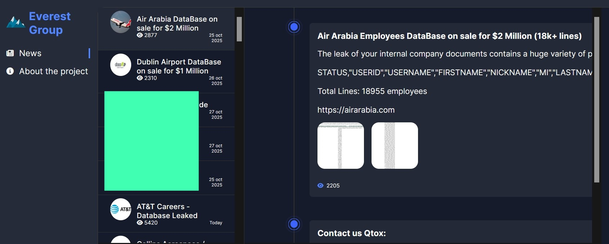
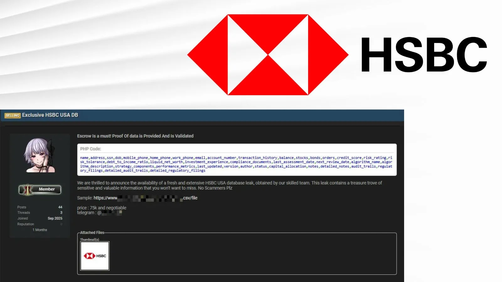
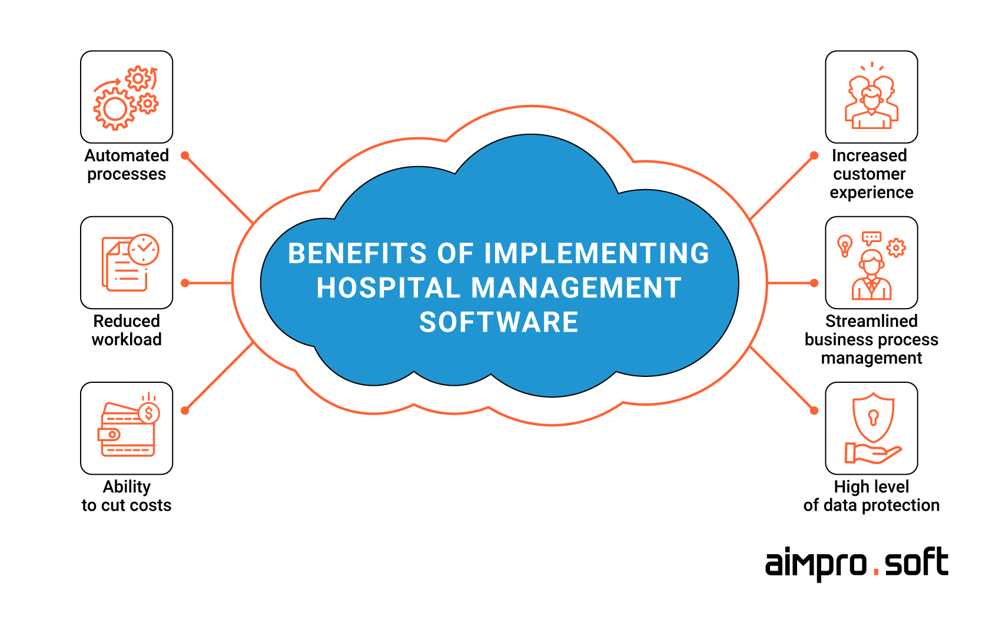

---
hide:
  - navigation
  - toc
---

# Last Week's Security Incidents
 

-   
    :material-security:{ .lg .middle } __Nihon Kohden CNS-6201 Central Monitor Vulnerability__

    **CVE-2025-59668**{.cve-chip}
    **Critical availability loss**{.cve-chip} 
    **patient safety risk**{.cve-chip}
    
    ---

    A vulnerability in the Nihon Kohden CNS-6201 central monitoring system allows a remote attacker to send specially crafted UDP packets that cause the system to crash, resulting in a loss of monitoring capability. The flaw exists due to a NULL pointer dereference when processing malformed network data.

    

    [:octicons-arrow-right-24: View Full Details](Week44/nihon-kohden-cns-6201.md)

-   

    :material-lock-open:{ .lg .middle } __ASKI Energy ALS-Mini-S8 and ALS-Mini-S4 Vulnerability__

    **CVE-2025-9574**{.cve-chip} 
    **Full device compromise**{.cve-chip} 
    **operational disruption**{.cve-chip}
    ---

    A critical security vulnerability in the embedded web server of ASKI Energy ALS-Mini-S4 and ALS-Mini-S8 IP controllers allows remote attackers to access and modify configuration parameters without authentication. The flaw provides full administrative control over affected devices, compromising their operational integrity.

    

    [:octicons-arrow-right-24: View Full Details](Week44/aski-energy-als-mini.md)

-   

    :material-file-alert:{ .lg .middle } __Delta Electronics ASDA-Soft Vulnerability__
    
    **CVE-2025-62579**{.cve-chip}
    **Code execution**{.cve-chip}
    **configuration compromise**{.cve-chip}
    
    ---

    Opening a specially crafted ASDA-Soft project file can trigger a stack-based buffer overflow, allowing data to be written outside the intended stack buffer. The issue exists in ASDA-Soft versions 7.0.2.0 and prior.

    [:octicons-arrow-right-24: View Full Details](Week44/delta-electronics-asda-soft.md)

-   

    :material-server:{ .lg .middle } __Windows Server Update Service (WSUS) Vulnerability__
    
    **CVE-2025-59287**{.cve-chip}
    **Remote code execution**{.cve-chip}
    **SYSTEM privileges**{.cve-chip}
    
    ---

    Critical remote code execution vulnerability in Microsoft Windows Server Update Services (WSUS) allows unauthenticated attackers to execute arbitrary code with SYSTEM privileges on vulnerable servers. The vulnerability is caused by unsafe deserialization of untrusted data in the WSUS reporting web service endpoint.

    [:octicons-arrow-right-24: View Full Details](Week44/windows-server-wsus.md)

-   

    :material-account-alert:{ .lg .middle } __BlueNoroff GhostCall and GhostHire Campaigns__
    
    **APT Campaign**{.cve-chip}
    **AI-Enhanced**{.cve-chip}
    **Cryptocurrency theft**{.cve-chip}
    
    ---

    BlueNoroff (North Korean Lazarus Group subgroup) launched two AI-enhanced intrusion campaigns targeting executives and blockchain developers. GhostCall uses fake investment meetings while GhostHire distributes infected developer test tasks, both leveraging generative AI for enhanced social engineering.

    [:octicons-arrow-right-24: View Full Details](Week44/bluenoroff-ghostcall-ghosthire.md)

-   

    :material-database-alert:{ .lg .middle } __Everest Ransomware Leaks AT&T and Aviation Records__
    
    **Data Breach**{.cve-chip}
    **Ransomware Group**{.cve-chip}
    **2.1M+ Records**{.cve-chip}
    
    ---

    The Everest ransomware group leaked sensitive databases from AT&T Careers, Dublin Airport, and Air Arabia between October 21-28, 2025. Over 2.1 million records including passenger data, employee information, and applicant details were exposed and offered for sale on dark web markets.

    [:octicons-arrow-right-24: View Full Details](Week44/everest-att-aviation-leaks.md)

-   

    :material-bank:{ .lg .middle } __HSBC USA Data Breach Allegation__
    
    **Data Breach**{.cve-chip}
    **Financial Records**{.cve-chip}
    **Disputed Incident**{.cve-chip}
    
    ---

    Cybercriminals posted alleged HSBC USA customer and transaction records on underground forums on October 28, 2025. While HSBC denies any breach occurred, independent researchers found strong indications the leaked data containing SSNs, transaction histories, and account numbers is authentic.

    [:octicons-arrow-right-24: View Full Details](Week44/hsbc-usa-data-breach.md)

-   

    :material-hospital-box:{ .lg .middle } __Vertikal Systems Hospital Manager Backend Vulnerabilities__
    
    **CVE-2025-54459**{.cve-chip}
    **Information disclosure**{.cve-chip}
    **Healthcare systems**{.cve-chip}
    
    ---

    CISA issued advisory ICSMA-25-301-01 warning of vulnerabilities in Vertikal Systems Hospital Manager backend services used by hospitals for operational management. The vulnerabilities could expose sensitive system information, internal service paths, or configuration data that could assist threat actors in planning attacks.

    [:octicons-arrow-right-24: View Full Details](Week44/vertikal-hospital-manager.md)

