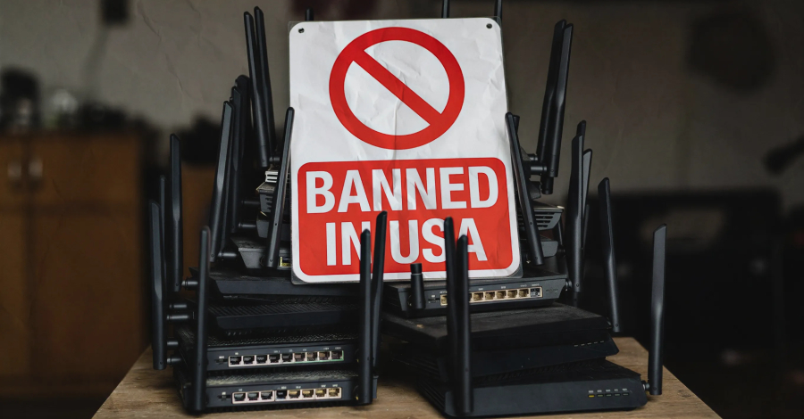
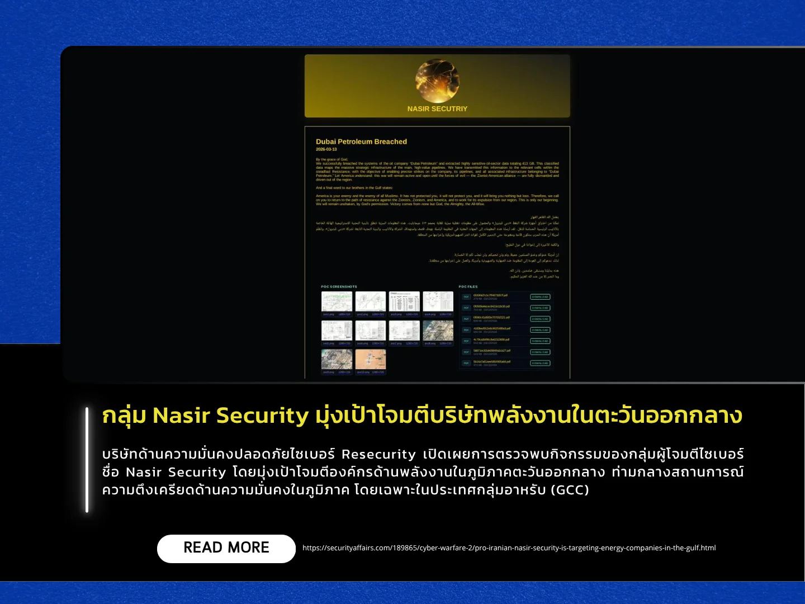

---
hide:
  - navigation
  - toc
---

# Last Week's Security Incidents
 

-   

    **FCC Ban on Foreign-Made Consumer Routers (Covered List Expansion)**

    **FCC Covered List Expansion**{.cve-chip} **Supply Chain Security**{.cve-chip} **Consumer Router Risk**{.cve-chip}

    The U.S. Federal Communications Commission expanded its Covered List to restrict authorization of new foreign-manufactured consumer routers over national security concerns.

    The action blocks non-compliant devices from receiving certification required for import and sale in the United States, creating a de facto market access ban for affected products.

    [Read more](2026/Week12/foreignMade.md)

-   

    **Pro-Iranian "Nasir Security" Targeting Gulf Energy Sector**

    **Nasir Security**{.cve-chip} **Gulf Energy Sector**{.cve-chip} **Supply Chain Compromise**{.cve-chip} **Cyber Espionage**{.cve-chip}

    A pro-Iranian threat group known as Nasir Security is conducting cyber operations against Gulf energy organizations by targeting third-party vendors and contractors.

    The campaign centers on intelligence collection and data theft from engineering, contractual, and operational documents, potentially enabling future cyber or physical targeting.

    [Read more](2026/Week12/nasir.md)

-   

    **Iran National CCTV Surveillance Network Exploitation**

    **CCTV/VMS Intrusion**{.cve-chip} **AI-Driven Intelligence**{.cve-chip} **National Surveillance Risk**{.cve-chip} **Geopolitical Cyber**{.cve-chip}

    Reporting indicates adversaries infiltrated elements of Iran's national CCTV and centralized video monitoring environment, with access to live and stored surveillance feeds.

    The compromise highlights how internet-exposed IoT camera ecosystems and weak segmentation can be repurposed into strategic intelligence pipelines for tracking and targeting operations.

    [Read more](2026/Week12/CCTV.md)

-   

    **FBI Says Iranian Hackers Are Using Telegram to Steal Data in Malware Attacks**

    **Handala**{.cve-chip} **Telegram C2 Abuse**{.cve-chip} **Data Exfiltration Malware**{.cve-chip} **Social Engineering**{.cve-chip}

    The FBI warned that pro-Iranian Handala operators are using Telegram bot/API channels as command-and-control infrastructure for malware campaigns delivered through phishing and social engineering.

    Attackers can task malware to collect files and screenshots, then exfiltrate stolen data through encrypted messaging-platform traffic that can blend with normal usage.

    [Read more](2026/Week12/Telegram.md)

-   

    **Indian Government Probes CCTV Espionage Operation Linked to Pakistan**

    **Physical-Cyber Espionage**{.cve-chip} **Critical Infrastructure**{.cve-chip} **CCTV Abuse**{.cve-chip}

    Indian authorities uncovered a coordinated covert surveillance operation using hidden CCTV devices at strategic infrastructure locations, including railway stations.

    Investigators reported video exfiltration to foreign-linked handlers, raising concerns around infrastructure mapping, operational security exposure, and national-level risk.

    [Read more](2026/Week12/Indian.md)

-   

    **Apple Urges iPhone Users to Update as Coruna and DarkSword Exploit Kits Emerge**

    **Coruna**{.cve-chip} **DarkSword**{.cve-chip} **iOS/WebKit Exploit Chains**{.cve-chip} **Spyware Risk**{.cve-chip}

    Coruna and DarkSword are reported exploit kits that chain Safari/WebKit and iOS vulnerabilities to execute code on iPhones and deploy high-risk surveillance or data-theft payloads.

    With DarkSword reportedly leaked publicly, the risk of broader exploitation increases, making immediate iOS patching and hardened browsing posture critical.

    [Read more](2026/Week12/apple.md)

-   

    **New Perseus Android Banking Malware Monitors Notes Apps to Extract Sensitive Data**

    **Android Malware**{.cve-chip} **Banking Threat**{.cve-chip} **Credential Theft**{.cve-chip}

    Perseus is a newly tracked Android malware that targets secrets stored in note-taking apps, including passwords, banking details, and crypto recovery phrases.

    By stealing pre-stored credentials from local notes rather than intercepting OTPs, it can bypass many traditional MFA-focused detection patterns.

    [Read more](2026/Week12/perseus.md)

-   

    **TP-Link Archer NX Firmware Takeover Vulnerabilities**

    **TP-Link Archer NX**{.cve-chip} **Firmware Takeover**{.cve-chip} **Router Security**{.cve-chip}

    Multiple vulnerabilities in Archer NX routers can enable authentication bypass, malicious firmware upload, and persistent root-level control of edge network devices.

    Exploitation can lead to DNS hijacking, MITM traffic manipulation, and botnet-style abuse, making rapid firmware patching and management-plane hardening essential.

    [Read more](2026/Week12/Tplink.md)

-   

    **Interlock Ransomware Exploits Cisco FMC Zero-Day CVE-2026-20131 for Root Access**

    **Interlock Ransomware**{.cve-chip} **CVE-2026-20131**{.cve-chip} **Cisco FMC**{.cve-chip} **Unauthenticated RCE**{.cve-chip}

    Interlock operators reportedly exploited CVE-2026-20131 as a zero-day in Cisco Secure Firewall Management Center to gain unauthenticated root access and compromise a critical network security control plane.

    With management-plane control, attackers can tamper with firewall policies, exfiltrate sensitive data, and deploy ransomware while moving laterally across enterprise environments.

    [Read more](2026/Week12/Interlock.md)

-   

    **CVE-2026-3888 - Ubuntu Desktop Snap Local Privilege Escalation**

    **Ubuntu Desktop**{.cve-chip} **Local Privilege Escalation**{.cve-chip} **snapd**{.cve-chip}

    A race-condition flaw in Ubuntu Desktop's `snapd`/`snap-confine` path can allow a local unprivileged user to escalate to root by abusing `/tmp/.snap` recreation timing.

    Successful exploitation may enable full host takeover, persistence, and credential theft, making rapid patching and local-access controls essential.

    [Read more](2026/Week12/ubuntu.md)

-   

    **CVE-2026-21992 - Critical Remote Code Execution in Oracle Identity Manager**

    **Oracle Middleware**{.cve-chip} **Pre-Auth RCE**{.cve-chip} **Critical Vulnerability**{.cve-chip}

    CVE-2026-21992 is a critical unauthenticated HTTP-exposed flaw in Oracle Identity Manager and Oracle Web Services Manager that can enable remote code execution.

    Successful exploitation may lead to full middleware server compromise and lateral movement through enterprise identity infrastructure.

    [Read more](2026/Week12/oracle.md)

-   

    **Ubiquiti UniFi Network Application Account Takeover Vulnerability (CVE-2026-22557)**

    **Ubiquiti UniFi**{.cve-chip} **Account Takeover**{.cve-chip} **Path Traversal**{.cve-chip}

    A severe vulnerability set in UniFi Network Application can expose sensitive files, enable account hijacking, and allow privilege escalation in vulnerable controller deployments.

    If exploited, attackers may take control of the management plane and alter the configuration of managed switches, access points, and gateways.

    [Read more](2026/Week12/ubiquiti.md)

-   

    **QNAP NAS Zero-Day Vulnerabilities Demonstrated at Pwn2Own Ireland 2025**

    **QNAP NAS**{.cve-chip} **Zero-Day**{.cve-chip} **Pwn2Own Ireland 2025**{.cve-chip} **RCE + Privilege Escalation**{.cve-chip}

    QNAP patched multiple critical NAS vulnerabilities after successful live exploitation demonstrations at Pwn2Own Ireland 2025 across QTS/QuTS hero and key backup/security applications.

    Attackers who chain these flaws can gain remote code execution and escalate to root, enabling data theft, ransomware deployment, and lateral movement from internet-exposed storage systems.

    [Read more](2026/Week12/QNAP.md)

