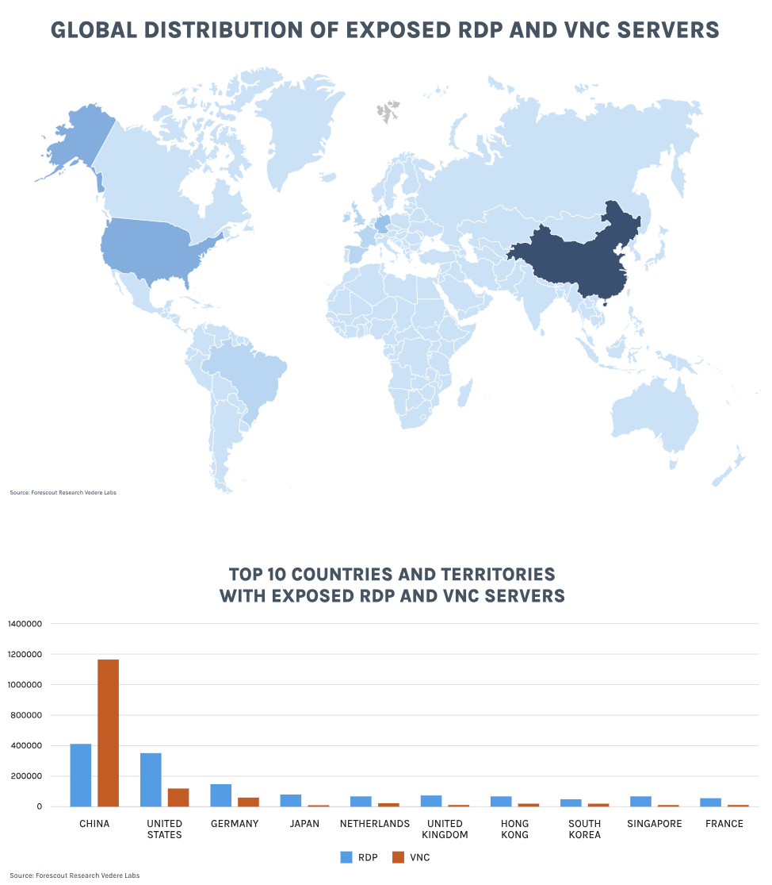
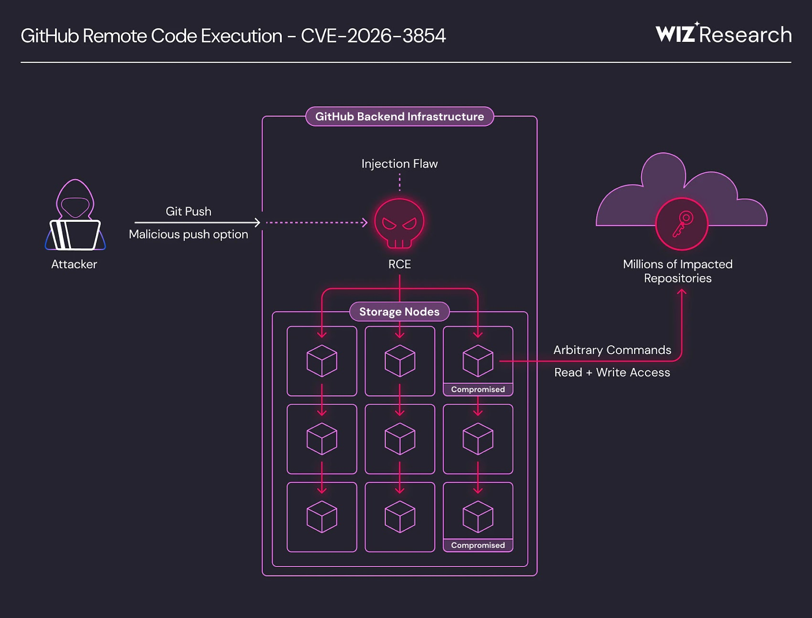

---
hide:
  - navigation
  - toc
---

# Last Week's Security Incidents
 

-   

    **Internet-Exposed VNC/RDP Servers in ICS/OT Infrastructure**

    **ICS/OT Security**{.cve-chip} **Exposed Remote Access**{.cve-chip} **Critical Infrastructure**{.cve-chip}

    ~60,000 VNC servers require no authentication and ~670 are directly linked to ICS/OT systems, giving attackers trivial remote desktop access to SCADA and HMI interfaces. Combined with ~1.8 million exposed RDP servers, the attack surface enables ransomware deployment, process manipulation, and physical safety risks without exploiting any vulnerability.

    [Read more](2026/Week17/VNC.md)

-   

    **Critical GitHub Vulnerability Exposed Millions of Repositories (CVE-2026-3854)**

    **CVE-2026-3854**{.cve-chip} **Remote Code Execution**{.cve-chip} **Supply Chain Risk**{.cve-chip}

    A command injection flaw in GitHub's internal `git push` pipeline allowed an attacker with ordinary push access to inject headers, override hook execution paths, and achieve RCE on backend servers. On GHES this means full instance compromise; on GitHub.com, Wiz confirmed RCE on multi-tenant storage nodes exposing millions of repositories.

    [Read more](2026/Week17/GitHub.md)

-   

    **Electric Motorcycles and Scooters Bluetooth & Keyless Entry Vulnerabilities**

    **IoT Security**{.cve-chip} **Bluetooth Vulnerability**{.cve-chip} **Vehicle Security**{.cve-chip}

    Researchers found a Bluetooth pairing authentication bypass in Zero Motorcycles and a key fob replay/spoofing flaw in Yadea scooters. Attackers within range can connect without verification, upload malicious firmware, or remotely unlock and start vehicles — posing theft and rider safety risks.

    [Read more](2026/Week17/Motorcycles.md)

-   

    **Easily Exploitable Pack2TheRoot Linux Vulnerability Leads to Root Access**

    **CVE-2026-41651**{.cve-chip} **Pack2TheRoot**{.cve-chip} **Linux Privilege Escalation**{.cve-chip} **PackageKit TOCTOU**{.cve-chip}

    Pack2TheRoot is a high-severity PackageKit race-condition vulnerability that can let local unprivileged users run package operations as root without expected authentication.

    Given broad default PackageKit deployment, this issue significantly lowers the barrier for post-compromise escalation on Linux desktops and some shared server environments.

    [Read more](2026/Week17/Pack2TheRoot.md)

-   

    **Firefox Vulnerability Allows Tor User Fingerprinting**

    **CVE-2026-6770**{.cve-chip} **Firefox/Tor Browser**{.cve-chip} **IndexedDB Privacy Flaw**{.cve-chip} **Cross-Site Linkability**{.cve-chip}

    A privacy flaw in Firefox-based browsers allowed sites to derive a stable process-lifetime identifier from IndexedDB behavior, enabling cross-site correlation without cookies.

    The issue had elevated impact for anonymity use cases, including Tor workflows, where expected session unlinkability could be weakened until patched versions were deployed.

    [Read more](2026/Week17/Firefox.md)

-   

    **FIRESTARTER Backdoor on Cisco ASA / Firepower Devices**

    **FIRESTARTER**{.cve-chip} **Cisco ASA/FTD**{.cve-chip} **Persistent Backdoor**{.cve-chip} **Federal Network Impact**{.cve-chip}

    CISA reported a persistent FIRESTARTER backdoor on a federal Cisco firewall device, with attacker access surviving normal patching workflows.

    The case demonstrates that compromised perimeter appliances may require full reimaging and integrity validation, not just vulnerability patching.

    [Read more](2026/Week17/FIRESTARTER.md)

-   

    **China-Linked GopherWhisper Infects 12 Mongolian Government Systems with Go Backdoors**

    **GopherWhisper**{.cve-chip} **China-Linked Espionage**{.cve-chip} **Go Malware Toolset**{.cve-chip} **Cloud C2 Abuse**{.cve-chip}

    GopherWhisper operators reportedly compromised at least 12 Mongolian government systems using a modular Go-based toolchain with persistence, command execution, and encrypted document exfiltration.

    The campaign abuses trusted SaaS channels including Slack, Discord, and Outlook/Graph for covert command-and-control, complicating conventional detection.

    [Read more](2026/Week17/GopherWhisper.md)

