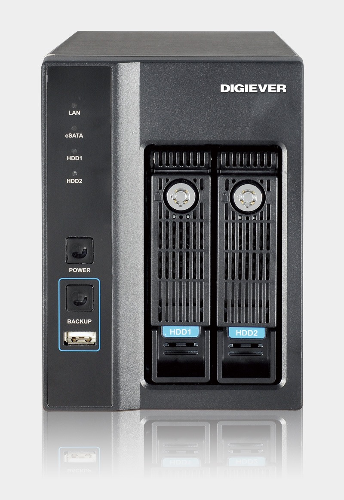
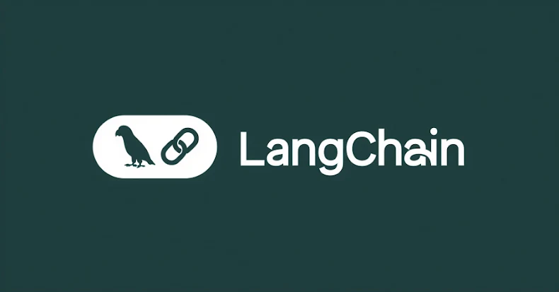

---
hide:
  - navigation
  - toc
---

# Last Week's Security Incidents
 

-   

    :material-email:{ .lg .middle } **Critical SmarterMail Arbitrary File Upload / Remote Code Execution Vulnerability**

    **CVE-2025-52691**{.cve-chip} 
    **CVSS 10.0**{.cve-chip} 
    **RCE / Arbitrary File Upload**{.cve-chip}

    A critical unauthenticated arbitrary file upload vulnerability in SmarterTools SmarterMail (Build 9406 and earlier) can allow remote attackers to upload and execute files, leading to full server compromise. Update to Build 9413 or later immediately.

    [:octicons-arrow-right-24: View Full Details](2025/Week53/smartermail.md)

-   

    :material-database:{ .lg .middle } **MongoBleed — MongoDB Memory Disclosure (CVE-2025-14847)**
    
    **CVE-2025-14847**{.cve-chip} 
    **Memory Disclosure**{.cve-chip} 
    **Pre-auth Network Leak**{.cve-chip}
    
    Critical pre-auth memory disclosure in MongoDB allowing unauthenticated attackers to extract heap memory via specially crafted compressed messages. Patch to fixed versions and restrict network exposure.
    
    [:octicons-arrow-right-24: View Full Details](2025/Week53/mongo.md)

-   

    **Digiever DS-2105 Pro NVR Authorization Bypass & Command Injection**

    **CVE-2023-52163**{.cve-chip} 
    **CVE-2023-52164**{.cve-chip} 
    **CVSS 9.8**{.cve-chip} 
    **CISA KEV**{.cve-chip} 
    **RCE**{.cve-chip}

    Critical vulnerability chain in end-of-life Digiever DS-2105 Pro Network Video Recorders allows unauthenticated attackers to bypass authorization and execute arbitrary OS commands via time_tzsetup.cgi endpoint. CISA confirms active exploitation by Mirai and ShadowV2 botnets. Attackers inject commands without authentication, deploy malware, hijack surveillance footage, harvest credentials via CVE-2023-52164 file read, and pivot to internal networks. No patches available (EoL device).

    [:octicons-arrow-right-24: View Full Details](2025/Week53/digiever.md)

-   

    **Malicious npm Packages Abused as Phishing Infrastructure**

    **npm Supply Chain**{.cve-chip} 
    **Phishing Infrastructure**{.cve-chip} 
    **Credential Theft**{.cve-chip} 
    **CDN Abuse**{.cve-chip}

    Sophisticated phishing campaign published 27 malicious npm packages across 6 attacker accounts, abusing npm's CDN as hosting platform for phishing content. Packages hosted HTML/JS payloads (not functional code) mimicking document portals that redirected to fake Microsoft 365 login pages with pre-filled emails. Evilginx-style AitM framework bypasses traditional MFA via session token theft. Anti-analysis techniques include JavaScript obfuscation, bot detection, and user interaction validation. Healthcare and industrial sectors targeted for BEC and potential OT access.

    **Mitigation:** Deploy phishing-resistant MFA (FIDO2/WebAuthn). Implement Conditional Access policies. Use private npm registries with package allowlists. Monitor authentication logs for impossible travel and suspicious token activity. Train users on trusted-platform phishing tactics.

    [:octicons-arrow-right-24: View Full Details](2025/Week53/npm.md)

-   

    :material-whatsapp:{ .lg .middle } **GhostPairing: WhatsApp Account Takeover**

    **Social Engineering**{.cve-chip} 
    **WhatsApp**{.cve-chip} 
    **Account Takeover**{.cve-chip} 
    **Device Linking Abuse**{.cve-chip}

    GhostPairing exploits WhatsApp's legitimate device-linking feature through social engineering. Attackers send phishing messages from compromised accounts appearing as trusted contacts, tricking victims into entering pairing codes on fake verification pages. Once linked, attackers gain full access to all chats, media, and real-time messages while victims remain unaware. No malware, SIM swap, or password theft required—purely social manipulation abusing legitimate functionality.

    [:octicons-arrow-right-24: View Full Details](2025/Week53/ghostpairing.md)

-   

    :material-shield-alert:{ .lg .middle } **Fortinet FortiOS SSL VPN 2FA Bypass**

    **CVE-2020-12812**{.cve-chip} 
    **CVSS 7.7**{.cve-chip} 
    **Authentication Bypass**{.cve-chip} 
    **2FA Bypass**{.cve-chip}

    Active exploitation of five-year-old vulnerability in Fortinet FortiOS SSL VPN. Improper authentication flaw allows attackers to bypass two-factor authentication by altering username casing. FortiOS treats usernames as case-sensitive while LDAP is case-insensitive, creating authentication logic flaw. Attackers submit valid credentials with altered case (e.g., "Admin" vs "admin"), bypassing local 2FA and authenticating via LDAP without 2FA. Affects misconfigured FortiGate devices with local users + LDAP integration.

    [:octicons-arrow-right-24: View Full Details](2025/Week53/vpn2fa.md)

-   
    :material-wallet:{ .lg .middle } **Trust Wallet Chrome Extension Supply-Chain Attack**

    **Supply Chain Attack**{.cve-chip}  
    **Browser Extension**{.cve-chip}  
    **$7M Stolen**{.cve-chip}  
    **Cryptocurrency Theft**{.cve-chip}  
    ---------------------------------

    **Trust Wallet Chrome extension v2.68** compromised via **malicious update** distributed through **Chrome Web Store**. Injected JavaScript executed when users unlocked wallets, exfiltrating **seed phrases and private keys** to attacker servers disguised as analytics traffic. Attackers used stolen credentials to sign **legitimate blockchain transactions** draining funds. **~$7 million stolen** from **hundreds of wallets** across multiple blockchains. Core mobile app and backend **not compromised**. Patched v2.69 released. **Remove v2.68**, update to v2.69+, **migrate to new wallets with fresh seed phrases**, use **hardware wallets** for significant holdings, never enter seeds on recovery websites, and monitor blockchain transactions. Irreversible cryptocurrency loss.

    [:octicons-arrow-right-24: View Full Details](2025/Week53/wallet.md)

-   
    :material-robot-confused-outline:{ .lg .middle } **CVE-2025-68664 LangChain Serialization Injection**

    **Serialization Injection**{.cve-chip}  
    **Secret Exposure**{.cve-chip}  
    **Code Execution**{.cve-chip}  
    **AI Framework**{.cve-chip}  
    ---------------------------------

    **CVE-2025-68664** critical flaw in **LangChain Core** serialization functions (`dumps()`/`dumpd()`) fails to escape dictionaries with **"lc" marker key**. User-controlled data flows into serialization/deserialization cycles (caching, logging, event streaming), treated as **trusted LangChain objects**. Enables **unsafe object instantiation**, **environment secret exposure** (API keys, credentials), and **Jinja2 SSTI code execution**. Affects **langchain-core ≥1.0.0 <1.2.5** and **0.x <0.3.81**. Patched in **1.2.5/0.3.81**. CWE-502. **Update immediately**, apply object allowlists, disable `secrets_from_env`, block Jinja2, sanitize user inputs, minimize serialization scope, use secret managers, and isolate AI workflows.

    [:octicons-arrow-right-24: View Full Details](2025/Week53/langchain.md)

