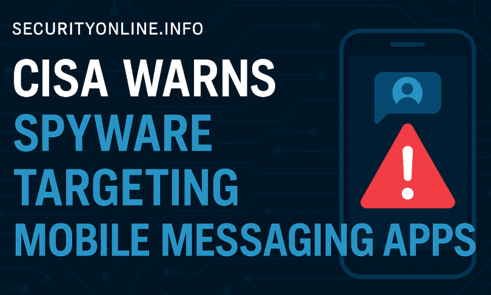
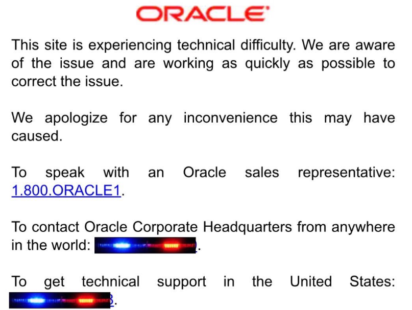

---
hide:
  - navigation
  - toc
---

# Last Week's Security Incidents
 

-   
    :material-cellphone-lock:{ .lg .middle } **CISA Warning: Spyware Campaigns Targeting Messaging App Users**

    **Commercial Spyware**{.cve-chip}  
    **Zero-Click Exploits**{.cve-chip}  
    ---------------------------------

    CISA warns that multiple cyber-threat actors are actively leveraging commercial spyware to target users of mobile messaging applications (e.g., WhatsApp, Signal). They use advanced methods — social engineering, zero-click exploits, impersonation — to deliver spyware and gain unauthorized access to victims' messaging apps and devices. Known vulnerabilities include **CVE-2025-55177**, **CVE-2025-43300**, and **CVE-2025-21042**, affecting both iOS and Android platforms.

    [:octicons-arrow-right-24: View Full Details](Week48/spyware.md)

-   
    :material-cog-outline:{ .lg .middle } **Festo Compact Vision System – Insecure Configuration Vulnerabilities**

    **Exposure of Resources**{.cve-chip}  
    **ICS/OT Systems**{.cve-chip}  
    ---------------------------------

    CISA warns that certain Festo products — **Compact Vision System**, **Control Block**, **Controller**, and **Operator Unit** — contain vulnerabilities related to insecure configuration or exposure of resources. Internal resources (configuration interfaces, control endpoints, services) are exposed without proper authentication or access control, creating a weakness that attackers could exploit remotely to gain unauthorized access or control over critical industrial control systems.

    [:octicons-arrow-right-24: View Full Details](Week48/festo.md)

-   
    :material-cloud-alert:{ .lg .middle } **China-Linked APT31 Stealth Cyberattacks on Russian IT Using Cloud Services**

    **State-Sponsored Espionage**{.cve-chip}  
    **Multi-Year Campaign**{.cve-chip}  
    ---------------------------------

    APT31 (a China-linked threat group) conducted a **multi-year cyber espionage campaign** targeting the Russian IT sector. They used legitimate cloud services (notably **Yandex Cloud** and **Microsoft OneDrive**) to blend malicious traffic with normal traffic, enabling long-term persistence and data exfiltration. They also used encrypted payloads hidden in social media, and timed attacks during weekends and holidays to lower detection risk.

    [:octicons-arrow-right-24: View Full Details](Week48/apt31.md)

-   
    :material-database-alert:{ .lg .middle } **Critical Oracle EBS Zero-Day Exploitation (CVE-2025-61882)**

    **Remote Code Execution**{.cve-chip}  
    **Active Exploitation**{.cve-chip}  
    ---------------------------------

    The vulnerability resides in the Oracle Concurrent Processing component (BI Publisher Integration) of Oracle E-Business Suite (EBS). It allows an attacker with network access (no credentials, no user interaction) to execute arbitrary code on the system. The flaw is being **actively exploited in the wild** by threat actors (including those using the **Cl0p brand**) in extortion and data-theft campaigns targeting global enterprises.

    [:octicons-arrow-right-24: View Full Details](Week48/oracle-ebs.md)

-   
    :material-factory:{ .lg .middle } **Critical ABB Ability Edgenius Authentication Bypass (CVE-2025-10571)**

    **Authentication Bypass**{.cve-chip}  
    **Adjacent Network Access**{.cve-chip}  
    ---------------------------------

    CVE-2025-10571 is a critical authentication bypass vulnerability in ABB Ability Edgenius, an industrial edge computing and management platform. Due to improper access controls, an attacker on the adjacent network can directly interact with the Edgenius Management Portal and execute privileged operations without authentication. This allows attackers to install, modify, or uninstall software packages, reconfigure systems, or take control of edge nodes within an industrial environment.

    [:octicons-arrow-right-24: View Full Details](Week48/abb.md)

-   
    :material-shield-lock:{ .lg .middle } **Critical Oracle Identity Manager Authentication Bypass (CVE-2025-61757)**

    **Authentication Bypass**{.cve-chip}  
    **Network Attack Vector**{.cve-chip}  
    ---------------------------------

    CVE-2025-61757 is a critical authentication bypass vulnerability in Oracle Identity Manager (OIM) REST WebServices, part of Oracle Fusion Middleware. Due to a logic flaw, certain sensitive API endpoints can be accessed without authentication, allowing attackers to invoke privileged identity management functions over the network. Because OIM controls the authentication and provisioning of enterprise accounts, exploitation can result in complete identity takeover across the environment.

    [:octicons-arrow-right-24: View Full Details](Week48/oracle.md)

